---
## Front matter
lang: ru-RU
title: Презентация по лабораторной работе №1
subtitle: Работа с Git
author:
  - Ибатулина Д.Э.
institute:
  - Российский университет дружбы народов, Москва, Россия
date: 16 февраля 2025

## i18n babel
babel-lang: russian
babel-otherlangs: english

## Formatting pdf
toc: false
toc-title: Содержание
slide_level: 2
aspectratio: 169
section-titles: true
theme: metropolis
header-includes:
 - \metroset{progressbar=frametitle,sectionpage=progressbar,numbering=fraction}
---

# Информация

## Докладчик

:::::::::::::: {.columns align=center}
::: {.column width="70%"}

  * Ибатулина дарья эдуардовна
  * студентка группы НФИбд-01-22
  * Российский университет дружбы народов
  * [1132226434@rudn.ru](mailto:1132226434@rudn.ru)
  * <https://deibatulina.github.io>

:::
::: {.column width="30%"}

:::
::::::::::::::

# Вводная часть

## Актуальность

Системы контроля версий широко используются разработчиками для совместной работы над проектом. Они удобны и позволяют сделать откат к предыдущей версии легко и быстро.

## Объект и предмет исследования

- Система контроля версий Git

## Цели и задачи

* Настроить Git;
* Создать тестовый репозиторий и поработать с ним.

# Основная часть

## Теоретическое введение

Системы контроля версий (Version Control System, VCS) применяются при работе нескольких человек над одним проектом. Обычно основное дерево проекта хранится в локальном или удалённом репозитории, к которому настроен доступ для участников проекта. При внесении изменений в содержание проекта система контроля версий позволяет их фиксировать, совмещать изменения, произведённые разными участниками проекта, производить откат к любой более ранней версии проекта, если это требуется.

## Настройка параметров установки окончаний строк]

\centering
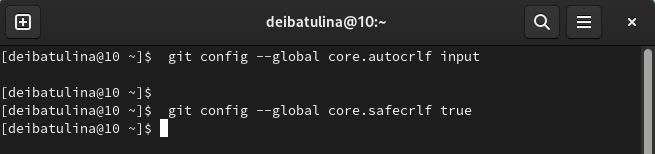{width=100%}

## Создание Git-репозитория

\centering
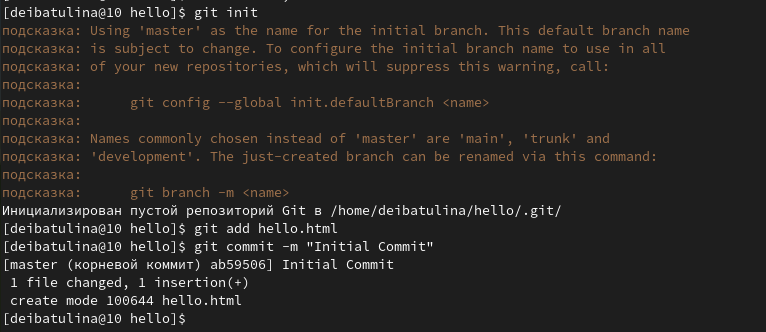{width=100%}

## Проверка состояния репозитория

\centering
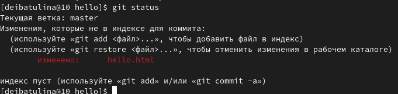{width=100%}

## Коммит

\centering
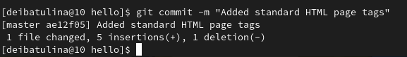

## Список изменений - лог

\centering
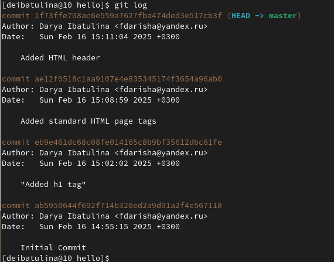{width=60%}

## Присвоение тегов

\centering
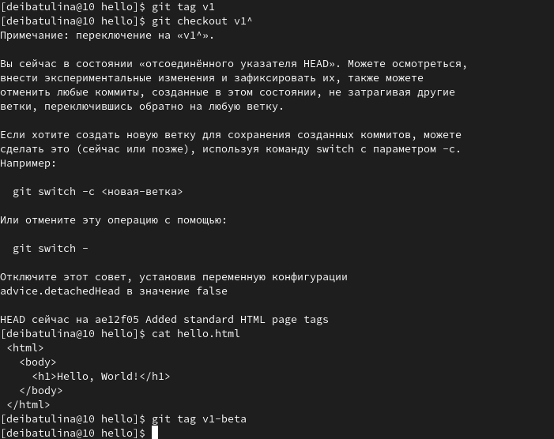

## Отмена коммита

\centering
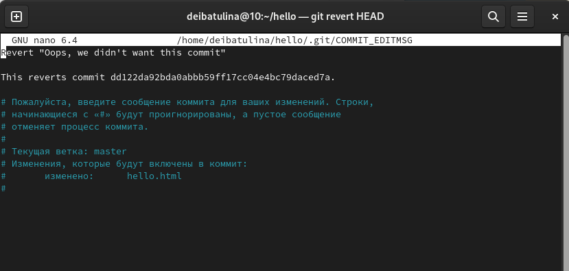{width=90%}

## Отмена коммита в истории ветки

\centering
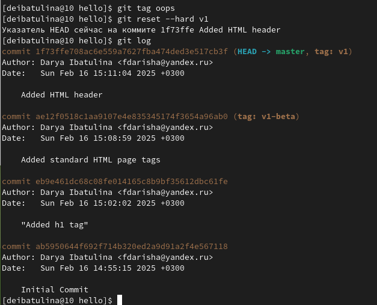

## Слияние веток

\centering
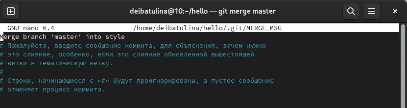{width=60%}

## Клонирование одного репозитория в другой

\centering
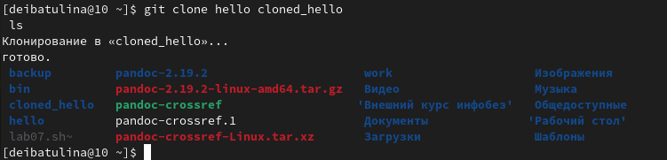

## Что такое origin?

Нет ничего особенного в имени «origin», однако существует традиция использовать «origin» в качестве имени первичного централизованного репозитория (если таковой имеется):
\centering
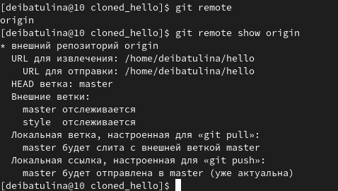

## Просмотр всех веток

\centering
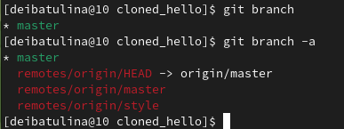

## Отправка изменений в общий репозиторий

\centering
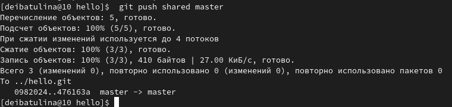

## Извлечение изменений из общего репозитория в клонированный

\centering
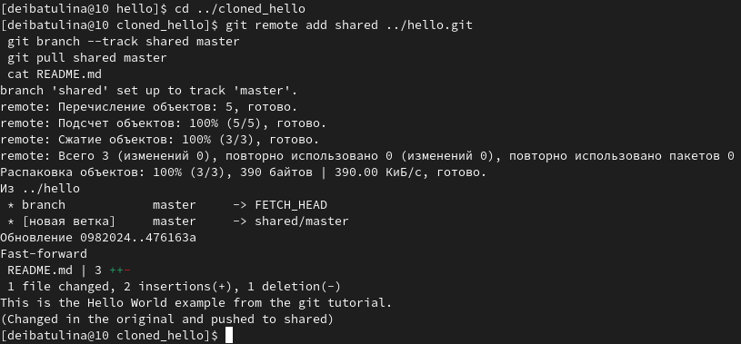

# Заключительная часть

## Выводы

- Научилась работать с Git
- Укрепила уже имевшиеся знания
- Потренировалась использовать команды Git на практике

