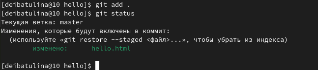
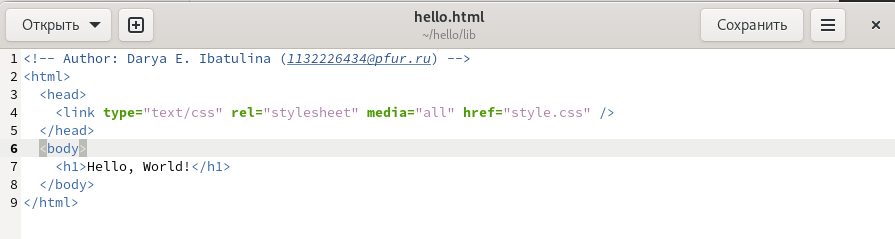

---
## Front matter
title: "Отчёт по лабораторной работе №1"
subtitle: "Система контроля версий Git"
author: "Дарья Эдуардовна Ибатулина"

## Generic otions
lang: ru-RU
toc-title: "Содержание"

## Bibliography
bibliography: bib/cite.bib
csl: pandoc/csl/gost-r-7-0-5-2008-numeric.csl

## Pdf output format
toc: true # Table of contents
toc-depth: 2
lof: true # List of figures
lot: false # List of tables
fontsize: 12pt
linestretch: 1.5
papersize: a4
documentclass: scrreprt
## I18n polyglossia
polyglossia-lang:
  name: russian
  options:
	- spelling=modern
	- babelshorthands=true
polyglossia-otherlangs:
  name: english
## I18n babel
babel-lang: russian
babel-otherlangs: english
## Fonts
mainfont: PT Serif
romanfont: PT Serif
sansfont: PT Sans
monofont: PT Mono
mainfontoptions: Ligatures=TeX
romanfontoptions: Ligatures=TeX
sansfontoptions: Ligatures=TeX,Scale=MatchLowercase
monofontoptions: Scale=MatchLowercase,Scale=0.9
## Biblatex
biblatex: true
biblio-style: "gost-numeric"
biblatexoptions:
  - parentracker=true
  - backend=biber
  - hyperref=auto
  - language=auto
  - autolang=other*
  - citestyle=gost-numeric
## Pandoc-crossref LaTeX customization
figureTitle: "Рис."
tableTitle: "Таблица"
listingTitle: "Листинг"
lofTitle: "Список иллюстраций"
lotTitle: "Список таблиц"
lolTitle: "Листинги"
## Misc options
indent: true
header-includes:
  - \usepackage{indentfirst}
  - \usepackage{float} # keep figures where there are in the text
  - \floatplacement{figure}{H} # keep figures where there are in the text
---

# Цель работы

Познакомиться с новыми командами Git, повторить уже изученный материал.

# Задание

* Настроить Git;
* Создать тестовый репозиторий и поработать с ним.

# Теоретическое введение

Системы контроля версий (Version Control System, VCS) применяются при работе нескольких человек над одним проектом. Обычно основное дерево проекта хранится в локальном или удалённом репозитории, к которому настроен доступ для участников проекта. При внесении изменений в содержание проекта система контроля версий позволяет их фиксировать, совмещать изменения, произведённые разными участниками проекта, производить откат к любой более ранней версии проекта, если это требуется.

В классических системах контроля версий используется централизованная модель, предполагающая наличие единого репозитория для хранения файлов. Выполнение большинства функций по управлению версиями осуществляется специальным сервером. Участник проекта (пользователь) перед началом работы посредством определённых команд получает нужную ему версию файлов. После внесения изменений, пользователь размещает новую версию в хранилище. При этом предыдущие версии не удаляются из центрального хранилища и к ним можно вернуться в любой момент. Сервер может сохранять не полную версию изменённых файлов, а производить так называемую дельта-компрессию — сохранять только изменения между последовательными версиями, что позволяет уменьшить объём хранимых данных.

Системы контроля версий поддерживают возможность отслеживания и разрешения конфликтов, которые могут возникнуть при работе нескольких человек над одним файлом. Можно объединить (слить) изменения, сделанные разными участниками (автоматически или вручную), вручную выбрать нужную версию, отменить изменения вовсе или заблокировать файлы для изменения. В зависимости от настроек блокировка не позволяет другим пользователям получить рабочую копию или препятствует изменению рабочей копии файла средствами файловой системы ОС, обеспечивая таким образом, привилегированный доступ только одному пользователю, работающему с файлом.

Системы контроля версий также могут обеспечивать дополнительные, более гибкие функциональные возможности. Например, они могут поддерживать работу с несколькими версиями одного файла, сохраняя общую историю изменений до точки ветвления версий и собственные истории изменений каждой ветви. Кроме того, обычно доступна информация о том, кто из участников, когда и какие изменения вносил. Обычно такого рода информация хранится в журнале изменений, доступ к которому можно ограничить.

В отличие от классических, в распределённых системах контроля версий центральный репозиторий не является обязательным.

Среди классических VCS наиболее известны CVS, Subversion, а среди распределённых — Git, Bazaar, Mercurial. Принципы их работы схожи, отличаются они в основном синтаксисом используемых в работе команд.

# Выполнение лабораторной работы

У меня уже установлен гит, так как я работала с ним на предыдущих курсах, поэтому пропускаю шаг с настройкой и перехожу сразу к заданию параметров.

Настраиваю параметры установки окончаний строк. Если core.safecrlf установлен в true или warm, git проверяет, если преобразование является обратимым для текущей настройки *core.autocrlf*, *core.safecrlf true* - отвержение необратимого преобразования lf<->crlf (рис. [-@fig:001]).

{#fig:001 width=70%}

Чтобы избежать нечитаемых строк, установила соответствующий флаг (рис. [-@fig:002]).

{#fig:002 width=70%}

Начну работу в домашнем каталоге с создания пустого каталога с именем hello, затем захожу в него и создала там файл с именем hello.html (рис. [-@fig:003]).

{#fig:003 width=70%}

Чтобы создать git репозиторий из этого каталога, выполнила команду git init (рис. [-@fig:004]).

{#fig:004 width=70%}

Проверила текущее состояние репозитория (рис. [-@fig:005]).

{#fig:005 width=70%}

Создала файл и заполнила его (рис. [-@fig:006]).

{#fig:006 width=70%}

Проверила состояние рабочего каталога. git знает, что файл hello.html был изменен, но при этом эти изменения еще не зафиксированы в репозитории (рис. [-@fig:007]).

{#fig:007 width=70%}

Добавила изменения в репозиторий (рис. [-@fig:008]).

{#fig:008 width=70%}

Сделала коммит и проверю позже состояние. Откроется редактор. В первой строке ввела комментарий: «Added h1 tag» (рис. [-@fig:009]).

{#fig:009 width=70%}

Проверила состояние. Теперь все изменения проиндексированы (рис. [-@fig:010]).

{#fig:010 width=70%}

Редактирую файл hello.html и добавляю изменение в гит (рис. [-@fig:011], [-@fig:012]).

{#fig:011 width=70%}

{#fig:012 width=70%}

Вновь редактирую файл hello.html и проверяю состояние репозитория (рис. [-@fig:013], [-@fig:014]).

{#fig:013 width=70%}

{#fig:014 width=70%}

hello.html указан дважды в состоянии. Первое изменение (добавление стандартных тегов) проиндексировано и готово к коммиту.Второе изменение (добавление заголовков HTML) является непроиндексированным.

Теперь добавляю второе изменение в индекс, а затем проверяю состояние (рис. [-@fig:015], [-@fig:016], [-@fig:017]). Сделала коммит второго изменения (добавление заголовков) (рис. [-@fig:018]).

{#fig:015 width=70%}

{#fig:016 width=70%}

{#fig:017 width=70%}

{#fig:018 width=70%}

Получим список произведенных изменений (рис. [-@fig:019]).

{#fig:019 width=70%}

Однострочный формат истории (рис. [-@fig:020]).

{#fig:020 width=70%}

Справочник по логу (рис. [-@fig:021]).

{#fig:021 width=70%}

Получаю хэши предыдущих версий, изучаю данные лога и нахожу хэш для первого коммита. Он должен быть в последней строке данных. Использую этот хэш-код (достаточно первых 7 знаков)
в команде ниже.

`git checkout <hash>`

Затем проверяю содержимое файла hello.html.

Возвращаюсь к последней версии в ветке master и вывожу содержимое файла (рис. [-@fig:022], [-@fig:023]).

{#fig:022 width=70%}

{#fig:023 width=70%}

Создаю теги и переключаюсь между ними. Вывожу логи и могу просмотреть теги (рис. [-@fig:024], [-@fig:025], [-@fig:026]).

{#fig:024 width=70%}

{#fig:025 width=70%}

{#fig:026 width=70%}

Пробую отменить ошибочно добавленные коммиты и проверяю логи, используя команду `git revert`. Всё получается (рис. [-@fig:027], [-@fig:028], [-@fig:029], [-@fig:030], [-@fig:031], [-@fig:032]? [-@fig:033], [-@fig:034], [-@fig:035], [-@fig:036], [-@fig:037]).

{#fig:027 width=70%}

{#fig:028 width=70%}

{#fig:029 width=70%} 

{#fig:030 width=70%}

{#fig:031 width=70%}

{#fig:032 width=70%} 

{#fig:033 width=70%}

{#fig:034 width=70%}

{#fig:035 width=70%} 

{#fig:036 width=70%}

{#fig:037 width=70%}

Чтобы коммиты удалялись и из истории ветки, существует более мощная команда `git reset` (рис. [-@fig:038], [-@fig:039], [-@fig:040]).

{#fig:038 width=70%}

{#fig:039 width=70%} 

{#fig:040 width=70%}

Добавление автора и электронной почты в файл приветствия (рис. [-@fig:041], [-@fig:042], [-@fig:043], [-@fig:044], [-@fig:045]).

{#fig:041 width=70%}

{#fig:042 width=70%} 

{#fig:043 width=70%}

{#fig:044 width=70%} 

{#fig:045 width=70%}

Создаем новый каталог и копируем в него содержимое hello, отправляем в репозиторий (рис. [-@fig:046], [-@fig:047]).

{#fig:046 width=70%} 

{#fig:047 width=70%}

Создаем новый файл, отправляем в репозиторий (рис. [-@fig:048], [-@fig:049]).

{#fig:048 width=70%} 

{#fig:049 width=70%}

Теперь при открытии index.html, я вижу кусок страницы hello в маленьком окошке (рис. [-@fig:050).

{#fig:050 width=70%} 

Углубляюсь в базу данных объектов, смотрю файлы конфига, ветки и теги, файлы HEAD (рис. [-@fig:051], [-@fig:052], [-@fig:053], [-@fig:054], [-@fig:055]).

{#fig:051 width=70%}

{#fig:052 width=70%} 

{#fig:053 width=70%}

{#fig:054 width=70%} 

{#fig:055 width=70%}

Работаю непосредственно с объектами git (рис. [-@fig:056], [-@fig:057], [-@fig:058], [-@fig:059], [-@fig:060], [-@fig:061]).

{#fig:056 width=70%}

{#fig:057 width=70%} 

{#fig:058 width=70%}

{#fig:059 width=70%} 

{#fig:060 width=70%}

{#fig:061 width=70%}

Добавляю файл стилей и новую ветку style (рис. [-@fig:062], [-@fig:063], [-@fig:064], [-@fig:065], [-@fig:066]).

{#fig:062 width=70%}

{#fig:063 width=70%} 

{#fig:064 width=70%}

{#fig:065 width=70%} 

{#fig:066 width=70%}

Изменяю файлы так, чтобы использовались стили style.css (рис. [-@fig:067], [-@fig:068], [-@fig:069], [-@fig:070], [-@fig:071], [-@fig:072], [-@fig:073]).

{#fig:067 width=70%}

{#fig:068 width=70%} 

{#fig:069 width=70%}

{#fig:070 width=70%} 

{#fig:071 width=70%}

{#fig:072 width=70%}

{#fig:073 width=70%}

Выполняю слияние веток. Появляются конфликты, которые необходимо разрешить. Успешно справляюсь с данной задачей (рис. [-@fig:074], [-@fig:075], [-@fig:076], [-@fig:077], [-@fig:078], [-@fig:079], [-@fig:080], [-@fig:081], [-@fig:082], [-@fig:083], [-@fig:084], [-@fig:085], [-@fig:086], [-@fig:087], [-@fig:088], [-@fig:089]).

{#fig:074 width=70%}

{#fig:075 width=70%} 

{#fig:076 width=70%}

{#fig:077 width=70%} 

{#fig:078 width=70%}

{#fig:079 width=70%}

{#fig:080 width=70%}

{#fig:081 width=70%}

{#fig:082 width=70%} 

{#fig:083 width=70%}

{#fig:084 width=70%} 

{#fig:085 width=70%}

{#fig:086 width=70%}

{#fig:087 width=70%}

{#fig:088 width=70%}

{#fig:089 width=70%}

Клонируем один репозиторий в другой созданный (рис. [-@fig:090], [-@fig:091], [-@fig:092], [-@fig:093]).

{#fig:090 width=70%}

{#fig:091 width=70%}

{#fig:092 width=70%}

{#fig:093 width=70%}

Мы видим, что клонированный репозиторий знает об имени по умолчанию удаленного репозитория. Давайте посмотрим, можем ли мы получить более подробную информацию об имени по умолчанию. Удаленные репозитории обычно размещаются наотдельной машине, возможно, централизованном сервере. Однако, как мы видим здесь, они могут с тем же успехом указывать на репозиторий на той же машине. Нет ничего особенного в имени «origin», однако существует традиция использовать «origin» в качестве имени первичного централизованного репозитория (если таковой имеется) рис. [-@fig:094]).

{#fig:094 width=70%}

Просмотрим все ветки (в том числе и удаленные) рис. [-@fig:095]).

{#fig:095 width=70%}

Клонируем один репозиторий в другой созданный (рис. [-@fig:096], [-@fig:097], [-@fig:098], [-@fig:099], [-@fig:100], [-@fig:101]).

{#fig:096 width=70%}

{#fig:097 width=70%}

{#fig:098 width=70%}

{#fig:099 width=70%}

{#fig:100 width=70%}

{#fig:101 width=70%}

Создадим чистый репозиторий. Сейчас мы находимся в рабочем (домашнем) каталоге. Как правило, репозитории, оканчивающиеся на .git, являются чистыми репозиториями. Мы видим,что в репозитории hello.git нетрабочего каталога.По сути, это есть не что иное,как каталог.git нечистого репозитория (рис. [-@fig:102]).

{#fig:102 width=70%}

Так как чистые репозитории, как правило, расшариваются на каком-нибудь сетевом сервере,нам необходимо отправить наши изменения в другие репозитории. Начнем с создания изменения для отправки. Отредактирую файл README.md и сделаю коммит (рис. [-@fig:103], [-@fig:104], [-@fig:105]).

{#fig:103 width=70%}

{#fig:104 width=70%}

{#fig:105 width=70%}

Отправляю изменения в общий репозиторий (рис. [-@fig:106]).

{#fig:106 width=70%}

Переключаемся в клонированный репозиторий и извлекаем изменения из общего репозитория (рис. [-@fig:107]).

{#fig:107 width=70%}

# Выводы

В результате проделывания лабораторной работы я разобралась с тем, как работает гит и его команды. Научилась отменять коммиты не только из репозитория, но и из истории веток. Вспомнила основные команды гита, уже изученные мною, и применила полученные знания на практике, создав тестовый репозиторий.

# Список литературы{.unnumbered}

1. Кулябов Д.С., Королькова А.В. Руководство к лабораторной работе №1. Математическое моделирование. - 2025. — 31 с.

::: {#refs}
:::
