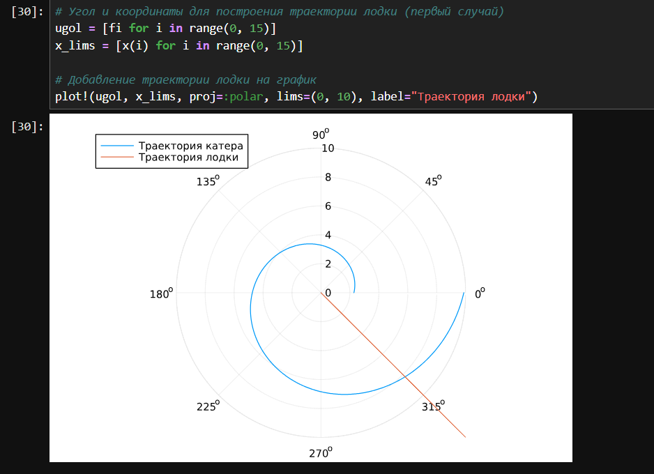
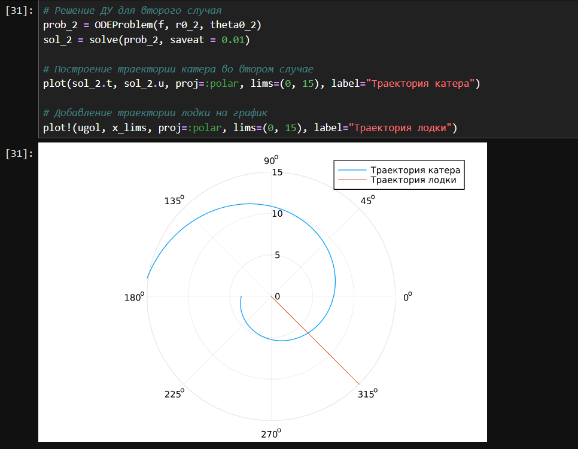
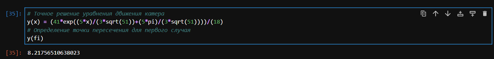
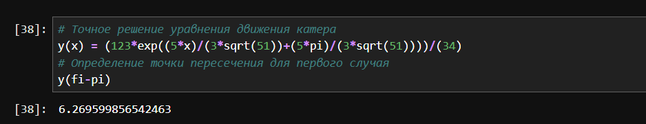

---
## Front matter
lang: ru-RU
title: Презентация по лабораторной работе №2
subtitle: Задача о погоне
author:
  - Ибатулина Д.Э.
institute:
  - Российский университет дружбы народов, Москва, Россия
date: 7 марта 2025

## i18n babel
babel-lang: russian
babel-otherlangs: english

## Formatting pdf
toc: false
toc-title: Содержание
slide_level: 2
aspectratio: 169
section-titles: true
theme: metropolis
header-includes:
 - \metroset{progressbar=frametitle,sectionpage=progressbar,numbering=fraction}
---

# Информация

## Докладчик

:::::::::::::: {.columns align=center}
::: {.column width="70%"}

  * Ибатулина дарья эдуардовна
  * студентка группы НФИбд-01-22
  * Российский университет дружбы народов
  * [1132226434@rudn.ru](mailto:1132226434@rudn.ru)
  * <https://deibatulina.github.io>

:::
::: {.column width="30%"}


:::
::::::::::::::

# Вводная часть

## Актуальность

Построение математических моделей различных процессов необходимо для выбора правильной стратегии при решении задач поиска. В данной лабораторной работе рассмотрена задача о погоне, как вид задач поиска.

## Объект и предмет исследования

- Задача о погоне
- Язык программирования Julia

## Цели

Приобретение навыков построения математических моделей для выбора правильной стратегии при решении задачи о погоне.

# Задание

На море в тумане катер береговой охраны преследует лодку браконьеров. Через определенный промежуток времени туман рассеивается, и лодка обнаруживается на расстоянии 12,3 км от катера. Затем лодка снова скрывается в тумане и уходит прямолинейно в неизвестном направлении. Известно, что скорость катера в 4,4 раза больше скорости браконьерской лодки.

1. Записать уравнение, описывающее движение катера, с начальными условиями для двух случаев (в зависимости от расположения катера относительно лодки в начальный момент времени);
2. Построить траекторию движения катера и лодки для двух случаев;
3. Найти точку пересечения траектории катера и лодки.

# Основная часть

## Теоретическое введение

Кривая погони — кривая, представляющая собой решение задачи о «погоне», которая ставится следующим образом. Пусть точка A равномерно движется по некоторой заданной кривой. Требуется найти траекторию равномерного движения точки P такую, что касательная, проведённая к траектории в любой момент движения, проходила бы через соответствующее этому моменту положение точки A.

## Вычисление номера варианта

\centering
{width=100%}

## Задание 1 (уравнения движения катера для первого случая)

$$\frac{x}{v} = \frac{k - x}{4.4v}$$

Таким образом, для первого случая, где $k = 12.3$:

$$x_1 = \frac{12.3}{5.4}$$

## Задание 1 (уравнения движения катера для второго случая)

$$\frac{x}{v} = \frac{k + x}{4.4v}$$

Для второго случая:

$$x_2 = \frac{12.3}{3.4}$$

## Задание 1 (переход к круговой траектории)

- Радиальная скорость ($v_r$) — это скорость, с которой катер удаляется от полюса. Она равна скорости лодки: $$v_r = \frac{dr}{dt} = v$$

- Тангенциальная скорость ($v_{\tau}$) — это скорость, с которой катер движется по окружности вокруг полюса. Эта скорость определяется через угловую скорость $\frac{d\theta}{dt}$: $$v_{\tau} = r \frac{d\theta}{dt}$$

Так как катер движется с более высокой скоростью (в 4,4 раза больше скорости лодки), мы находим тангенциальную скорость:

$$v_{\tau} = \sqrt{18.36 \cdot v^2 - v^2} = \sqrt{18.36} \cdot v$$

## Задание 1 (Система дифференциальных уравнений)

$$
\begin{cases}
\frac{dr}{dt} = v \\
r \frac{d\theta}{dt} = \sqrt{18.36} \cdot v
\end{cases}
$$

## Задание 1 (нач. условия для первого случая)

$$
\begin{cases}
\theta_0 = 0 \\
r_0 = \frac{12.3}{5.4}
\end{cases}
$$

## Задание 1 (нач. условия для второго случая)

$$
\begin{cases}
\theta_0 = -\pi \\
r_0 = \frac{12.3}{3.4}
\end{cases}
$$

## Задание 1 (Уравнение для радиальной зависимости)

Исключая из системы производную по времени $t$, можно получить уравнение, которое связывает радиус $r$ и угол $\theta$:

$$\frac{dr}{d\theta} = \frac{r}{\sqrt{18.36}}$$

## Задание 2 (код)

```Julia
using DifferentialEquations, Plots  # используемые пакеты

# Расстояние между лодкой и катером
k = 12.3 

# Начальные условия для двух случаев
r0 = k / 5.4   # к кратности скоростей прибавляем 1
r0_2 = k / 3.4   # из кратности скоростей вычитаем 1
theta0 = (0.0, 2*pi)   # целый круг
theta0_2 = (-pi, pi)  # целый круг

# Угол движения лодки браконьеров и интервал времени
fi = 3*pi/4
t = (0, 50)

```

## Задание 2 (код)

```Julia
# Функция, описывающая движение лодки браконьеров
x(t) = tan(fi) * t

# Дифференциальное уравнение для движения катера
f(r, p, t) = r / sqrt((4.4) ^ 2 - 1)  # (4.4) ^ 2 - 1 = 18.36

# Решение ДУ для первого случая с подставленными начальными условиями
prob = ODEProblem(f, r0, theta0)
sol = solve(prob, saveat = 0.01)

# Построение траектории катера
plot(sol.t, sol.u, proj=:polar, lims=(0, 10), label="Траектория катера")
```

## Задание 2 (построение траектории лодки, случай 1)

```Julia
# Угол и координаты для построения траектории лодки (первый случай)
ugol = [fi for i in range(0, 15)]
x_lims = [x(i) for i in range(0, 15)]

# Добавление траектории лодки на график
plot!(ugol, x_lims, proj=:polar, lims=(0, 10), label="Траектория лодки")
```

## ## Задание 2 (график, случай 1)

\centering


## Задание 2 (построение траектории лодки, случай 2)

```Julia
# Решение ДУ для второго случая
prob_2 = ODEProblem(f, r0_2, theta0_2)
sol_2 = solve(prob_2, saveat = 0.01)

# Построение траектории катера во втором случае
plot(sol_2.t, sol_2.u, proj=:polar, lims=(0, 15), label="Траектория катера")

# Добавление траектории лодки на график
plot!(ugol, x_lims, proj=:polar, lims=(0, 15), label="Траектория лодки")

```

## Задание 2 (график, случай 2)

\centering


## Задание 3 (нахождение точки пересечения, случай 1)

$$y'=\frac{y}{\sqrt{18.36}},\;\;{x}_0=0,\;y\left(0\right)=\frac{12.3}{5.4}$$

$$y=\dfrac{41\,{e}^{\frac{5\,x}{3\,\sqrt{51}}}}{18}$$

## Задание 3 (нахождение точки пересечения, случай 1)

```Julia
# Точное решение уравнения движения катера
y(x) = (41*exp((5*x)/(3*sqrt(51))+(5*pi)/(3*sqrt(51))))/(18)
# Определение точки пересечения для первого случая
y(fi)
```

## Задание 3 (нахождение точки пересечения, случай 1)

\centering


## Задание 3 (нахождение точки пересечения, случай 2)

$$y'=\frac{y}{\sqrt{18.36}},\;\;{x}_0=-\pi,\;y\left(0\right)=\frac{12.3}{3.4}$$

$$y=\dfrac{123\,{e}^{\frac{5\,x}{3\,\sqrt{51}}+\frac{5\,\pi}{3\,\sqrt{51}}}}{34}$$

## Задание 3 (нахождение точки пересечения, случай 2)

```Julia
# Точное решение уравнения движения катера
y(x) = (123*exp((5*x)/(3*sqrt(51))+(5*pi)/(3*sqrt(51))))/(34)
# Определение точки пересечения для второго случая
y(fi-pi)
```

## Задание 3 (нахождение точки пересечения, случай 2)

\centering


# Заключительная часть

## Выводы

В ходе данной работы я приобрела практические навыки построения математических моделей для выбора правильной стратегии при решении задач поиска.


