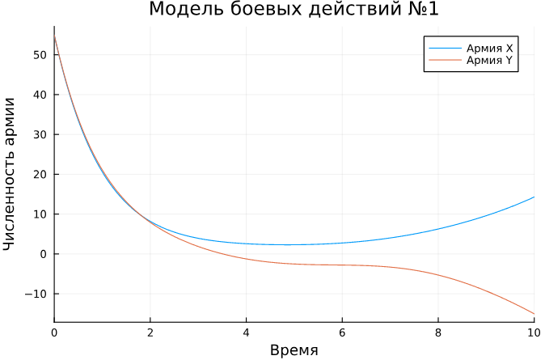
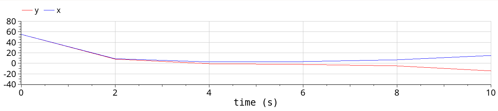
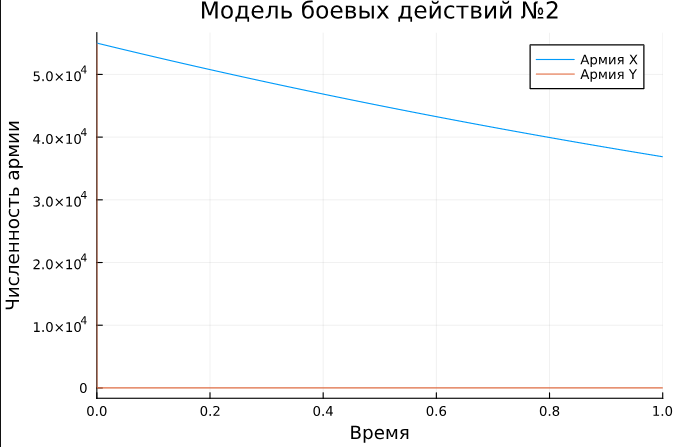
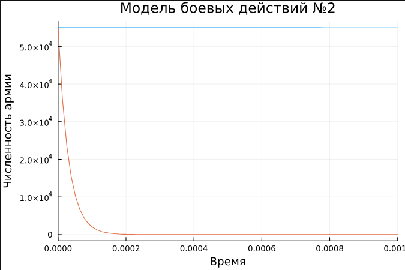
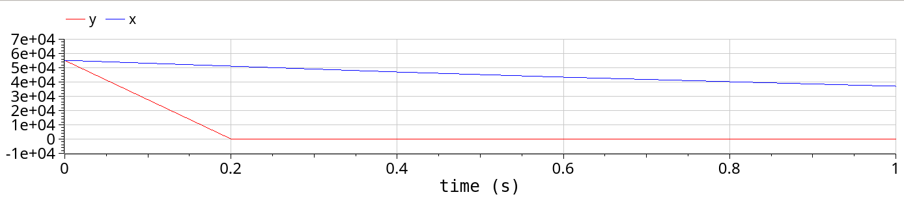

---
## Front matter
lang: ru-RU
title: Презентация по лабораторной работе №3
subtitle: Модель боевых действий
author:
  - Ибатулина Д.Э.
institute:
  - Российский университет дружбы народов, Москва, Россия
date: 18 марта 2025

## i18n babel
babel-lang: russian
babel-otherlangs: english

## Formatting pdf
toc: false
toc-title: Содержание
slide_level: 2
aspectratio: 169
section-titles: true
theme: metropolis
header-includes:
 - \metroset{progressbar=frametitle,sectionpage=progressbar,numbering=fraction}
---

# Информация

## Докладчик

:::::::::::::: {.columns align=center}
::: {.column width="70%"}

  * Ибатулина Дарья Эдуардовна
  * студентка группы НФИбд-01-22
  * Российский университет дружбы народов
  * [1132226434@rudn.ru](mailto:1132226434@rudn.ru)
  * <https://deibatulina.github.io>

:::
::: {.column width="30%"}


:::
::::::::::::::

# Вводная часть

## Объект и предмет исследования

- Модель боевых действий
- Язык программирования Julia
- ПО OpenModelica

## Цели

Построить модель боевых действий на языке прогаммирования *Julia* и посредством ПО *OpenModelica*.

# Задание

Между страной $X$ и страной $Y$ идет война. Численность состава войск исчисляется от начала войны, и являются временными функциями $x(t)$ и $y(t)$. В начальный момент времени страна $X$ имеет армию численностью 55 000 человек, а в распоряжении страны $Y$ армия численностью в 55 000 человек. Для упрощения модели считаем, что коэффициенты $a, b, c, h$ постоянны. Также считаем $P(t)$ и $Q(t)$ непрерывные функции. Построить графики изменения численности войск армии $X$ и армии $Y$ для  следующих случаев:

## Модель боевых действий между регулярными войсками

$$\begin{cases}
    \dfrac{dx}{dt} = -0.3x(t)- 0.69y(t)+sin(t)\\
    \dfrac{dy}{dt} = -0.7x(t)- 0.29y(t)+cos(t)
\end{cases}$$

## Модель ведение боевых действий с участием регулярных войск и партизанских отрядов

$$\begin{cases}
    \dfrac{dx}{dt} = -0.4x(t)-0.79y(t)+sin(4t)+3\\
    \dfrac{dy}{dt} = -0.6x(t)y(t)-0.1y(t)+2*|cos(4t)|
\end{cases}$$

# Основная часть

## Теоретическое введение

Уравнения Ланчестера — это дифференциальные уравнения, описывающие зависимость между силами сражающихся сторон A и D как функцию от времени, причем функция зависит только от A и D.

## Модель боевых действий между регулярными войсками

$$\begin{cases}
    \dfrac{dx}{dt} = -0.3x(t)- 0.69y(t)+sin(t)\\
    \dfrac{dy}{dt} = -0.7x(t)- 0.29y(t)+cos(t)
\end{cases}$$

## Модель на Julia

```Julia

# используемые библиотеки
using DifferentialEquations, Plots;

# задание системы дифференциальных уравнений, описывающих модель 
# боевых действий между регулярными войсками
function reg(u, p, t)
    x, y = u
    a, b, c, h = p
    dx = -a*x - b*y+sin(t)
    dy = -c*x -h*y+cos(t)
    return [dx, dy]
end
```

## График

\centering
{width=70%}

## Модель на OpenModelica

```OpenModelica

model lab3_1
  parameter Real a = 0.3;
  parameter Real b = 0.69;
  parameter Real c = 0.7;
  parameter Real h = 0.29;
  parameter Real x0 = 55;
  parameter Real y0 = 55;
  Real x(start=x0);
  Real y(start=y0);
equation
  der(x) = -a*x - b*y+sin(time);
  der(y) = -c*x -h*y+cos(time);
end lab3_1;
```

## График

\centering


## Модель ведения боевых действий с участием регулярных войск и партизанских отрядов

$$\begin{cases}
    \dfrac{dx}{dt} = -0.4x(t)-0.79y(t)+sin(4t)+3\\
    \dfrac{dy}{dt} = -0.6x(t)y(t)-0.1y(t)+2*|cos(4t)|
\end{cases}$$

## Модель на Julia:

```Julia

# задание системы дифференциальных уравнений, описывающих модель 
# боевых действий с участием регулярных войск и партизанских отрядов
function reg_part(du, u, p, t)
    x, y = u
    a, b, c, h = p
    du[1] = -a*x - b*y+sin(4*t) + 3
    du[2] = -c*x*y -h*y+2*abs(cos(4*t))
    return nothing
end
```

## График

\centering
{width=70%}

## Уменьшение интервала

```Julia

# возьмем временной интервал поменьше, чтобы было более наглядно,\
как умирает армия Y
plot(sol2, title = "Модель боевых действий №2", label = false,\
xaxis = "Время", yaxis = "Численность армии", xlimit = [0,0.001])
```

## График с уменьшением интервала

\centering
{width=70%}

## Модель на OpenModelica

```OpenModelica

model lab3_2
  parameter Real a = 0.4;
  parameter Real b = 0.79;
  parameter Real c = 0.6;
  parameter Real h = 0.1;
  parameter Real x0 = 55000;
  parameter Real y0 = 55000;
  Real x(start=x0);
  Real y(start=y0);
equation
  der(x) = -a*x - b*y+sin(4*time) + 3;
  der(y) = -c*x*y -h*y+2*abs(cos(4*time));
end lab3_2;
```

## График

\centering


# Заключительная часть

## Выводы

В процессе выполнения данной лабораторной работы я построила модель боевых действий на языке программирования `Julia` и посредством ПО `OpenModelica`, а также провела сравнительный анализ.


