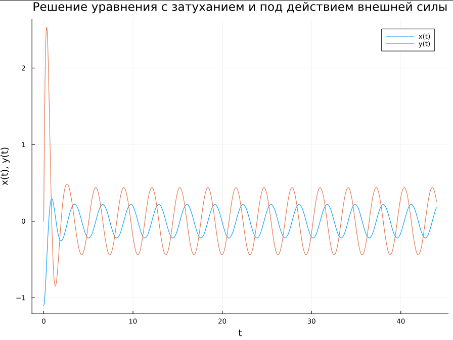

---
## Front matter
lang: ru-RU
title: Презентация по лабораторной работе №4
subtitle: Модель гармонических колебаний
author:
  - Ибатулина Д.Э.
institute:
  - Российский университет дружбы народов, Москва, Россия
date: 5 апреля 2025

## i18n babel
babel-lang: russian
babel-otherlangs: english

## Formatting pdf
toc: false
toc-title: Содержание
slide_level: 2
aspectratio: 169
section-titles: true
theme: metropolis
header-includes:
 - \metroset{progressbar=frametitle,sectionpage=progressbar,numbering=fraction}
---

# Информация

## Докладчик

:::::::::::::: {.columns align=center}
::: {.column width="70%"}

  * Ибатулина Дарья Эдуардовна
  * студентка группы НФИбд-01-22
  * Российский университет дружбы народов
  * [1132226434@rudn.ru](mailto:1132226434@rudn.ru)
  * <https://deibatulina.github.io>

:::
::: {.column width="30%"}


:::
::::::::::::::

# Вводная часть

## Объект и предмет исследования

- Модель гармонических колебаний
- Язык программирования Julia
- ПО OpenModelica

## Цель работы

Построить математическую модель гармонического осциллятора.

## Задание

Построить фазовый портрет гармонического осциллятора и решение уравнения
гармонического осциллятора для следующих случаев:

1. Колебания гармонического осциллятора без затуханий и без действий внешней силы:

$\ddot{x} +2.2x = 0$

2. Колебания гармонического осциллятора c затуханием и без действий внешней силы:

$$x + 2.4x + x = 0$$

3. Колебания гармонического осциллятора c затуханием и под действием внешней силы:

$$x + 3.5x + 13 x = 2.5 cos(2t).$$

На интервале $t \in [0; 44]$ (шаг 0.05) с начальными условиями $x_0 = -1.1, \,\, y_0=0$.

## Теоретическое введение

Гармонические колебания — колебания, при которых физическая величина изменяется с течением времени по гармоническому (синусоидальному, косинусоидальному) закону.

Уравнение гармонического колебания имеет вид

$$x(t)=A\sin(\omega t+\varphi _{0})$$

или

$$x(t)=A\cos(\omega t+\varphi _{0})$$ 

# Выполнение лабораторной работы

## Модель колебаний гармонического осциллятора без затуханий и без действий внешней силы

```Julia

using DifferentialEquations
using Plots

# Параметры уравнения x'' + 2.2x = 0
omega_squared = 2.2

# Функция, описывающая систему уравнений первого порядка
function harmonic_oscillator!(du, u, p, t)
    du[1] = u[2]       # dx/dt = v
    du[2] = -omega_squared * u[1]  # dv/dt = -omega^2 * x
end
```

## Модель колебаний гармонического осциллятора без затуханий и без действий внешней силы

```Julia
# Начальные условия
x0 = -1.1  # x(0) = -1.1
v0 = 0.0   # v(0) = 0
u0 = [x0, v0]  # Вектор начальных условий

# Временной интервал
tspan = (0.0, 44.0)

# Задача Коши
prob = ODEProblem(harmonic_oscillator!, u0, tspan)

# Решение задачи
sol = solve(prob, Tsit5(), saveat=0.05)
```

## Модель колебаний гармонического осциллятора без затуханий и без действий внешней силы

```Julia
# График решения x(t) и y(t)

plot(sol.t, sol[1,:], label="x(t)",
    xlabel="t", ylabel="x(t), y(t)", 
    title="Решение уравнения без затухания и без внешней силы", 
    legend=true,
    size=(800, 600))

plot!(sol.t, sol[2,:], label="y(t)",
    xlabel="t", ylabel="x(t), y(t)", 
    title="Решение уравнения без затухания и без внешней силы", 
    legend=true,
    size=(800, 600))
```

## Модель колебаний гармонического осциллятора без затуханий и без действий внешней силы

```Julia
using Plots

# Построение фазового портрета
plot(sol[1,:], sol[2,:], 
     xlabel="x", ylabel="v", 
     title="Фазовый портрет: без затухания и без действия внешних сил", 
     legend=false, 
     size=(800, 600))  # Установка размера графика в пикселях
```

## Модель колебаний гармонического осциллятора без затуханий и без действий внешней силы

\centering
{width=65%}

## Модель колебаний гармонического осциллятора без затуханий и без действий внешней силы

\centering
{width=65%}

## Модель колебаний гармонического осциллятора без затуханий и без действий внешней силы

```Modelica
model HarmonicOscillator
  // Параметры
  parameter Real omega_squared = 2.2;

  // Переменные состояния
  Real x(start = -1.1); // Начальное значение x
  Real v(start = 0.0);  // Начальное значение v

  // Уравнения
  equation
    der(x) = v; // dx/dt = v
    der(v) = -omega_squared * x; // dv/dt = -omega^2 * x

end HarmonicOscillator;
```

## Модель колебаний гармонического осциллятора без затуханий и без действий внешней силы

\centering
{width=90%}

## Модель колебаний гармонического осциллятора без затуханий и без действий внешней силы

\centering
{width=90%}

## Модель колебаний гармонического осциллятора c затуханием и без действий внешней силы 

```Julia
using DifferentialEquations
using Plots

# Параметры уравнения x'' + 2.4x' + x = 0
gamma = 2.4      # Коэффициент затухания
omega_squared = 1.0  # omega^2 = 1

# Функция, описывающая систему уравнений первого порядка с затуханием
function damped_oscillator!(du, u, p, t)
    du[1] = u[2]              # dx/dt = v
    du[2] = -gamma * u[2] - omega_squared * u[1]
end
```

## Модель колебаний гармонического осциллятора c затуханием и без действий внешней силы 

\centering
{width=65%}


## Модель колебаний гармонического осциллятора c затуханием и без действий внешней силы 

\centering
{width=65%}


## Модель колебаний гармонического осциллятора c затуханием и без действий внешней силы 

```Modelica
model DampedOscillator
  // Параметры
  parameter Real gamma = 2.4; // Коэффициент затухания
  parameter Real omega_squared = 1.0; // omega^2 = 1

  // Переменные состояния
  Real x(start = -1.1); // Начальное значение x
  Real v(start = 0.0); // Начальное значение v

  // Уравнения
  equation
    der(x) = v; // dx/dt = v
    der(v) = -gamma * v - omega_squared * x;

end DampedOscillator;
```

## Модель колебаний гармонического осциллятора c затуханием и без действий внешней силы 

\centering
{width=90%}


## Модель колебаний гармонического осциллятора c затуханием и без действий внешней силы 

\centering
{width=90%}

## Модель колебаний гармонического осциллятора c затуханием и под действием внешней силы

```Julia
gamma = 3.5      # Коэффициент затухания
omega_squared = 13.0 # omega^2 = 13
F0 = 2.5         # Амплитуда внешней силы
Omega = 2.0      # Частота внешней силы
function forced_oscillator!(du, u, p, t)
    du[1] = u[2]                      # dx/dt = v
    du[2] = -gamma * u[2] - omega_squared * u[1] + F0 * cos(Omega * t)
end
```

## Модель колебаний гармонического осциллятора c затуханием и под действием внешней силы

\centering
{width=65%}

## Модель колебаний гармонического осциллятора c затуханием и под действием внешней силы

\centering
{#fig:010 width=65%}

## Модель колебаний гармонического осциллятора c затуханием и под действием внешней силы

```Modelica
model ForcedDampedOscillator
  parameter Real gamma = 3.5; // Коэффициент затухания
  parameter Real omega_squared = 13.0; // omega^2 = 13
  parameter Real F0 = 2.5; // Амплитуда внешней силы
  parameter Real Omega = 2.0; // Частота внешней силы
  Real x(start = -1.1); // Начальное значение x
  Real v(start = 0.0); // Начальное значение v
  equation
    der(x) = v; // dx/dt = v
    der(v) = -gamma * v - omega_squared * x + F0 * cos(Omega * time);
end ForcedDampedOscillator;
```

## Модель колебаний гармонического осциллятора c затуханием и под действием внешней силы

\centering
{width=85%}

## Модель колебаний гармонического осциллятора c затуханием и под действием внешней силы

\centering
{width=85%}

## Выводы

В процессе выполнения данной лабораторной работы я построила математическую модель гармонического осциллятора.


