---
## Front matter
title: "Отчёт по лабораторной работе №4"
subtitle: "Модель гармонических колебаний"
author: "Ибатулина Дарья Эдуардовна, НФИбд-01-22"

## Generic otions
lang: ru-RU
toc-title: "Содержание"

## Bibliography
bibliography: bib/cite.bib
csl: pandoc/csl/gost-r-7-0-5-2008-numeric.csl

## Pdf output format
toc: true # Table of contents
toc-depth: 2
lof: true # List of figures
lot: false # List of tables
fontsize: 12pt
linestretch: 1.5
papersize: a4
documentclass: scrreprt
## I18n polyglossia
polyglossia-lang:
  name: russian
  options:
	- spelling=modern
	- babelshorthands=true
polyglossia-otherlangs:
  name: english
## I18n babel
babel-lang: russian
babel-otherlangs: english
## Fonts
mainfont: PT Serif
romanfont: PT Serif
sansfont: PT Sans
monofont: PT Mono
mainfontoptions: Ligatures=TeX
romanfontoptions: Ligatures=TeX
sansfontoptions: Ligatures=TeX,Scale=MatchLowercase
monofontoptions: Scale=MatchLowercase,Scale=0.9
## Biblatex
biblatex: true
biblio-style: "gost-numeric"
biblatexoptions:
  - parentracker=true
  - backend=biber
  - hyperref=auto
  - language=auto
  - autolang=other*
  - citestyle=gost-numeric
## Pandoc-crossref LaTeX customization
figureTitle: "Рис."
tableTitle: "Таблица"
listingTitle: "Листинг"
lofTitle: "Список иллюстраций"
lotTitle: "Список таблиц"
lolTitle: "Листинги"
## Misc options
indent: true
header-includes:
  - \usepackage{indentfirst}
  - \usepackage{float} # keep figures where there are in the text
  - \floatplacement{figure}{H} # keep figures where there are in the text
---

# Цель работы

Построить математическую модель гармонического осциллятора.

# Задание

Построить фазовый портрет гармонического осциллятора и решение уравнения гармонического осциллятора для следующих случаев [1]:

1. Колебания гармонического осциллятора без затуханий и без действий внешней силы:

$$x + 2.2x = 0$$

2. Колебания гармонического осциллятора c затуханием и без действий внешней силы:
  
$$x + 2.4x + x = 0$$

3. Колебания гармонического осциллятора c затуханием и под действием внешней силы:
   
$$x + 3.5x + 13 x = 2.5 cos(2t).$$

На интервале $t \in [0; 44]$ (шаг 0.05) с начальными условиями $x_0 = -1.1, \,\, y_0=0$.

# Теоретическое введение

Гармонические колебания — колебания, при которых физическая величина изменяется с течением времени по гармоническому (синусоидальному, косинусоидальному) закону.

Уравнение гармонического колебания имеет вид

$$x(t)=A\sin(\omega t+\varphi _{0})$$

или

$$x(t)=A\cos(\omega t+\varphi _{0}),$$ 

где $x$ — отклонение колеблющейся величины в текущий момент времени $t$ от среднего за период значения (например, в кинематике — смещение, отклонение колеблющейся точки от положения равновесия);
$A$ — амплитуда колебания, то есть максимальное за период отклонение колеблющейся величины от среднего за период значения, размерность $A$ совпадает с размерностью $x$ [2];
$\omega$ (радиан/с, градус/с) — циклическая частота, показывающая, на сколько радиан (градусов) изменяется фаза колебания за 1 с;

$(\omega t+\varphi _{0})=\varphi$ (радиан, градус) — полная фаза колебания (сокращённо — фаза, не путать с начальной фазой);

$\varphi _{0}$ (радиан, градус) — начальная фаза колебаний, которая определяет значение полной фазы колебания (и самой величины $x$) в момент времени $t=0$.
Дифференциальное уравнение, описывающее гармонические колебания, имеет вид

$$\frac {d^{2}x}{dt^{2}}+\omega ^{2}x=0.$$ [2, 3, 4].

# Выполнение лабораторной работы

## Модель колебаний гармонического осциллятора без затуханий и без действий внешней силы

Для начала реализуем эту модель на языке программирования Julia. 

```Julia

using DifferentialEquations
using Plots

# Параметры уравнения x'' + 2.2x = 0
omega_squared = 2.2

# Функция, описывающая систему уравнений первого порядка
function harmonic_oscillator!(du, u, p, t)
    du[1] = u[2]       # dx/dt = v
    du[2] = -omega_squared * u[1]  # dv/dt = -omega^2 * x
end

# Начальные условия
x0 = -1.1  # x(0) = -1.1
v0 = 0.0   # v(0) = 0
u0 = [x0, v0]  # Вектор начальных условий

# Временной интервал
tspan = (0.0, 44.0)

# Задача Коши
prob = ODEProblem(harmonic_oscillator!, u0, tspan)

# Решение задачи
sol = solve(prob, Tsit5(), saveat=0.05)

# График решения x(t) и y(t)

plot(sol.t, sol[1,:], label="x(t)",
    xlabel="t", ylabel="x(t), y(t)", 
    title="Решение уравнения без затухания и без внешней силы", 
    legend=true,
    size=(800, 600))

plot!(sol.t, sol[2,:], label="y(t)",
    xlabel="t", ylabel="x(t), y(t)", 
    title="Решение уравнения без затухания и без внешней силы", 
    legend=true,
    size=(800, 600))
```

Код для фазового портрета:

```Julia
using Plots

# Построение фазового портрета
plot(sol[1,:], sol[2,:], 
     xlabel="x", ylabel="v", 
     title="Фазовый портрет: без затухания и без действия внешних сил", 
     legend=false, 
     size=(800, 600))  # Установка размера графика в пикселях
```
В результате получаем следующие графики решения уравнения
гармонического осциллятора  (рис. @fig:001) и его фазового портрета  (рис. @fig:002).

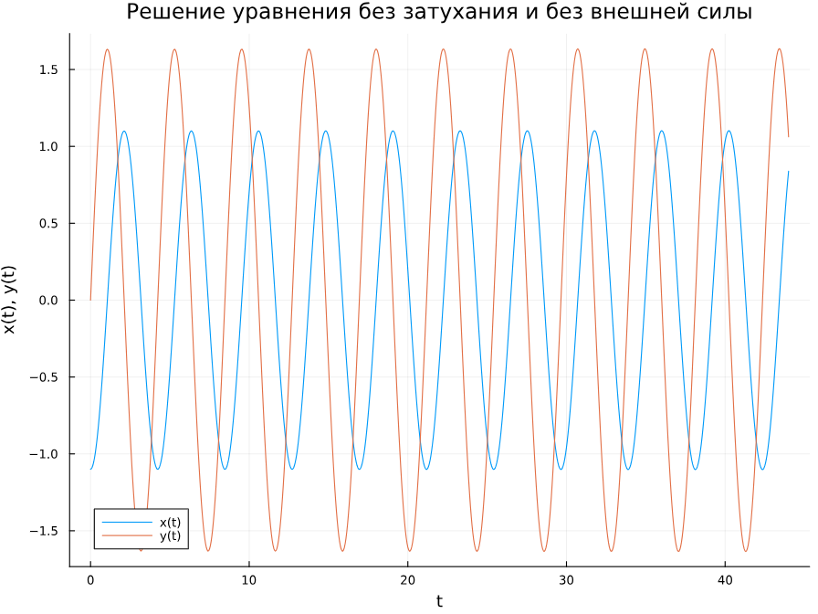{#fig:001 width=70%}

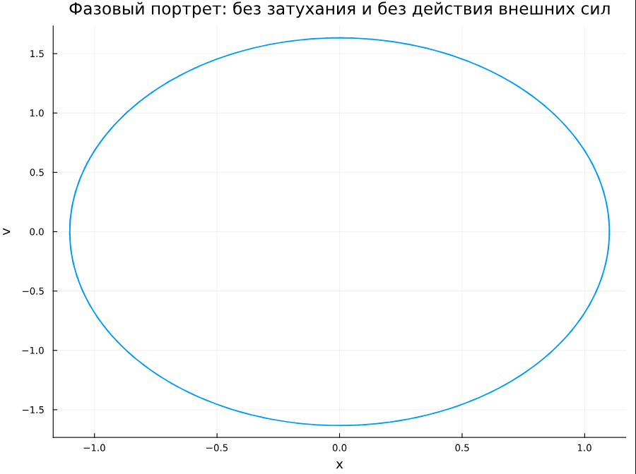{#fig:002 width=70%}

Можно заметить, что колебание осциллятора периодично, график не задухает.

Теперь реализуем эту модель посредством OpenModelica.

```Modelica
model HarmonicOscillator
  // Параметры
  parameter Real omega_squared = 2.2;

  // Переменные состояния
  Real x(start = -1.1); // Начальное значение x
  Real v(start = 0.0);  // Начальное значение v

  // Уравнения
  equation
    der(x) = v; // dx/dt = v
    der(v) = -omega_squared * x; // dv/dt = -omega^2 * x

end HarmonicOscillator;
```

В результате получаем следующие графики решения уравнения гармонического осциллятора  (рис. @fig:003) и его фазового портрета  (рис. @fig:004).

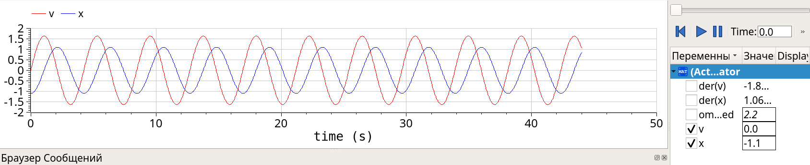{#fig:003 width=70%}

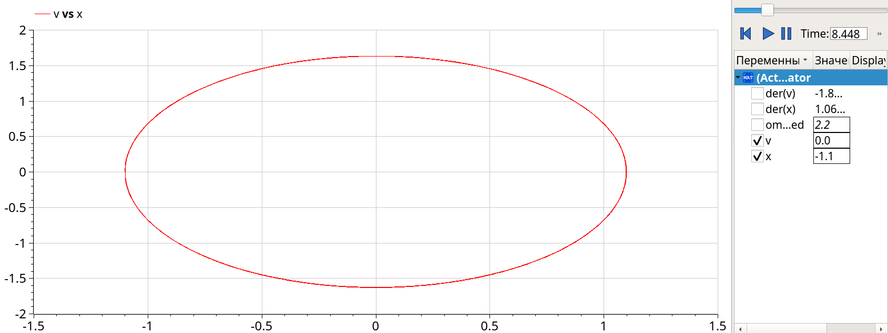{#fig:004 width=70%}

Также несложно увидеть, что графики, полученные с помощью OpenModelica и Julia идентичны.

## Модель колебаний гармонического осциллятора c затуханием и без действий внешней силы 

Реализуем эту модель на языке программирования Julia. 

```Julia

using DifferentialEquations
using Plots

# Параметры уравнения x'' + 2.4x' + x = 0
gamma = 2.4      # Коэффициент затухания
omega_squared = 1.0  # omega^2 = 1

# Функция, описывающая систему уравнений первого порядка с затуханием
function damped_oscillator!(du, u, p, t)
    du[1] = u[2]              # dx/dt = v
    du[2] = -gamma * u[2] - omega_squared * u[1]  # dv/dt = -gamma*v - omega^2 * x
end

# Начальные условия
x0 = -1.1  # x(0) = -1.1
v0 = 0.0   # v(0) = 0
u0 = [x0, v0]  # Вектор начальных условий

# Временной интервал
tspan = (0.0, 44.0)

# Задача Коши
prob = ODEProblem(damped_oscillator!, u0, tspan)

# Решение задачи
sol = solve(prob, Tsit5(), saveat=0.05)

# График решения x(t) и y(t)
plot(sol.t, sol[1,:], label="x(t)",
    xlabel="t", ylabel="x(t), y(t)", 
    title="Решение уравнения с затуханием и без внешней силы", 
    legend=true,
    size=(800, 600))

plot!(sol.t, sol[2,:], label="y(t)",
    xlabel="t", ylabel="x(t), y(t)", 
    title="Решение уравнения с затуханием и без внешней силы", 
    legend=true,
    size=(800, 600))
```

Код для фазового портрета:

```Julia
using Plots

# Построение фазового портрета
plot(sol[1,:], sol[2,:], 
     xlabel="x", ylabel="v", 
     title="Фазовый портрет: с затуханием и без внешней силы", 
     legend=false,
    size=(800, 600))
```

В результате получаем следующие графики решения уравнения гармонического осциллятора  (рис. @fig:005) и его фазового портрета  (рис. @fig:006).

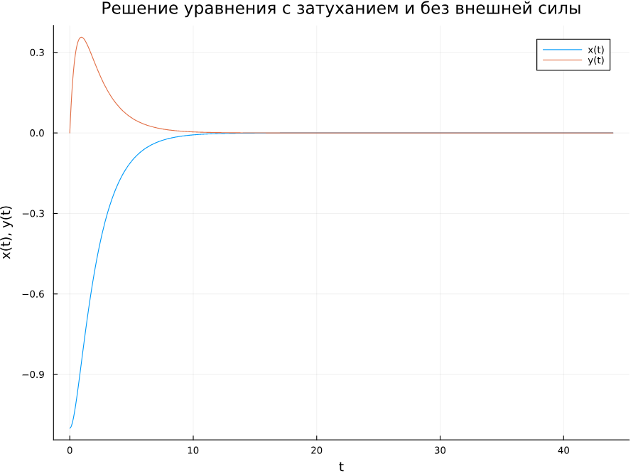{#fig:005 width=70%}

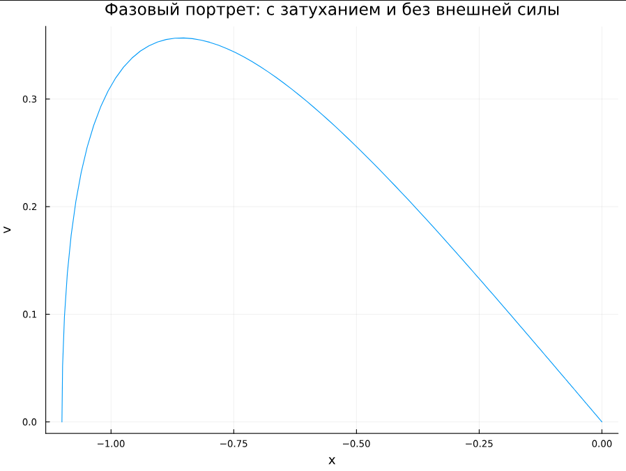{#fig:006 width=70%}

В этом случае сначала происходят колебания осциллятора, а затем график затухает, поскольку у нас есть параметр, отвечающий за потери энергии.

Теперь реализуем эту модель посредством OpenModelica.

```Modelica
model DampedOscillator
  // Параметры
  parameter Real gamma = 2.4; // Коэффициент затухания
  parameter Real omega_squared = 1.0; // omega^2 = 1

  // Переменные состояния
  Real x(start = -1.1); // Начальное значение x
  Real v(start = 0.0); // Начальное значение v

  // Уравнения
  equation
    der(x) = v; // dx/dt = v
    der(v) = -gamma * v - omega_squared * x; // dv/dt = -gamma*v - omega^2 * x

end DampedOscillator;
```

В результате получаем следующие графики решения уравнения гармонического осциллятора  (рис. @fig:007) и его фазового портрета  (рис. @fig:008).

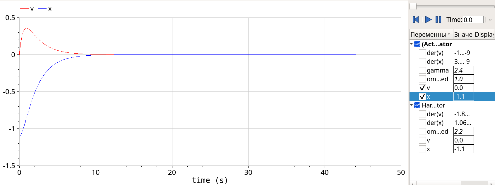{#fig:007 width=70%}

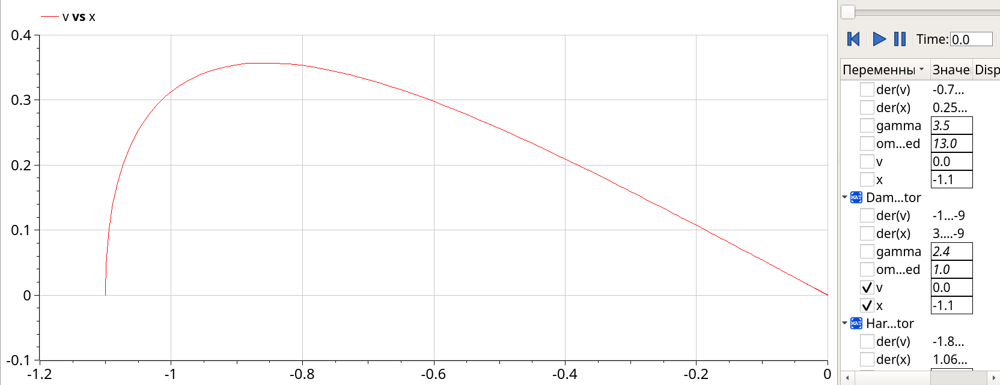{#fig:008 width=70%}

Во второй модели также несложно увидеть, что графики, полученные с помощью OpenModelica и Julia идентичны.

## Модель колебаний гармонического осциллятора c затуханием и под действием внешней силы

Реализуем эту модель на языке программирования Julia. 

```Julia

using DifferentialEquations
using Plots

# Параметры уравнения x'' + 3.5x' + 13x = 2.5cos(2t)
gamma = 3.5      # Коэффициент затухания
omega_squared = 13.0 # omega^2 = 13
F0 = 2.5         # Амплитуда внешней силы
Omega = 2.0      # Частота внешней силы

# Функция, описывающая систему уравнений первого порядка с затуханием и внешней силой
function forced_oscillator!(du, u, p, t)
    du[1] = u[2]                      # dx/dt = v
    du[2] = -gamma * u[2] - omega_squared * u[1] + F0 * cos(Omega * t)  # dv/dt = -gamma*v - omega^2*x + F0*cos(Omega*t)
end

# Начальные условия
x0 = -1.1  # x(0) = -1.1
v0 = 0.0   # v(0) = 0
u0 = [x0, v0]  # Вектор начальных условий

# Временной интервал
tspan = (0.0, 44.0)

# Задача Коши
prob = ODEProblem(forced_oscillator!, u0, tspan)

# Решение задачи
sol = solve(prob, Tsit5(), saveat=0.05)

# График решения x(t) и y(t)
plot(sol.t, sol[1,:], label="x(t)", 
     xlabel="t", ylabel="x(t), y(t)", 
     title="Решение уравнения c затуханием и под действием внешней силы", 
     legend=true,
    size=(800, 600))

plot!(sol.t, sol[2,:], label="y(t)", 
     xlabel="t", ylabel="x(t), y(t)", 
     title="Решение уравнения c затуханием и под действием внешней силы", 
     legend=true,
    size=(800, 600))
```

Код для фазового портрета:

```Julia
using Plots

# Построение фазового портрета
plot(sol[1,:], sol[2,:], 
     xlabel="x", ylabel="v", 
     title="Фазовый портрет: с внешней силой", 
     legend=false,
    size=(800, 600))
```

В результате получаем следующие графики решения уравнения гармонического осциллятора  (рис. @fig:009) и его фазового портрета  (рис. @fig:010).

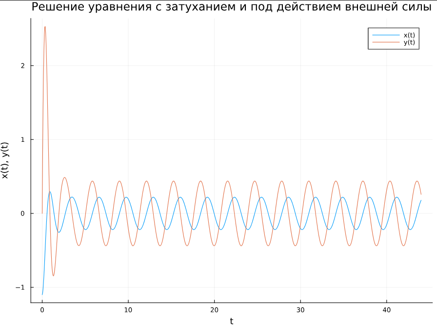{#fig:009 width=70%}

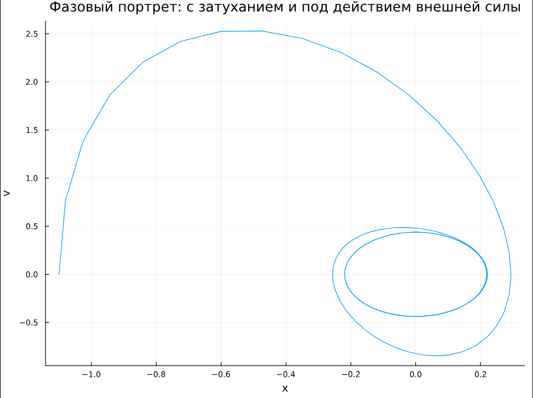{#fig:010 width=70%}

Теперь реализуем эту модель посредством OpenModelica.

```Modelica
model ForcedDampedOscillator
  // Параметры
  parameter Real gamma = 3.5; // Коэффициент затухания
  parameter Real omega_squared = 13.0; // omega^2 = 13
  parameter Real F0 = 2.5; // Амплитуда внешней силы
  parameter Real Omega = 2.0; // Частота внешней силы

  // Переменные состояния
  Real x(start = -1.1); // Начальное значение x
  Real v(start = 0.0); // Начальное значение v

  // Уравнения
  equation
    der(x) = v; // dx/dt = v
    der(v) = -gamma * v - omega_squared * x + F0 * cos(Omega * time); // dv/dt = -gamma*v - omega^2*x + F0*cos(Omega*t)

end ForcedDampedOscillator;
```

В результате получаем следующие графики решения уравнения гармонического осциллятора  (рис. @fig:011) и его фазового портрета  (@fig:012).

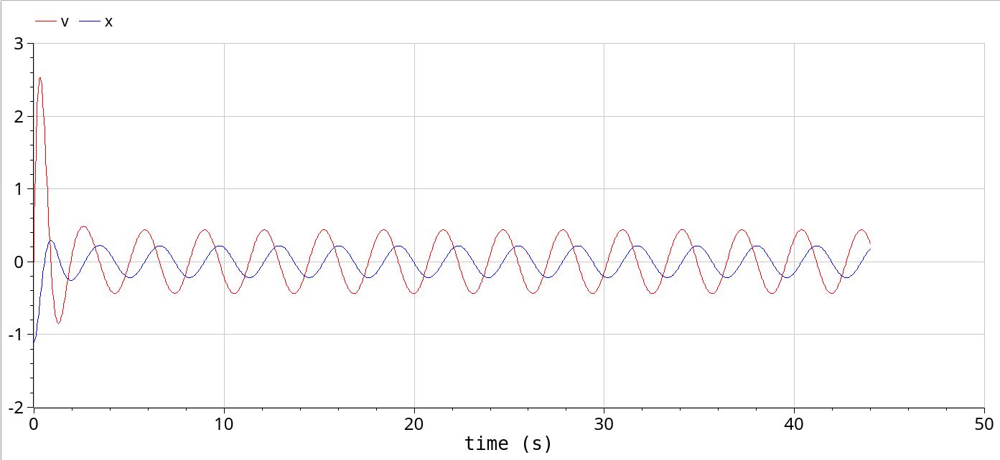{#fig:011 width=70%}

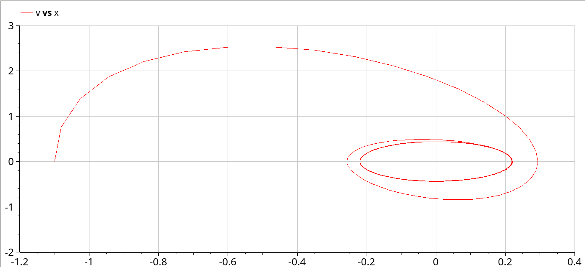{#fig:012 width=70%}

В третьем случае графики, полученные с помощью OpenModelica и Julia все также идентичны.

# Выводы

В процессе выполнения данной лабораторной работы я построила математическую модель гармонического осциллятора.

# Список литературы{.unnumbered}

1. Кулябов Д.С. Руководство к лабораторной работе №4. Математическое моделирование. - 2025. — 4 с.

2. Ландау Л. Д., Лифшиц Е. М. Теоретическая физика. Том 1. Механика. — Москва: Наука, 1973. — 170 с.

3. Иванов И. И. Гармонические колебания в физических системах // Журнал физики. — 2010. — Т. 10, № 2. — С. 12—20.

4. Корн Г. А., Корн Т. М. Справочник по математике для научных работников и инженеров. — Москва: Наука, 1977. — 832 с.

::: {#refs}
:::
