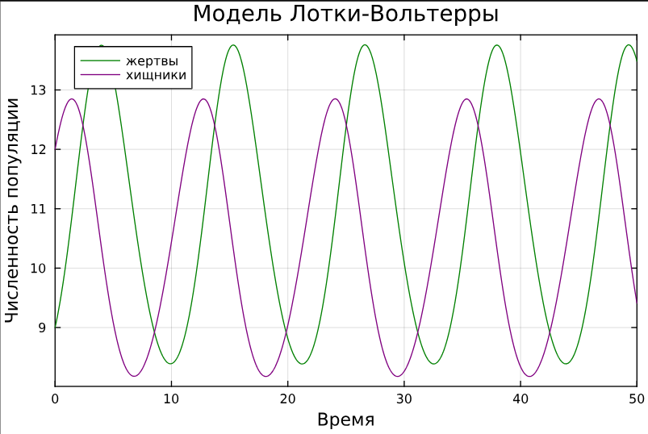
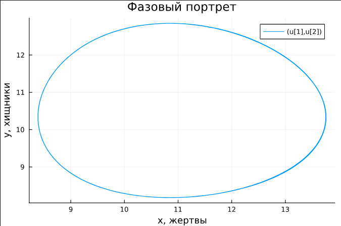
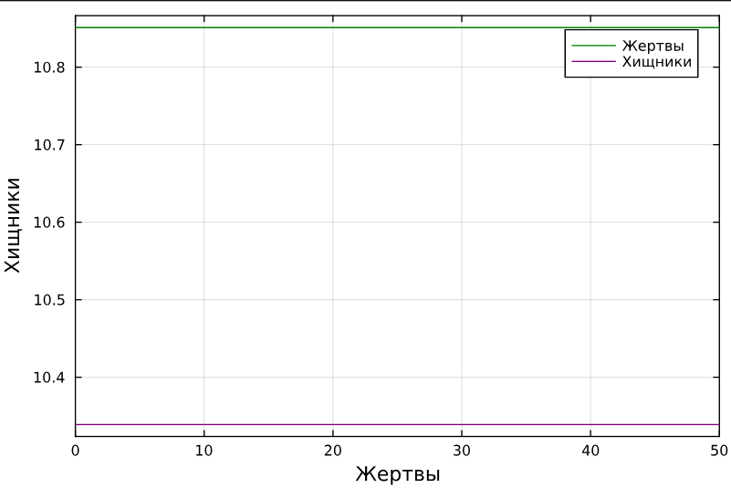
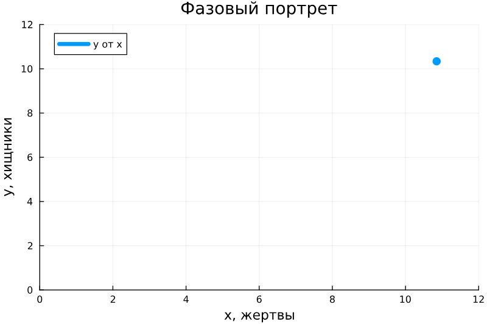
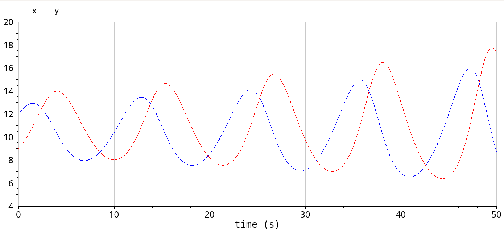
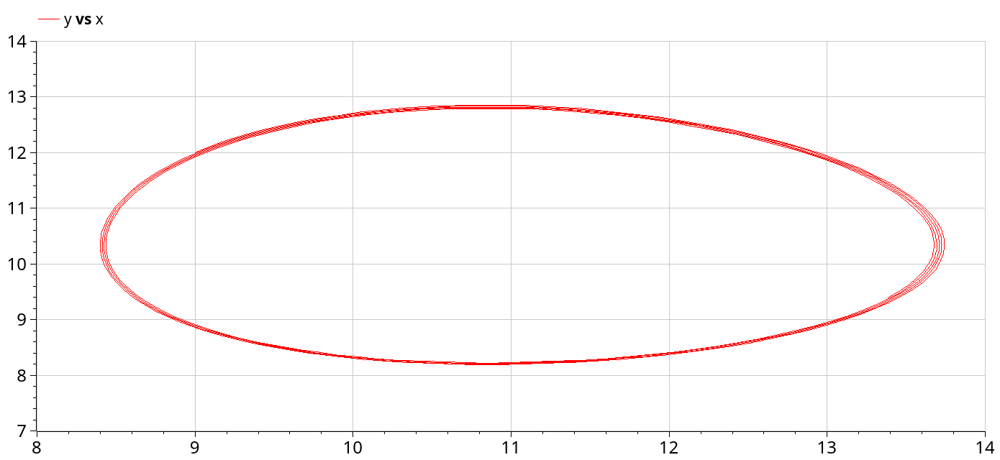
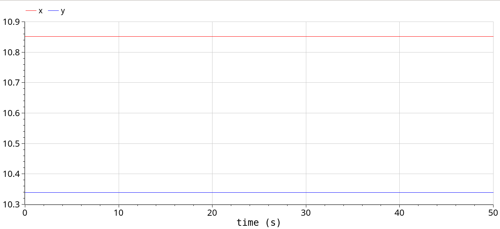
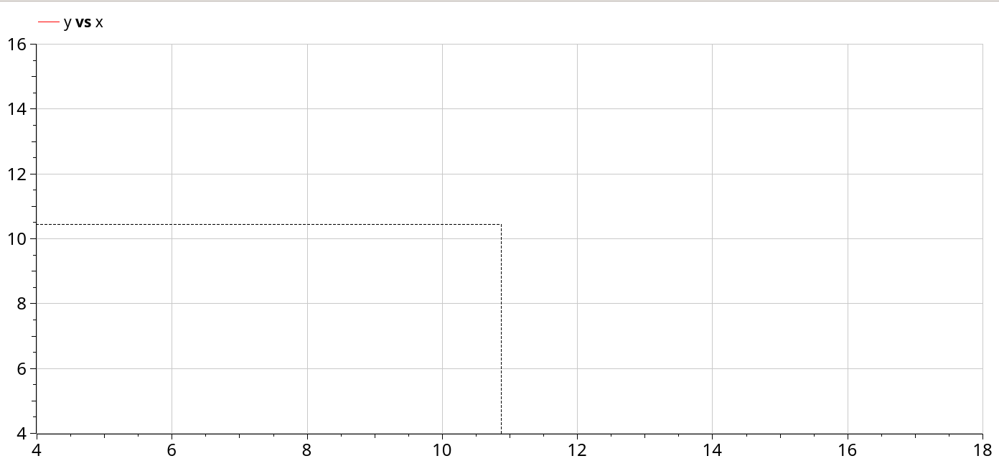

---
## Front matter
lang: ru-RU
title: Презентация по лабораторной работе №5
subtitle: Модель хищник-жертва (Лотки-Вольерры)
author:
  - Ибатулина Д.Э.
institute:
  - Российский университет дружбы народов, Москва, Россия
date: 19 апреля 2025

## i18n babel
babel-lang: russian
babel-otherlangs: english

## Formatting pdf
toc: false
toc-title: Содержание
slide_level: 2
aspectratio: 169
section-titles: true
theme: metropolis
header-includes:
 - \metroset{progressbar=frametitle,sectionpage=progressbar,numbering=fraction}
---

# Информация

## Докладчик

:::::::::::::: {.columns align=center}
::: {.column width="70%"}

  * Ибатулина Дарья Эдуардовна
  * студентка группы НФИбд-01-22
  * Российский университет дружбы народов
  * [1132226434@rudn.ru](mailto:1132226434@rudn.ru)
  * <https://deibatulina.github.io>

:::
::: {.column width="30%"}


:::
::::::::::::::

# Вводная часть

## Объект и предмет исследования

- Модель хищник-жертва
- Язык программирования Julia
- ПО OpenModelica

## Цель работы

Исследовать математическую модель Лотки-Вольерры.

## Задание

Для модели «хищник-жертва»:

$$\begin{cases}
    &\dfrac{dx}{dt} = \alpha x(t) - \beta x(t)y(t) \\
    &\dfrac{dy}{dt} = -\gamma y(t) + \delta x(t)y(t)
\end{cases}$$

Построить график зависимости численности хищников от численности жертв,
а также графики изменения численности хищников и численности жертв при
следующих начальных условиях:
$x_0 = 9, y_0 = 12.$ 
Найти стационарное состояние системы.

# Выполнение лабораторной работы

## Реализация на Julia  

```Julia
# Используемые библиотеки
using DifferentialEquations, Plots;
# задания системы ДУ, описывающей модель Лотки-Вольтерры
function LV(u, p, t)
    x, y = u
    a, b, c, d = p
    dx = a*x - b*x*y
    dy = -c*y + d*x*y
    return [dx, dy]
end
```

## Реализация на Julia 

```Julia
# Начальные условия
u0 = [9, 12]
p = [-0.61, -0.059, -0.51, -0.047]
tspan = (0.0, 50.0)
prob = ODEProblem(LV, u0, tspan, p)
sol = solve(prob, Tsit5())
```

## График изменения численности хищников и численности жертв

\centering
{width=70%}

## Реализация на Julia 

```Julia
# Постановка проблемы и ее решение
plot(sol, title = "Модель Лотки-Вольтерры",
    xaxis = "Время", yaxis = "Численность популяции",
    label = ["жертвы" "хищники"],
    c = ["green" "purple"], box =:on)
plot(sol, vars=(1, 2),
    xlabel="x, жертвы", ylabel="y, хищники", 
    title="Фазовый портрет")
```

## График зависимости численности хищников от численности жертв

\centering
{width=70%}

## Реализация на Julia 

$$\begin{cases}
  &x_0 = \dfrac{\gamma}{\delta}\\
  &y_0 = \dfrac{\alpha}{\beta}
\end{cases}
$$

Получим, что $x_0 = \dfrac{0.51}{0.047}$, а $y_0 = \dfrac{0.61}{0.059}.$

## Реализация на Julia 

```Julia
x_c = p[3]/p[4]
y_c = p[1]/p[2]
u0_c = [x_c, y_c]
prob2 = ODEProblem(LV, u0_c, tspan, p)
sol2 = solve(prob2, Tsit5())
plot(sol2, xaxis = "Жертвы", yaxis = "Хищники",
    label = ["Жертвы" "Хищники"],
    c = ["green" "purple"], box =:on)
```

## График изменения численности хищников и численности жертв в стационарном состоянии

\centering
{width=70%}

## Реализация на Julia

```
plot(sol2, vars=(1, 2), label="y от x", 
    xlabel="x, жертвы", ylabel="y, хищники", 
    title="Фазовый портрет", xlimit = [0,12], 
    ylimit=[0,12], lw=10)
```

## График зависимости численности хищников от численности жертв в стационарном состоянии

\centering
{width=70%}

## Реализация на OpenModelica

```
model lab5_1
  parameter Real a = -0.61;
  parameter Real b = -0.059;
  parameter Real c = -0.51;
  parameter Real d = -0.047;
  parameter Real x0 = 9;
  parameter Real y0 = 12;
  Real x(start=x0);
  Real y(start=y0);
equation
    der(x) = a*x - b*x*y;
    der(y) = -c*y + d*x*y;
end lab5_1;
```

## График изменения численности хищников и численности жертв. OpenModelica

\centering
{width=70%}

## График зависимости численности хищников от численности жертв. OpenModelica

\centering
{width=70%}

## Реализация в OpenModelica

```
model lab5_2
  parameter Real a = -0.61;
  parameter Real b = -0.059;
  parameter Real c = -0.51;
  parameter Real d = -0.047;
  parameter Real x0 = 0.51/0.047;
  parameter Real y0 = 0.61/0.059;
  Real x(start=x0);
  Real y(start=y0);
equation
    der(x) = a*x - b*x*y;
    der(y) = -c*y + d*x*y;
end lab5_2;
```

## График изменения численности хищников и численности жертв в стационарном состоянии. OpenModelica

\centering
{width=70%}

## График зависимости численности хищников от численности жертв в стационарном состоянии. OpenModelica

\centering
{width=70%}

## Выводы

В результате выполнения лабораторной работы я построила математическую модель Лотки-Вольтерры на Julia и в OpenModelica.
