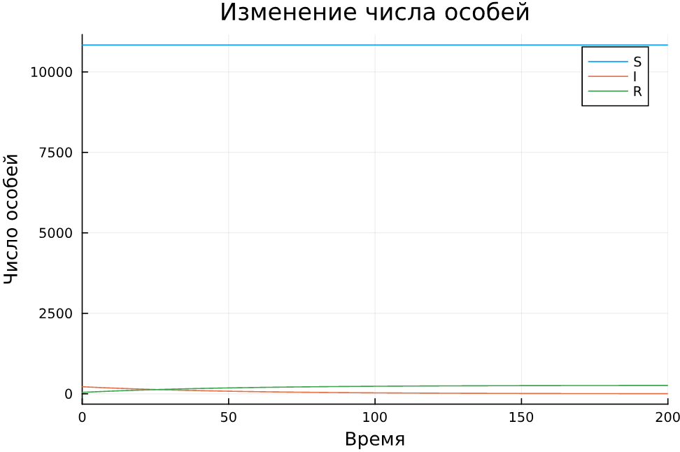
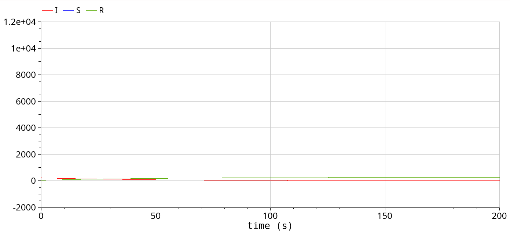
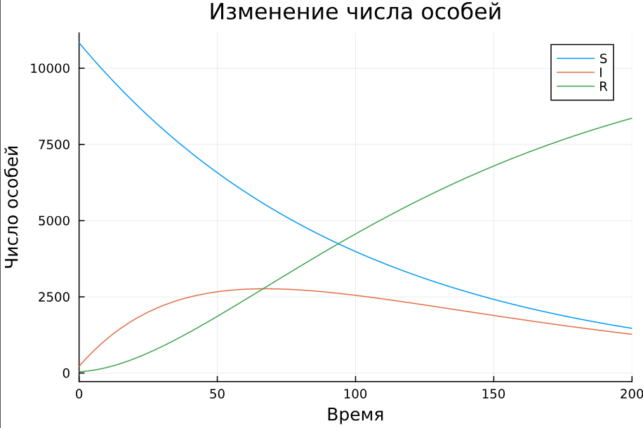
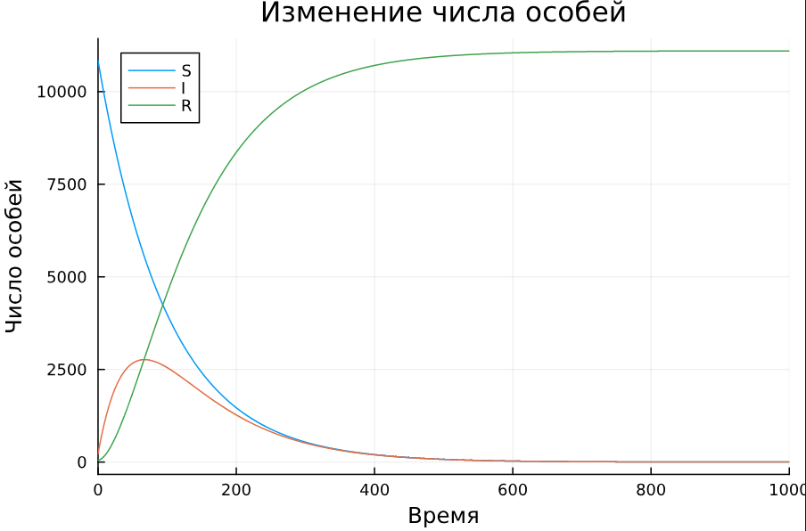
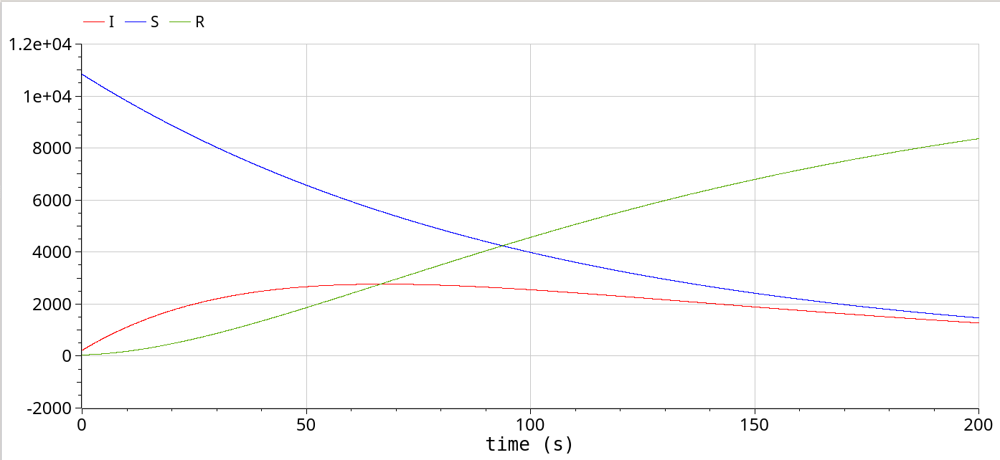

---
## Front matter
lang: ru-RU
title: Презентация по лабораторной работе №6
subtitle: Модель эпидемии SIR
author:
  - Ибатулина Д.Э.
institute:
  - Российский университет дружбы народов, Москва, Россия
date: 3 мая 2025

## i18n babel
babel-lang: russian
babel-otherlangs: english

## Formatting pdf
toc: false
toc-title: Содержание
slide_level: 2
aspectratio: 169
section-titles: true
theme: metropolis
header-includes:
 - \metroset{progressbar=frametitle,sectionpage=progressbar,numbering=fraction}
---

# Информация

## Докладчик

:::::::::::::: {.columns align=center}
::: {.column width="70%"}

  * Ибатулина Дарья Эдуардовна
  * студентка группы НФИбд-01-22
  * Российский университет дружбы народов
  * [1132226434@rudn.ru](mailto:1132226434@rudn.ru)
  * <https://deibatulina.github.io>

:::
::: {.column width="30%"}


:::
::::::::::::::

# Вводная часть

## Объект и предмет исследования

- Модель эпидемии SIR
- Язык программирования Julia
- ПО OpenModelica

## Цель работы

Исследовать модель SIR (задача об эпидемии).

## Задание

На одном острове вспыхнула эпидемия. Известно, что из всех проживающих на острове ($N=11 100$) в момент начала эпидемии ($t=0$) число заболевших людей (являющихся распространителями инфекции) $I(0)=220$, А число здоровых людей с иммунитетом к болезни $R(0)=44$. Таким образом, число людей восприимчивых к болезни, но пока здоровых, в начальный момент времени $S(0) = N - I(0) - R(0) = 10836$.
Постройте графики изменения числа особей в каждой из трех групп.
Рассмотрите, как будет протекать эпидемия в случае:
1) если $I(0)\leq I^*$;
2) если $I(0) > I^*$.

# Теоретическое введение

Компартментальные модели являются очень общим методом моделирования. Они часто применяются к математическому моделированию инфекционных заболеваний. Население распределяется по отделениям с помощью меток – например, S, I, или R, (Susceptible, Infectious, or Recovered). Люди могут делать прогресс между отсеками. Порядок расположения меток обычно показывает структуру потоков между компартментами; например, SEIS означает восприимчивый, подверженный воздействию, инфекционный, затем снова восприимчивый.

# Выполнение лабораторной работы

## Реализация на Julia  (1) 

```Julia
using Plots
using DifferentialEquations
# I0 <= I*
function sir(u,p,t)
    (S,I,R) = u
    (alpha, beta) = p
    N = S+I+R
    dS = 0
    dI = -beta*I
    dR = beta*I
    return [dS, dI, dR]
end
```

## Реализация на Julia (2)

```Julia
N = 11100
I_0 = 220
R_0 = 44
S_0 = N - I_0 - R_0
u0 = [S_0, I_0, R_0]
p = [0.01, 0.02]
tspan = (0.0, 200.0)
prob = ODEProblem(sir, u0, tspan, p)
sol = solve(prob, Tsit5(), saveat = 0.01)
plot(sol, label = ["S" "I" "R"], xlabel = "Время", 
    ylabel = "Число особей", 
    title = "Изменение числа особей")
```

## Динамика изменения числа людей в каждой из трех групп

\centering
{width=70%}

## Реализация на OpenModelica

```OpenModelica
  parameter Real N = 11100;
  parameter Real alpha = 0.01;
  parameter Real beta = 0.02;
  parameter Real I0 = 220;
  parameter Real R0 = 44;
  parameter Real S0 = N-I0-R0;
  Real S(start=S0);
  Real I(start=I0);
  Real R(start=R0);
equation
    der(S) = 0;
    der(I) = -beta*I;
    der(R) = beta*I;
```

## Динамика изменения числа людей в каждой из трех групп

\centering
{width=70%}

## Реализация на Julia (1)

```Julia
function sir_2(u,p,t)
    (S,I,R) = u
    (alpha, beta) = p
    N = S+I+R
    dS = -alpha*S
    dI = alpha*S - beta*I
    dR = beta*I
    return [dS, dI, dR]
end
N = 11100
I_0 = 220
R_0 = 44
```

## Реализация на Julia (2)

```Julia
S_0 = N - I_0 - R_0
u0 = [S_0, I_0, R_0]
p = [0.01, 0.02]
tspan2 = (0.0, 1000.0)
tspan = (0.0, 200.0)
prob2 = ODEProblem(sir_2, u0, tspan, p)
sol2 = solve(prob2, Tsit5(), saveat = 0.01)
plot(sol2, label = ["S" "I" "R"], 
    xlabel = "Время", 
    ylabel = "Число особей", 
    title = "Изменение числа особей")
```

## Динамика изменения числа людей в каждой из трех групп (время до 200)

\centering
{width=70%}

## Динамика изменения числа людей в каждой из трех групп (время до 1000)

\centering
{width=70%}

## Реализация на OpenModelica

```
parameter Real N = 11100;
  parameter Real alpha = 0.01;
  parameter Real beta = 0.02;
  parameter Real I0 = 220;
  parameter Real R0 = 44;
  parameter Real S0 = N-I0-R0;
  Real S(start=S0);
  Real I(start=I0);
  Real R(start=R0);
equation
    der(S) = -alpha*S;
    der(I) = alpha*S - beta*I;
    der(R) = beta*I;
```

## Динамика изменения числа людей в каждой из трех групп

\centering
{width=70%}

## Выводы

В результате выполнения данной лабораторной работы я исследовала модель SIR.
