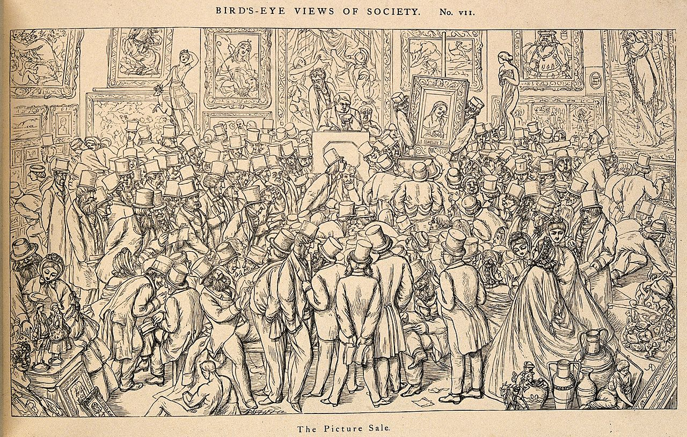
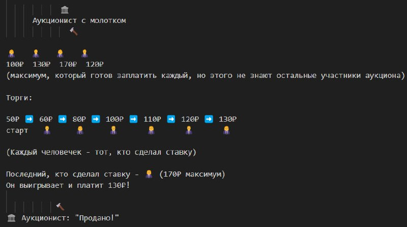
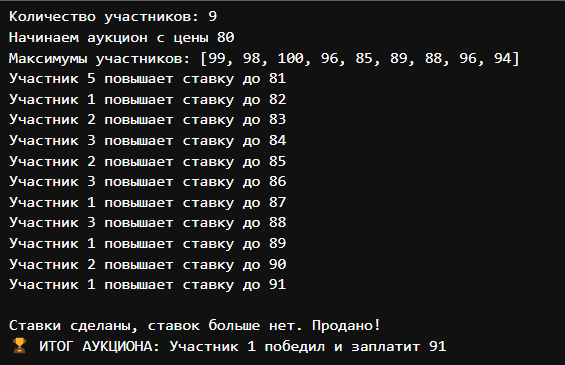

---
## Front matter
lang: ru-RU
title: Аукцион с повышением цены
subtitle: Доклад по предмету "Математическое моделирование"
author:
  - Ибатулина Д.Э.
institute:
  - Российский университет дружбы народов, Москва, Россия
date: 01 мая 2025

## i18n babel
babel-lang: russian
babel-otherlangs: english

## Formatting pdf
toc: false
toc-title: Содержание
slide_level: 2
aspectratio: 169
section-titles: true
theme: metropolis
header-includes:
 - \metroset{progressbar=frametitle,sectionpage=progressbar,numbering=fraction}
---

# Информация

## Докладчик

:::::::::::::: {.columns align=center}
::: {.column width="70%"}

  * Ибатулина Дарья Эдуардовна
  * студентка группы НФИбд-01-22
  * Российский университет дружбы народов
  * [1132226434@rudn.ru](mailto:1132226434@rudn.ru)
  * <https://deibatulina.github.io>

:::
::: {.column width="30%"}


:::
::::::::::::::

# Вводная часть

## Введение

В современном мире аукционы играют важную роль в экономике и торговле, эффективно распределяя ресурсы и определяя рыночную стоимость. Особое значение имеет аукцион с повышением цены (английский аукцион), где участники последовательно повышают ставки, конкурируя за лот. Математическое моделирование помогает понять стратегии участников, оптимизировать торги и прогнозировать результаты.

## Актуальность

Сферы применения: от торговли искусством и антиквариатом до государственных контрактов, лицензий, электронной коммерции и IT.

* обеспечивает прозрачность и динамичное ценообразование;

* понимание математических закономерностей и стратегий поведения участников помогает минимизировать риски и повысить эффективность как для продавцов, так и для покупателей;

* имеет прикладное значение для разработки автоматизированных торговых платформ и систем электронных закупок.

## Объект и предмет исследования

**Объект исследования:** аукцион с повышением цены как вероятностно-стратегическая система. 

**Основные компоненты модели:**

* Участники - игроки, обладающие индивидуальными частными оценками стоимости лота;

* Правила торгов - механизм последовательного повышения ставок и выхода из торгов;

* Стратегии поведения - алгоритмы принятия решений о повышении ставки или выходе из аукциона

## Цель

Ознакомиться с принципом проведения классического английского аукциона, построить его математическую модель. 

## Научная новизна

1. Анализ классического аукциона с повышением цены (английского аукциона).

2. Формальная модель, отражающая динамику торгов.

3. Стратегии поведения участников аукциона, демонстрирующие, как меняются ставки и принимаются решения участниками в реальном времени.

4. Применение модели для разработки автоматизированных торговых платформ и систем электронных закупок.

5. Предложен программный код на языке Julia для имитации процесса аукциона с повышением цены.

## Практическая значимость

Практическая ценность исследования проявляется в:

- Разработке эффективных стратегий для участников аукционов;

- Повышении качества аукционных механизмов;

- Применении в экономике и финансах для оценки активов, прогнозирования цен и анализа конкурентного поведения;

- Внедрении в IT-системы.

## Исторический обзор

История аукционов насчитывает тысячи лет, начиная с Древнего Рима, где их использовали для продажи имущества должников. Теория аукционов сформировалась в XX веке благодаря работам Викри, Майерсона и Крамтона.

\centering
{width=60%}

# Основная часть

## Общее описание модели

\centering
{width=80%}

## Основные этапы

1. Объявление стартовой цены;

2. Последовательное повышение ставок участниками;

3. Завершение торгов при отсутствии новых ставок;

4. Определение победителя и цены

## Ключевые параметры

- Минимальный шаг повышения ставки;

- Порядок торгов (фиксированный или свободный);

- Правила выхода из торгов.

## Ключевые характеристики

* Открытость процесса;

* Прозрачность правил;

* Рациональная стратегия.

## Схемы стратегий для нескольких участников в аукционе с повышением цены (1)

**1. Стратегия "Честная игра" (доминирующая)**

Описание: Участник повышает ставку до своей истинной оценки товара

Формула: $s_i = \min{p + \Delta p, v_i}$, где $v_i$ - оценка участника

Пример: Участник с оценкой 100₽ будет повышать ставку до 100₽ и не более

## Схемы стратегий для нескольких участников в аукционе с повышением цены (2)

**2. Стратегия "Выжидание"**

Описание: Участник ждет до последнего момента, затем делает ставку

Применение: Эффективна при неопределенности оценок других участников

Риск: Можно не успеть сделать ставку, если аукцион завершится неожиданно

## Схемы стратегий для нескольких участников в аукционе с повышением цены (3)

**3. Стратегия "Агрессивные ставки"**

Описание: Быстрое повышение ставки большими шагами

Цель: Психологическое давление на других участников

Недостаток: Не меняет итоговый результат при рациональном поведении других.

## Математическая модель

Пусть в аукционе участвуют $n$ игроков с частными оценками $v_i$, $i=1,...,n$.

## Наиболее рациональная стратегия

Рациональная стратегия каждого участника - повышать ставку до своей оценки, но не выше: $s_i = \max \{\, p \mid p \leq v_i \,\}$

где $s_i$ - максимальная ставка участника $i$, $v_i$ - его оценка (то есть, максимальная цена, которую он готов заплатить за товар).

## Правила выигрыша

Побеждает участник с максимальной ставкой: $i^* = \arg\max_{i} s_i$

Цена, которую платит победитель, равна его ставке: $p = s_{i^*}$

## Функция выигрыша участника $i$$

$$
U_i =
\begin{cases}
v_i - p, & \text{если } i = i^* \\
0, & \text{иначе}
\end{cases}
$$

## Иллюстрация процесса аукциона

$$
\underbrace{
\begin{cases}
\text{Стартовая цена } p_0 \\
\text{Участники по очереди повышают цену: } p_k = p_{k-1} + \Delta p \\
\text{Выход из торгов, если } p_k > v_i \\
\text{Аукцион завершается, когда никто не повышает ставку}
\end{cases}
}_{\text{Аукцион с повышением цены}}
$$

## Пример

Стартовая цена - 50.

1. Участник А говорит: 60.

2. Участник B - 70.

3. Участник C - 80.

4. Участник B - 90.

5. Участник A - 100.

Никто больше не хочет повышать.

Побеждает участник A, он платит 100.

## Код на Julia (1)

```Julia
using Random

function ascending_price_auction()
    # Случайное количество участников
    num_bidders = rand(3:9)
    # Инициализация ставок участников (все начинают с 0)
    bids = zeros(Int, num_bidders)
    
    # Начальная цена
    current_price = 80
    # Фиксированный шаг повышения цены
    step = 1
```

## Код на Julia (2)
    
```Julia
    # Индекс участника, сделавшего последнюю ставку (0 - никто)
    last_bidder = 0
    println("Количество участников: $num_bidders")
    println("Начинаем аукцион с цены $current_price")
    # Для простоты: каждому участнику задаём максимум,
    # до которого он готов торговаться
    max_limits = [current_price + rand(5:20) for _ in 1:num_bidders]
    println("Максимумы участников: ", max_limits)
    # Флаг, показывающий, был ли сделан ход в текущем раунде
    bid_made = true
```

## Код на Julia (3)

```Julia
    while bid_made
        bid_made = false
        # Проходим по всем участникам по очереди
        for i in 1:num_bidders
            # Участник не может делать ставку,
            # если он был последним, кто повысил цену
            if i == last_bidder
                continue
            end
            willing_to_pay = current_price + step
```

## Код на Julia (4)
    
```Julia 
    # Если участник готов повысить цену и случайно решает это
    # сделать
            if willing_to_pay <= max_limits[i] && rand() < 0.5
                current_price += step
                bids[i] = current_price
                last_bidder = i
                bid_made = true
                println("Участник $i повышает ставку до $current_price")
                break 
                # После успешной ставки сразу переходим к следующему раунду
            end
        end
    end
```

## Код на Julia (5)

```Julia
if last_bidder == 0
        println("Никто не сделал ставку. Аукцион не состоялся.")
        return nothing
    else
        println("\nСтавки сделаны, ставок больше нет. Продано!")
        println("ИТОГ АУКЦИОНА: Участник $last_bidder
        победил и заплатит $current_price")
    end
end

# Запуск аукциона
ascending_price_auction()
```

## Результат запуска модели

\centering
{width=70%}

## Применение модели

* Рынки произведений искусства и антиквариата:
* Традиционно английский аукцион используется для продажи уникальных предметов, где важна прозрачность и возможность участников последовательно повышать ставки, выявляя истинную ценность лота.

* Искусство и антиквариат: продажа уникальных лотов с прозрачным повышением ставок (например, Sotheby’s, Christie’s).

* Государственные закупки: выбор поставщиков через конкуренцию, снижение коррупции.

* Онлайн-аукционы: реальное время, автоматическое повышение ставок (eBay).

* Распределение лицензий и квот: эффективное использование ресурсов в энергетике, телекомах.

* Финансовые рынки: оценка активов, анализ поведения инвесторов.

* Коммерческие переговоры: последовательное улучшение условий сделки.

## Аукцион Christie’s

\centering
{width=80%}

# Заключительная часть

## Выводы

Модель аукциона с повышением цены - универсальный инструмент для эффективного распределения ресурсов и выявления рыночной стоимости.

- Применяется в экономике, финансах, госзакупках, IT и социальных науках.
- Простота и открытость правил обеспечивают удобство массового использования и автоматизации.
- Математическое моделирование помогает анализировать стратегии участников и создавать новые форматы торгов для цифровых рынков.

*Таким образом, аукционы с повышением цены остаются важным и развивающимся инструментом для практики и исследований.*

## Список литературы

1. Аукцион [Электронный ресурс]. 2024. URL: https://ru.wikipedia.org/wiki/%D
0%90%D1%83%D0%BA%D1%86%D0%B8%D0%BE%D0%BD.
2. Auction [Электронный ресурс]. 2024. URL: https://en.wikipedia.org/wiki/Auct
ion.
3. Krishna V. Auction Theory. 2nd изд. Academic Press, 2010.
4. Klemperer P. Auctions: Theory and Practice. Princeton University Press, 2004.
5. Milgrom P.R., Weber R.J. A Theory of Auctions and Competitive Bidding //
Econometrica. 1982. Т. 50, № 5. С. 1089–1122.
6. Myerson R.B. Optimal Auction Design // Mathematics of Operations Research.
INFORMS, 1981. Т. 6. С. 58–73.
