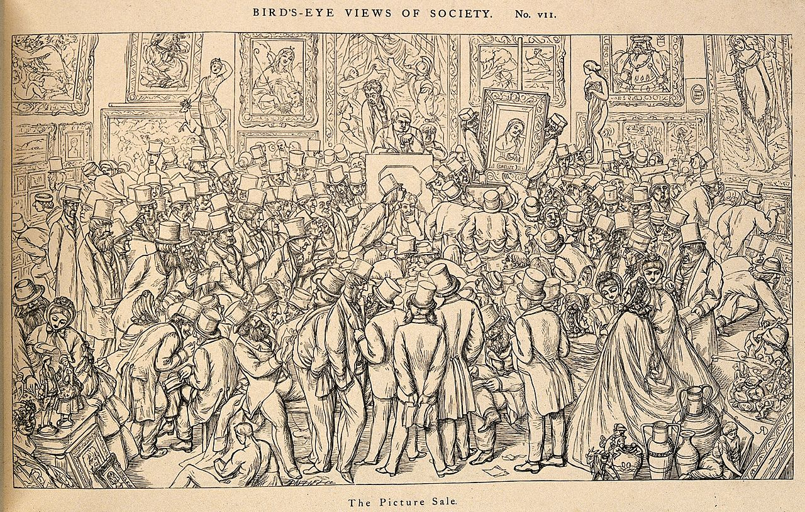
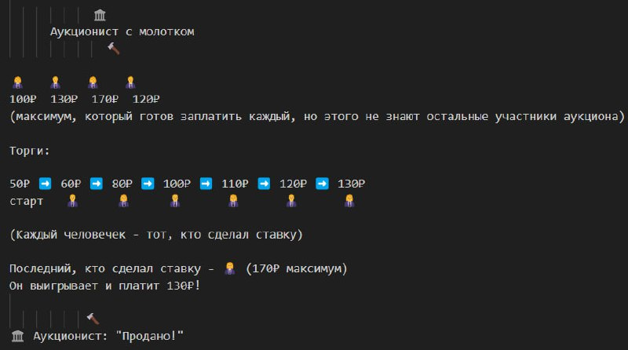
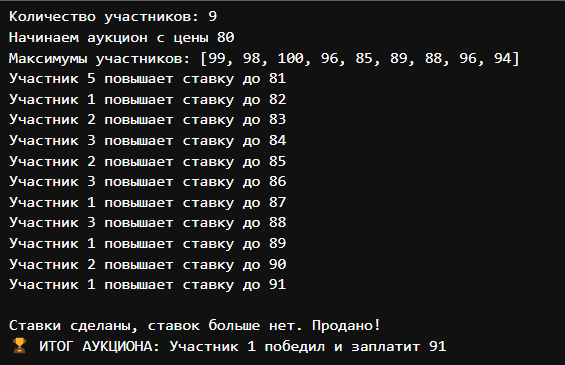

---
## Front matter
title: "Аукцион с повышением цены"
subtitle: "Математическое моделирование"
author: "Ибатулина Дарья Эдуардовна, НФИбд-01-22"

## Generic otions
lang: ru-RU
toc-title: "Содержание"

## Bibliography
bibliography: bib/cite.bib
csl: pandoc/csl/gost-r-7-0-5-2008-numeric.csl

## Pdf output format
toc: true # Table of contents
toc-depth: 2
lof: true # List of figures
lot: false # List of tables
fontsize: 12pt
linestretch: 1.5
papersize: a4
documentclass: scrreprt
## I18n polyglossia
polyglossia-lang:
  name: russian
  options:
	- spelling=modern
	- babelshorthands=true
polyglossia-otherlangs:
  name: english
## I18n babel
babel-lang: russian
babel-otherlangs: english
## Fonts
mainfont: PT Serif
romanfont: PT Serif
sansfont: PT Sans
monofont: PT Mono
mainfontoptions: Ligatures=TeX
romanfontoptions: Ligatures=TeX
sansfontoptions: Ligatures=TeX,Scale=MatchLowercase
monofontoptions: Scale=MatchLowercase,Scale=0.9
## Biblatex
biblatex: true
biblio-style: "gost-numeric"
biblatexoptions:
  - parentracker=true
  - backend=biber
  - hyperref=auto
  - language=auto
  - autolang=other*
  - citestyle=gost-numeric
## Pandoc-crossref LaTeX customization
figureTitle: "Рис."
tableTitle: "Таблица"
listingTitle: "Листинг"
lofTitle: "Список иллюстраций"
lotTitle: "Список таблиц"
lolTitle: "Листинги"
## Misc options
indent: true
header-includes:
  - \usepackage{indentfirst}
  - \usepackage{float} # keep figures where there are in the text
  - \floatplacement{figure}{H} # keep figures where there are in the text
---

# Введение

В современном мире аукционы занимают важное место в экономике и торговле, являясь эффективным механизмом распределения ресурсов и определения рыночной стоимости товаров и услуг. Среди различных форматов аукционов особое внимание заслуживает аукцион с повышением цены (английский аукцион), при котором участники последовательно предлагают всё более высокие ставки, конкурируя за право приобрести лот. Математическое моделирование данного процесса позволяет понять стратегические особенности поведения участников, выявить условия эффективности и оптимизации торгов, а также предсказать итоговые результаты в различных условиях [@1].

## Актуальность

Аукционы с повышением цены широко используются в самых разных сферах: от классических торгов произведениями искусства и антиквариатом до распределения государственных контрактов и лицензий, а также в электронной коммерции и IT-рынках.

Во-первых, данный формат аукциона обеспечивает прозрачность и динамичное ценообразование, что способствует выявлению истинной рыночной стоимости лота.

Во-вторых, понимание математических закономерностей и стратегий поведения участников помогает минимизировать риски и повысить эффективность как для продавцов, так и для покупателей.

В-третьих, моделирование аукционов с повышением цены имеет прикладное значение для разработки автоматизированных торговых платформ и систем электронных закупок, что делает эту тему особенно актуальной в эпоху цифровизации [@2].

## Объект исследования

Объектом исследования является аукцион с повышением цены как вероятностно-стратегическая система, в которой множество участников с разными оценками стоимости лота взаимодействуют в условиях конкуренции и ограниченной информации (каждый участник знает только свою оценку лота и видит текущие ставки, но не знает истинных оценок, стратегий и мотиваций других игроков).

Основные компоненты модели:

* Участники - игроки, обладающие индивидуальными частными оценками стоимости лота;

* Правила торгов - механизм последовательного повышения ставок и выхода из торгов;

* Стратегии поведения - алгоритмы принятия решений о повышении ставки или выходе из аукциона [@3].

## Научная новизна

Данная работа вносит вклад в понимание аукционов с повышением цены, объединяя подходы теории вероятностей и теории игр. В частности:

1. Проведен анализ классического аукциона с повышением цены (английского аукциона) с точки зрения математического моделирования и стратегий поведения участников.

2. Разработана формальная модель, отражающая динамику торгов.

3. Представлены различные стратегии поведения участников аукциона, демонстрирующие, как меняются ставки и принимаются решения участниками в реальном времени.

4. Рассмотрены практические аспекты применения модели для разработки автоматизированных торговых платформ и систем электронных закупок, что актуально в условиях цифровизации экономики.

5. Предложен программный код на языке Julia для имитации процесса аукциона с повышением цены, что обеспечивает инструмент для дальнейших исследований и оптимизации торгов [@1].

## Практическая значимость

Практическая ценность исследования проявляется в:

- Разработке эффективных стратегий для участников аукционов, позволяющих оптимизировать ставки и минимизировать переплату;

- Повышении качества аукционных механизмов, что способствует увеличению выручки продавцов и справедливому распределению ресурсов;

- Применении в экономике и финансах для оценки активов, прогнозирования цен и анализа конкурентного поведения;

- Внедрении в IT-системы - создание алгоритмов для онлайн-платформ и автоматизированных торговых систем.

# Исторический обзор

История аукционов насчитывает тысячи лет. Первые упоминания о подобных механизмах встречаются в Древнем Риме, где аукционы использовались для продажи имущества должников. В современном мире аукционы с повышением цены получили широкое распространение благодаря своей прозрачности и простоте правил. Современная теория аукционов сформировалась в XX веке благодаря работам таких учёных, как Уильям Викри, Роджер Майерсон и Пол Крамтон [@4]. Английский аукцион, или аукцион с повышением цены, является одним из наиболее интуитивных и широко применяемых форматов, где участники открыто конкурируют, последовательно повышая ставки до тех пор, пока не останется единственный победитель (рис. @fig:001).

{#fig:001 width=80%}

# Общее описание модели

Аукцион с повышением цены (английский аукцион, ascending price auction) - это разновидность открытого аукциона, в котором несколько участников поочередно делают ставки, постепенно увеличивая цену лота. Торги продолжаются до тех пор, пока никто из участников не захочет повысить текущую ставку. Победителем становится тот, кто предложил наибольшую цену, и именно эту сумму он выплачивает за лот [@1] (рис. @fig:002).

{#fig:002 width=80%}

## Основные этапы

1. Объявление стартовой цены;

2. Последовательное повышение ставок участниками;

3. Завершение торгов при отсутствии новых ставок;

4. Определение победителя и цены [@5].

## Ключевые параметры

- Минимальный шаг повышения ставки;

- Порядок торгов (фиксированный или свободный);

- Правила выхода из торгов.

## Ключевые характеристики

* Открытость процесса: Все ставки видны участникам, что позволяет корректировать свои действия в зависимости от поведения конкурентов.

* Прозрачность правил: Побеждает тот, кто предложил максимальную цену, и платит именно её.

* Рациональная стратегия: Каждый участник имеет смысл повышать цену только до значения, которое он действительно готов заплатить за выставленный товар.

## В чём проявляется ограниченность информации

В аукционе с повышением цены участники знают только свои собственные оценки стоимости лота и видят текущие ставки, но не знают, каковы истинные пределы и мотивация других игроков, сколько каждый готов предложить. Это создаёт условия для вероятностного и стратегического поведения, когда каждый участник должен принимать решения на основе неполной информации о конкурентах [@6].

## Схемы стратегий для нескольких участников в аукционе с повышением цены

*Основные стратегии участников:*

**1. Стратегия "Честная игра" (доминирующая)**

Описание: Участник повышает ставку до своей истинной оценки товара

Формула: $s_i = \min{p + \Delta p, v_i}$, где $v_i$ - оценка участника

Пример: Участник с оценкой 100₽ будет повышать ставку до 100₽ и не более

**2. Стратегия "Выжидание"**

Описание: Участник ждет до последнего момента, затем делает ставку

Применение: Эффективна при неопределенности оценок других участников

Риск: Можно не успеть сделать ставку, если аукцион завершится неожиданно

**3. Стратегия "Агрессивные ставки"**

Описание: Быстрое повышение ставки большими шагами

Цель: Психологическое давление на других участников

Недостаток: Не меняет итоговый результат при рациональном поведении других.
  
## Математическая модель

Пусть в аукционе участвуют $n$ игроков с частными оценками $v_i$, $i=1,...,n$. Эти оценки независимы и распределены по известным законам [@3].

## Стратегия участников

Рациональная стратегия каждого участника - повышать ставку до своей оценки, но не выше: $s_i = \max \{\, p \mid p \leq v_i \,\}$

где $s_i$ - максимальная ставка участника $i$, $v_i$ - его оценка (то есть, максимальная цена, которую он готов заплатить за товар) [@3].

## Правила выигрыша

Побеждает участник с максимальной ставкой: $i^* = \arg\max_{i} s_i$

Цена, которую платит победитель, равна его ставке: $p = s_{i^*}$

## Функция выигрыша участника $i$

$$
U_i =
\begin{cases}
v_i - p & \text{если } i = i^* \\
0 & \text{иначе}
\end{cases}
$$

## Иллюстрация процесса аукциона

$$
\underbrace{
\begin{cases}
\text{Стартовая цена } p_0 \\
\text{Участники по очереди повышают цену: } p_k = p_{k-1} + \Delta p \\
\text{Выход из торгов, если } p_k > v_i \\
\text{Аукцион завершается, когда никто не повышает ставку}
\end{cases}
}_{\text{Аукцион с повышением цены}}
$$

[@5;@6]

## Пример

Стартовая цена - 50.

1. Участник А говорит: 60.

2. Участник B - 70.

3. Участник C - 80.

4. Участник B - 90.

5. Участник A - 100.

Никто больше не хочет повышать.

Побеждает участник A, он платит 100.

## Имитационное моделирование

```Julia
using Random

function ascending_price_auction()
    # Случайное количество участников
    num_bidders = rand(3:9)
    # Инициализация ставок участников (все начинают с 0)
    bids = zeros(Int, num_bidders)
    
    # Начальная цена
    current_price = 80
    # Фиксированный шаг повышения цены
    step = 1
    
    # Индекс участника, сделавшего последнюю ставку (0 - никто)
    last_bidder = 0
    
    println("Количество участников: $num_bidders")
    println("Начинаем аукцион с цены $current_price")
    
    # Для простоты: каждому участнику задаём максимум,
    # до которого он готов торговаться
    max_limits = [current_price + rand(5:20) for _ in 1:num_bidders]
    println("Максимумы участников: ", max_limits)
    
    # Флаг, показывающий, был ли сделан ход в текущем раунде
    bid_made = true
    
    while bid_made
        bid_made = false
        # Проходим по всем участникам по очереди
        for i in 1:num_bidders
            # Участник не может делать ставку,
            # если он был последним, кто повысил цену
            if i == last_bidder
                continue
            end
            willing_to_pay = current_price + step
            # Если участник готов повысить цену и случайно решает это сделать
            if willing_to_pay <= max_limits[i] && rand() < 0.5
                current_price += step
                bids[i] = current_price
                last_bidder = i
                bid_made = true
                println("Участник $i повышает ставку до $current_price")
                break  # После успешной ставки
                # сразу переходим к следующему раунду
            end
        end
    end
    
    if last_bidder == 0
        println("Никто не сделал ставку. Аукцион не состоялся.")
        return nothing
    else
        println("\nСтавки сделаны, ставок больше нет. Продано!")
        println("ИТОГ АУКЦИОНА:
        Участник $last_bidder победил и заплатит $current_price")
    end
end

# Запуск аукциона
ascending_price_auction()
```

Результат запуска кода можем увидеть на (рис. @fig:003).

{#fig:003 width=80%}

## Применение модели

Аукцион с повышением цены - это универсальный и широко применяемый механизм торгов, который находит своё отражение во множестве практических областей. Ниже перечислены ключевые сферы, где модель английского аукциона помогает описывать и анализировать реальные процессы.

- Рынки произведений искусства и антиквариата:
* Традиционно английский аукцион используется для продажи уникальных предметов, где важна прозрачность и возможность участников последовательно повышать ставки, выявляя истинную ценность лота [@4].

**Пример:** аукционы Sotheby’s и Christie’s (рис. @fig:004).

{#fig:004 width=80%}

- Государственные и муниципальные закупки:
* Модель применяется для выбора поставщиков, когда заказчик выставляет контракт на торги, а участники повышают свои предложения по цене или условиям.
* Позволяет обеспечить конкуренцию и справедливое ценообразование, минимизируя коррупционные риски.

**Пример применения: государственные закупки**

В контрактной системе государственных и муниципальных закупок аукцион с повышением цены позволяет организовать честную конкуренцию между поставщиками. Заказчик устанавливает начальную цену, а участники поочерёдно предлагают более выгодные условия (например, снижение цены). Торги завершаются, когда никто не готов предложить лучшее условие. Итоговый контракт подписывается с победителем, предложившим наиболее выгодные параметры [@6].

- Онлайн-платформы и электронная коммерция:
* Многие интернет-аукционы (например, eBay) используют формат с повышением цены, позволяющий пользователям в реальном времени конкурировать за товары.
* Модель помогает оптимизировать алгоритмы автоматического повышения ставок (proxy bidding).
* Распределение лицензий и квот
* В телекоммуникациях, энергетике и других отраслях аукционы с повышением цены применяются для распределения ограниченных ресурсов (частоты, права на добычу и т.п.).
* Обеспечивают эффективное использование ресурсов и максимизацию дохода государства.

**Пример применения: онлайн-аукционы**
На платформах типа eBay модель реализуется через интерфейс, где пользователи видят текущую максимальную ставку и могут повысить её. Система может автоматически повышать ставки до заранее установленного максимума (proxy bidding), что экономит время и снижает риск пропуска выгодной ставки [@5].

- Финансовые рынки и торговля активами:
* Используются для оценки стоимости уникальных активов и ценных бумаг, когда участники конкурируют, повышая цену до уровня, отражающего реальную ценность.
* Модель помогает анализировать динамику цен и поведение инвесторов.

- Коммерческие переговоры и сделки:
* Формат аукциона с повышением цены применяется в переговорах, где стороны последовательно улучшают условия сделки, стремясь достичь оптимального результата [@2].

# Заключение

Модель аукциона с повышением цены - это универсальный и гибкий инструмент для эффективного распределения ресурсов, выявления рыночной стоимости и организации честной конкуренции.

* Она применяется в экономике, финансах, госзакупках, IT и социальных исследованиях.

* Открытость и простота правил делают английский аукцион удобным для массового использования и автоматизации.

* Математическое моделирование аукционов позволяет анализировать и оптимизировать стратегии участников, а также проектировать новые форматы торгов для современных цифровых рынков.

*Таким образом, аукционы с повышением цены остаются востребованным и развивающимся инструментом для решения практических и исследовательских задач в самых разных областях.*

# Список литературы{.unnumbered}

::: {#refs}
:::
