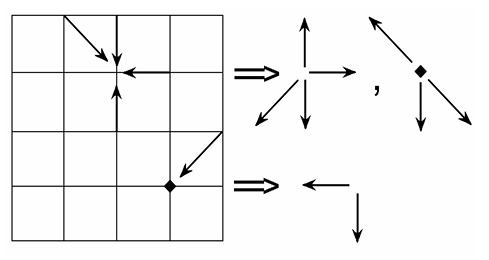

---
## Front matter
lang: ru-RU
title: Решеточные газы, решеточное уравнение Больцмана
subtitle: Групповой проект. Этап 1
author:
  - Абакумова О.М.,
  - Астраханцева А.А.,
  - Ганина Т.С.,
  - Ибатулина Д.Э.
institute:
  - Российский университет дружбы народов, Москва, Россия
date: 21 марта 2025

## i18n babel
babel-lang: russian
babel-otherlangs: english

## Formatting pdf
toc: false
toc-title: Содержание
slide_level: 2
aspectratio: 169
section-titles: true
theme: metropolis
header-includes:
 - \metroset{progressbar=frametitle,sectionpage=progressbar,numbering=fraction}
---

# Вводная часть

## Состав исследовательской команды

Студенты группы НФИбд-01/02-22:

- Абакумова Олеся Максимовна
- Астраханцева Анастасия Александровна
- Ганина Таисия Сергеевна
- Ибатулина Дарья Эдуардовна

## Постановка проблемы

Моделирование газовых потоков и жидкостей традиционными методами, такими как уравнения Навье-Стокса, требует значительных вычислительных ресурсов. 

Методы LGA и LBE предлагают альтернативу, упрощая вычисления при сохранении физической достоверности.

## Актуальность

1.  Исследования сложных многокомпонентных течений.
2.  Течений с фазовыми переходами и химическими реакциями.
3.  Создания высокопроизводительных параллельных алгоритмов.

## Объект и предмет исследования

- физические процессы в газах и жидкостях
- использование решеточных методов (LGA и LBE) для описания динамики частиц на дискретной сетке

## Цели и задачи

**Цель работы**

Разработать и проанализировать модель на основе решеточного уравнения Больцмана для описания течений газа.

1. **Формулировка научной проблемы**
2. **Теоретическое описание задачи**
3. **Описание модели**

# Основная часть

## Решеточные газы (LGA)

:::::::::::::: {.columns align=center}
::: {.column width="60%"}

  Квадратная решетка, в узлах - частицы единичной массы.
  Расстояние между узлами $\Delta x$ и шаг по времени $\Delta t$ принимаются за единицу.
  В каждом узле - не более одной частицы с данным направлением скорости.

:::
::: {.column width="40%"}

:::
::::::::::::::

## Модель HPP (Hardy–Pomeau–Pazzis)

\centering
*   Используется квадратная решетка.
*   Частицы двигаются в соседние узлы.
*   Соударения происходят с сохранением количества частиц и их полного импульса.
*   Нетривиальные соударения: скорости частиц поворачиваются на 90 градусов.

{width=70%}

## Кодирование состояний в HPP

*   Наличие частицы с направлением скорости кодируется битом (0 — нет, 1 — есть).
*   Состояние каждого узла записывается в четырех битах.
*   Примеры операций:
    *   Добавление к состоянию S частицы с направлением скорости $d_k$:  
        $S \text{ or } d_k \rightarrow S$
    *   Проверка наличия в S частицы с направлением скорости $d_k$:  
        $\text{if } (S \text{ and } d_k) \neq 0$
*   Операции сводятся к целочисленной арифметике: высокая скорость, отсутствие ошибок.

## Модели FHP-I, FHP-III

:::::::::::::: {.columns align=center}
::: {.column width="35%"}

*   **FHP-I**: Используется треугольная сетка с 6 направлениями скорости.
    * Обладает большей симметрией по сравнению с моделью HPP.
*   **FHP-III**: Включает в себя покоящиеся частицы.

:::
::: {.column width="65%"}

:::
::::::::::::::

## Квадратная решетка с движением по диагоналям (1)

:::::::::::::: {.columns align=center}
::: {.column width="35%"}

*   Движение по диагоналям (скорость $\sqrt{2}$).
*   9 направлений скорости.
*   Возможен ЗСЭ, можно ввести температуру.
*   Параметры:
    -   Число покоящихся частиц: $n_0$
    -   Число частиц с единичной скоростью: $n_1$
    -   Число частиц со скоростью $\sqrt{2}$: $n_2$
    
:::
::: {.column width="65%"}

:::
::::::::::::::

## Квадратная решетка с движением по диагоналям (2)

Плотность: $\rho = n_0 + n_1 + n_2$  
Полная энергия: $E = P + \frac{\rho u^2}{2} = \sum_i n_i v_i^2 / 2 = n_1/2 + n_2$ (где $P$ — давление)  
Температура: $T = \frac{P}{\rho}$

## Решеточное уравнение Больцмана (LBE)

Метод LBE позволяет устранить статистический шум, возникающий из-за случайности в модели LGA.
Эволюция системы описывается уравнением Больцмана:

$f_k(x + c_k \Delta t, t + \Delta t) = f_k(x, t) + \Omega_k(x, t)$, где:

*   $f_k$ — одночастичная функция распределения.
*   $c_k$ — скорость частиц.
*   $\Omega_k$ — столкновительный член.

## Условие и параметры

1. Скорости частиц $c_k$ должны удовлетворять условию $c_k \Delta t = e_k$, где $e_k$ — векторы, соединяющие узел с соседними. Обычно принимается $\Delta t = 1$.
2. Макроскопические параметры:
    * Плотность: $\rho = \sum_k f_k$
    * Скорость: $\rho u = \sum_k f_k c_k$
3. Столкновительный член:
    * $\Omega_k = \frac{1}{\tau} (f_k^{eq} - f_k)$, где $f_k^{eq}$ — равновесные функции распределения.

## Преимущества LBE

* Хорошо описывает течения вязкой жидкости в пределе малых скоростей (число Маха $M = u / c_s \ll 1$).
* Время релаксации $\tau$ определяет кинематическую вязкость $\nu = (\tau - 1/2) c_s^2 \Delta t$.
* На твердых границах можно просто разворачивать скорости прилетевших частиц, моделируя непроницаемые стенки без проскальзывания.

## Явный вид функций $f_k^{eq}$

Обычно равновесные функции распределения выбираются в максвелловском виде:

$f_k^{eq} \sim \exp(-(c_k - u)^2 / 2\theta)$.

В изотермических моделях достаточно разложить экспоненту в ряд с точностью до членов порядка $u^2$:

$f_k^{eq} = w_k \rho \left( 1 + \frac{c_k \cdot u}{\theta} + \frac{(c_k \cdot u)^2}{2\theta^2} - \frac{u^2}{2\theta} \right)$.

Коэффициенты $w_k \sim \exp(-c_k^2 / 2\theta)$ зависят только от модуля $|c_k|$.

## Равновесные функции распределения для сетки с 9 направлениями

$c_0 = (0, 0)$
$c_k = \frac{h}{\Delta t} (\cos(k \pi / 2), \sin(k \pi / 2))$ для $k = 1 \dots 4$
$c_k = \frac{\sqrt{2} h}{\Delta t} (\cos((k + 1/2) \pi / 2), \sin((k + 1/2) \pi / 2))$ для $k = 5 \dots 8$
$\theta = \frac{1}{3} (h / \Delta t)^2, \quad w_0 = \frac{4}{9}, \quad w_{1-4} = \frac{1}{9}, \quad w_{5-8} = \frac{1}{36}$
$f_0^{eq} = w_0 \rho (1 - d \tilde{u}^2)$
$f_1^{eq} = w_1 \rho (1 + a \tilde{u}_x + b \tilde{u}_x^2 - d \tilde{u}^2)$
$...$
$f_8^{eq} = w_8 \rho (1 + a (\tilde{u}_x - \tilde{u}_y) + b (\tilde{u}_x - \tilde{u}_y)^2 - d \tilde{u}^2)$

где $a = \frac{(\Delta t / h)^2}{\theta} = 3, \quad b = \frac{(\Delta t / h)^4}{2 \theta^2} = \frac{9}{2}, \quad d = \frac{(\Delta t / h)^2}{2 \theta} = \frac{3}{2}$

## Двумерная модель на квадратной сетке с 9 направлениями

\centering

{width=70%}

## Модели LGA со взаимодействием между частицами

* Несмешивающиеся решеточные газы:
    - Вводится отталкивание между частицами разного типа (например, "синими" и "красными").
    - При достаточной силе отталкивания происходит разделение веществ.
* Модель LGA с переходом "жидкость-газ":
    - Вводится притяжение между частицами на некотором расстоянии.
    - Импульсы частиц поворачиваются друг к другу, если это возможно.
    - При достаточно большой длине взаимодействия возможно сосуществование плотной и разреженной фаз.

## Модель LBE с внешними силами и фазовыми переходами. Действие внешних сил

Суммарная сила, действующая на вещество в узле, равна $F$.
Действие силы в течение шага по времени $\Delta t$ приводит к изменению скорости:
    $\Delta u = \frac{F \Delta t}{\rho}$.
Решеточное уравнение Больцмана принимает вид:
    $f_k(x + c_k \Delta t, t + \Delta t) = f_k(x, t) + \Omega_k(x, t) + \Delta f_k$.
Добавка равна разнице равновесных функций распределения при одной и той же плотности, но с разными скоростями:
    $\Delta f_k = f_k^{eq} (\rho, u + \Delta u) - f_k^{eq} (\rho, u)$.

## Модель LBE с внешними силами и фазовыми переходами. Порядок учета действия сил

1.  Вычислить промежуточные значения функций распределения:
    $f^*_k(x, t + \Delta t) = f_k(x, t) + \Delta f_k$.
2.  Применить оператор столкновений:
    $f_k(x, t + \Delta t) = f^*_k(x, t + \Delta t) + (f^{eq}_k (u + \Delta u) - f^*_k(x, t + \Delta t)) / \tau$.

## Модель LBE с внешними силами и фазовыми переходами. Фазовые переходы

Жидкость ↔ Газ
Твердое тело ↔ Жидкость

Сила взаимодействия между частицами в соседних узлах:
$F(x) = \psi(\rho(x)) \sum_k G_k e_k \psi(\rho(x + e_k))$, где:

* $G_k > 0$: притяжение
* $G_k < 0$: отталкивание
* $G_k$ выбираются для изотропии силы
* $\psi(\rho)$: "эффективная плотность"

## Пример: квадратная сетка

$G_{1-4} = G_0 > 0$, $G_{5-8} = \frac{G_0}{4}$

- Уравнение состояния:
$P = \rho \theta - \alpha G_0 \psi^2(\rho)$

- Эффективная плотность:
$\Phi(\rho, T) = \sqrt{\rho \theta - P(\rho, T)}$

- Сила, действующая на вещество. Одномерный случай:
$F(x) = \Phi(x)[\Phi(x + 1) - \Phi(x - 1)]$

- Сила, действующая на вещество. Двумерный случай:
$F(x) = \frac{2}{3} \Phi(x) \sum_k \frac{G_k}{G_0} \Phi(x + e_k) e_k$

## Моделирование двухкомпонентных течений

Смешивание или разделение двух разных веществ.

$f_{k,s}$ - функции распределения для каждого вещества (s = 1 или 2).

- Столкновительный член
$\Omega_{k,s} = \frac{f_{k,s} - f_{k,s}^{eq}(\rho_s, u)}{\tau_s}$

- Плотности и скорости каждого вещества
$\rho_s = \sum_k f_{k,s}$
$\rho_s u_s = \sum_k f_{k,s} c_k$

- Общая плотность и скорость
$\rho = \rho_1 + \rho_2$
$u = \frac{\sum_s \frac{\rho_s u_s}{\tau_s}}{\sum_s \frac{\rho_s}{\tau_s}}$

## Химические реакции в решеточных моделях

Хим. реакции - процессы превращения одних веществ в другие.

Общая сила, действующая на вещество в узле, равна $F$.
Действие силы в течение шага по времени $\Delta t$ приводит к изменению скорости:
$\Delta u = \frac{F \Delta t}{\rho}$

- Решеточное уравнение Больцмана с учетом сил:
$f_k(x + c_k \Delta t, t + \Delta t) = f_k(x, t) + \Omega_k(x, t) + \Delta f_k$

- Добавка к функциям распределения
$\Delta f_k = f_{k}^{eq}(\rho, u + \Delta u) - f_{k}^{eq}(\rho, u)$

- Физическая скорость вещества
$u^* = \frac{u + (u + \Delta u)}{2} = u + \frac{\Delta u}{2}$

# Заключение

## Выводы

Во время выполнения первого этапа группового проекта мы сделали теоретическое описание решеточного уравнения Больцмана и определили задачи дальнейшего исследования.

# Список литературы

1. Медведев Д.А. и др. Моделирование физических процессов и явлений на ПК: Учеб. пособие. // Новосибирск: Новосиб. гос. ун-т, 2010. 101 с.
2. Куперштох А. Л. Моделирование течений с границами раздела жидкость-пар методом решеточных уравнениях Больцмана //
   Вестник НГУ. Сер. Математика, механика и информатика. 2005. Т. 5, № 3. с. 29–42.
3. Chen S., Lee M., Zhao K. H., Doolen G. D. A lattice gas model with temperature // Physica D. 1989. V. 37. p. 42–59.
4. [Чащин Г.С. Метод решёточных уравнений Больцмана: моделирование изотермических низкоскоростных течений](https://doi.org/10.20948/prepr-2021-99) // [Препринты ИПМ им. М.В.Келдыша. 2021. № 99. 31 с.](https://library.keldysh.ru/preprint.asp?id=2021-99).
