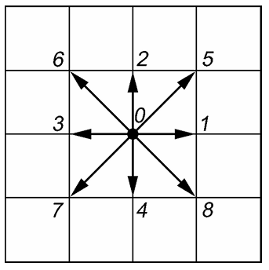

---
## Front matter
title: Решеточные газы, решеточное уравнение Больцмана
subtitle: Отчёт по первому этапу группового проекта
author: |
  Команда №4:
  Абакумова Олеся Максимовна (НФИбд-02-22)  
  Астраханцева Анастасия Александровна (НФИбд-01-22)  
  Ганина Таисия Сергеевна (НФИбд-01-22)  
  Ибатулина Дарья Эдуардовна (НФИбд-01-22)

## Generic otions
lang: ru-RU
toc-title: "Содержание"

## Bibliography
bibliography: bib/cite.bib
csl: pandoc/csl/gost-r-7-0-5-2008-numeric.csl

## Pdf output format
toc: true # Table of contents
toc-depth: 2
lof: true # List of figures
lot: false # List of tables
fontsize: 12pt
linestretch: 1.5
papersize: a4
documentclass: scrreprt
## I18n polyglossia
polyglossia-lang:
  name: russian
  options:
	- spelling=modern
	- babelshorthands=true
polyglossia-otherlangs:
  name: english
## I18n babel
babel-lang: russian
babel-otherlangs: english
## Fonts
mainfont: PT Serif
romanfont: PT Serif
sansfont: PT Sans
monofont: PT Mono
mainfontoptions: Ligatures=TeX
romanfontoptions: Ligatures=TeX
sansfontoptions: Ligatures=TeX,Scale=MatchLowercase
monofontoptions: Scale=MatchLowercase,Scale=0.9
## Biblatex
biblatex: true
biblio-style: "gost-numeric"
biblatexoptions:
  - parentracker=true
  - backend=biber
  - hyperref=auto
  - language=auto
  - autolang=other*
  - citestyle=gost-numeric
## Pandoc-crossref LaTeX customization
figureTitle: "Рис."
tableTitle: "Таблица"
listingTitle: "Листинг"
lofTitle: "Список иллюстраций"
lotTitle: "Список таблиц"
lolTitle: "Листинги"
## Misc options
indent: true
header-includes:
  - \usepackage{indentfirst}
  - \usepackage{float} # keep figures where there are in the text
  - \floatplacement{figure}{H} # keep figures where there are in the text
---

# Введение

## Цель проекта

Разработать и проанализировать модель на основе решеточного уравнения Больцмана для описания течений газа.

## Задачи первого этапа проекта

1. **Формулировка научной проблемы**: определение ключевых аспектов проблемы и ее значимости.
2. **Теоретическое описание задачи**: формулировка теоретических основ модели.
3. **Описание модели**: разработка математической модели, отражающей основные физические процессы.

## Объект и предмет исследования

- **Объект:** физические процессы в газах и жидкостях.  
- **Предмет:** использование решеточных методов (LGA и LBE) для описания динамики частиц на дискретной сетке.

## Постановка проблемы

Моделирование газовых потоков и жидкостей традиционными методами, такими как уравнения Навье-Стокса и методы конечных разностей, требует значительных вычислительных ресурсов и сложных алгоритмов. Методы решеточных газов (Lattice-Gas Automata, LGA) и решеточного уравнения Больцмана (Lattice Boltzmann Equation, LBE) предлагают альтернативу, позволяя упростить вычисления при сохранении физической достоверности. Эти методы широко используются в различных областях [1]:

- **Гидродинамика**: моделирование течений жидкостей и газов.
- **Аэродинамика**: изучение воздушных потоков и аэродинамических свойств объектов.
- **Биофизика**: моделирование биологических систем и процессов.
- **Моделирование пористых материалов**: изучение свойств и поведения пористых сред.
- **Анимация визуальных эффектов**: создание реалистичных симуляций жидкостей и газов в кино и играх.

**Применение методов актуально для:**

1. **Исследования сложных многокомпонентных течений**: моделирование взаимодействия нескольких жидкостей или газов.
2. **Течений с фазовыми переходами и химическими реакциями**: изучение процессов, связанных с изменением состояния вещества или химическими реакциями.
3. **Создания высокопроизводительных параллельных алгоритмов**: разработка эффективных вычислительных методов для крупномасштабных симуляций.

## Научная значимость

1. **Моделирование сложных систем**: решеточные методы позволяют описывать взаимодействие частиц и фазовые переходы, что важно для понимания поведения реальных систем.
2. **Высокая скорость вычислений**: дискретная природа моделей упрощает распараллеливание и ускоряет вычисления.
3. **Простота реализации**: алгоритмы не требуют сложных вычислительных схем, что делает их доступными для широкого круга исследователей и инженеров [2].

## Общее описание

В отчете рассматриваются методы моделирования гидродинамических процессов на основе решеточных моделей: Lattice-Gas Automata (LGA) и Lattice Boltzmann Equation (LBE). Эти методы позволяют упростить вычисления и моделировать сложные явления, такие как течения жидкостей и газов, теплопередача и фазовые переходы.

# Основная часть

## Решеточные газы (LGA)

### Общее описание
Рассматривается квадратная решетка, в узлах которой находятся частицы единичной массы. Расстояние между узлами $\Delta x$ и шаг по времени $\Delta t$ принимаются за единицу длины и времени соответственно. В каждом узле может быть не более одной частицы с данным направлением скорости (принцип исключения).

#### Модель HPP (Hardy–Pomeau–Pazzis)

*   **Описание**:
    *   Используется квадратная решетка.
    *   Частицы могут двигаться в одном из соседних узлов (вверх, вниз, вправо, влево).
    *   Соударения происходят с сохранением количества частиц и их полного импульса.
    *   Нетривиальными являются соударения "почти лоб в лоб", после которых скорости частиц поворачиваются на 90 градусов. В остальных случаях можно считать, что столкновения не произошло (частицы пролетели мимо друг друга).
        *   *Пояснение*: Столкновения "почти лоб в лоб" — это когда частицы летят навстречу друг другу по одной линии, а после столкновения их траектории отклоняются на 90 градусов (рис. @fig:001) [2].
        
{ #fig:001 width=100%}

*   **Кодирование состояний**:
    *   Наличие частицы, имеющей скорость по каждому направлению, может быть закодировано одним битом (0 — нет частицы, 1 — есть).
    *   Так можно записать состояние каждого узла в четырех битах.
    *   Примеры операций:
        *   Добавление к состоянию S частицы с направлением скорости $d_k$:
            $S \text{ or } d_k \rightarrow S$
        *   Проверка: есть ли в состоянии S частица с направлением скорости $d_k$:
            $\text{if } (S \text{ and } d_k) \neq 0$
    *   Здесь `or` — двоичная побитовая операция "или", а `and` — двоичная операция "и".
        *   *Пояснение*: Операции `or` и `and` используются для манипулирования битами, что позволяет эффективно кодировать и обрабатывать состояния частиц.
    *   Все операции сводятся к целочисленной арифметике, это означает высокую скорость расчетов и отсутствие ошибок округления. Кроме того, все вычисления локальные, поэтому их можно выполнять параллельно.
*   **Недостатки**:
    *   Квадратная сетка с 4 возможными направлениями скорости частиц недостаточно симметрична [3].

#### Модель FHP-I

*   **Описание**:
    *   Используется треугольная сетка с 6 возможными направлениями скорости частиц в узле.
    *   Обладает большей симметрией по сравнению с моделью HPP.

#### Модель FHP-III

*   **Описание**:
    *   Включает в себя покоящиеся частицы.
    *   Геометрия решетки и возможные столкновения частиц для моделей FHP-I, FHP-III представлены на рис. @fig:002.
    
{#fig:002 width=100%}

#### Квадратная решетка с движением по диагоналям

*   **Описание**:
    *   Вводится возможность движения частиц по диагоналям (скорость $\sqrt{2}$).
    *   Вместе с покоящимися частицами получаем 9 направлений скорости.
    *   Так как модули скоростей различны, возможен нетривиальный закон сохранения энергии, и можно ввести температуру.
*   **Параметры**:
    *   Число покоящихся частиц: $n_0$
    *   Число частиц с единичной скоростью: $n_1$
    *   Число частиц со скоростью $\sqrt{2}$: $n_2$
    *   Плотность: $\rho = n_0 + n_1 + n_2$
    *   Полная энергия: $E = P + \frac{\rho u^2}{2} = \sum_i n_i v_i^2 / 2 = n_1/2 + n_2$ (где $P$ — давление)
    *   Температура: $T = \frac{P}{\rho}$
*   **Возможности**:
    *   Моделирование течений с переменной температурой.
    *   Моделирование теплопередачи и выделения энергии.
    *   Легко задавать граничные условия любого вида (например, разворачивать скорости прилетевших частиц на угол 180 градусов на твердых границах) [1].
    Несколько примеров столкновений, в том числе с выделением энергии, приведены на рис. @fig:003.
    
{#fig:003 width=100%}

## Решеточное уравнение Больцмана (LBE)

### Общее описание
Метод LBE позволяет устранить статистический шум, возникающий из-за случайности в модели LGA. Эволюция системы описывается уравнением Больцмана:

$f_k(x + c_k \Delta t, t + \Delta t) = f_k(x, t) + \Omega_k(x, t)$, где:

*   $f_k$ — одночастичная функция распределения.
*   $c_k$ — скорость частиц.
*   $\Omega_k$ — столкновительный член.

    *   *Пояснение*: Это уравнение описывает, как меняется распределение частиц со временем и в пространстве. Левая часть описывает перенос частиц, а правая — изменения из-за столкновений [4].

*   **Условие**:
    *   Скорости частиц $c_k$ должны удовлетворять условию $c_k \Delta t = e_k$, где $e_k$ — векторы, соединяющие узел с соседними. Обычно принимается $\Delta t = 1$.
        *   *Пояснение*: Это условие гарантирует, что частицы перемещаются из одного узла в другой за один временной шаг.
*   **Макроскопические параметры**:
    *   Плотность: $\rho = \sum_k f_k$
    *   Скорость: $\rho u = \sum_k f_k c_k$
        *   *Пояснение*: Эти формулы позволяют связать микроскопические параметры (функцию распределения) с макроскопическими (плотность и скорость).
*   **Столкновительный член**:
    *   Описывает релаксацию системы к равновесному состоянию:
        $\Omega_k = \frac{1}{\tau} (f_k^{eq} - f_k)$, где $f_k^{eq}$ — равновесные функции распределения.
    *   Равновесные функции распределения зависят от плотности и скорости вещества в узле, чтобы выполнялись законы сохранения массы и импульса в столкновениях, то есть
        $\rho = \sum_k f_k^{eq}, \quad \rho u = \sum_k f_k^{eq} c_k$.
        *   *Пояснение*: Столкновительный член моделирует, как частицы стремятся к равновесному состоянию, а равновесные функции распределения определяют это состояние.
*   **Кинетическая температура**:
    *   $\theta = \frac{kT}{m}$ (в энергетических единицах) задается уравнением
        $\rho \theta = \sum_k f_k^{eq} (c_k - u)^2 / 2$.
        *   *Пояснение*: Кинетическая температура характеризует среднюю кинетическую энергию частиц.
    *   Часто масса LBE частиц принимается за единицу, $m = 1$.
*   **Преимущества**:
    *   Хорошо описывает течения вязкой жидкости в пределе малых скоростей (число Маха $M = u / c_s \ll 1$).
        *   *Пояснение*: Число Маха — отношение скорости потока к скорости звука.
    *   Время релаксации $\tau$ определяет кинематическую вязкость $\nu = (\tau - 1/2) c_s^2 \Delta t$.
    *   На твердых границах можно просто разворачивать скорости прилетевших частиц, моделируя непроницаемые стенки без проскальзывания.
        *   *Пояснение*: Граничные условия задаются простым отражением скорости, что упрощает моделирование [2].

### Приложение. Явный вид функций $f_k^{eq}$

Обычно равновесные функции распределения выбираются в максвелловском виде:

$f_k^{eq} \sim \exp(-(c_k - u)^2 / 2\theta)$.

В изотермических моделях достаточно разложить экспоненту в ряд с точностью до членов порядка $u^2$, используя приближенную формулу $e^x = 1 + x/1! + x^2/2! + ...$. В результате получаем:

$f_k^{eq} = w_k \rho \left( 1 + \frac{c_k \cdot u}{\theta} + \frac{(c_k \cdot u)^2}{2\theta^2} - \frac{u^2}{2\theta} \right)$.

Коэффициенты $w_k \sim \exp(-c_k^2 / 2\theta)$ зависят только от модуля $|c_k|$.

*   **Примеры**:

    *   **Одномерная модель**:
        *   $c_0 = 0, \quad c_{-1} = -h / \Delta t, \quad c_1 = h / \Delta t$
        *   $\theta = \frac{1}{3} (h / \Delta t)^2, \quad w_0 = \frac{2}{3}, \quad w_{\pm 1} = \frac{1}{6}$
        *   $f_0^{eq} = \frac{2}{3} \rho (1 - \frac{3}{2} \tilde{u}^2), \quad f_{\pm 1}^{eq} = \frac{1}{6} \rho (1 \pm 3\tilde{u} + 3\tilde{u}^2)$
        *   Здесь $\tilde{u} = u \Delta t / h$ — безразмерная скорость вещества.
    *   **Двумерная модель на квадратной сетке с 9 направлениями (рис. @fig:004)**:
        *   $c_0 = (0, 0)$
        *   $c_k = \frac{h}{\Delta t} (\cos(k \pi / 2), \sin(k \pi / 2))$ для $k = 1 \dots 4$
        *   $c_k = \frac{\sqrt{2} h}{\Delta t} (\cos((k + 1/2) \pi / 2), \sin((k + 1/2) \pi / 2))$ для $k = 5 \dots 8$
        *   $\theta = \frac{1}{3} (h / \Delta t)^2, \quad w_0 = \frac{4}{9}, \quad w_{1-4} = \frac{1}{9}, \quad w_{5-8} = \frac{1}{36}$
        *   $f_0^{eq} = w_0 \rho (1 - d \tilde{u}^2)$
        *   $f_1^{eq} = w_1 \rho (1 + a \tilde{u}_x + b \tilde{u}_x^2 - d \tilde{u}^2)$
        *   ...
        *   $f_8^{eq} = w_8 \rho (1 + a (\tilde{u}_x - \tilde{u}_y) + b (\tilde{u}_x - \tilde{u}_y)^2 - d \tilde{u}^2)$
        *   где $a = \frac{(\Delta t / h)^2}{\theta} = 3, \quad b = \frac{(\Delta t / h)^4}{2 \theta^2} = \frac{9}{2}, \quad d = \frac{(\Delta t / h)^2}{2 \theta} = \frac{3}{2}$

Далее для простоты будем опускать значок «~» у переменной $u$ [1].

{#fig:004 width=100%}

## Модели LGA со взаимодействием между частицами

### Общее описание
Приведенные выше модели описывают скорее газ, чем жидкость. В жидкости между частицами существуют силы взаимодействия, проявлением которых являются поверхностное натяжение, а также фазовые переходы жидкость-газ.

*   **Несмешивающиеся решеточные газы**
    *   Вводится отталкивание между частицами разного типа (например, "синими" и "красными").
    *   При достаточной силе отталкивания происходит разделение веществ.
    *   Это достигается перераспределением цвета частиц после столкновений так, чтобы красные частицы в основном направлялись в узлы с преобладанием красного цвета и наоборот.
*   **Модель LGA с переходом "жидкость-газ"**
    *   Вводится притяжение между частицами, находящимися на некотором расстоянии.
    *   Импульсы частиц поворачиваются друг к другу, если это возможно, с учетом закона сохранения импульса согласно третьему закону Ньютона.
    *   При достаточно большой длине взаимодействия в некотором диапазоне плотностей возможно сосуществование плотной (жидкой) и разреженной (газообразной) фаз [3].

## Модель LBE с внешними силами и фазовыми переходами

### Действие внешних сил

*   **Моделирование сил, действующих на вещество**.
    *   Природа сил может быть самой разной (например, электрические силы, сила тяжести, силы межмолекулярного взаимодействия и т.д.).
    *   Суммарная сила, действующая на вещество в узле, равна $F$.
    *   Действие силы в течение шага по времени $\Delta t$ приводит к изменению скорости:
        $\Delta u = \frac{F \Delta t}{\rho}$.
    *   Решеточное уравнение Больцмана принимает вид:
        $f_k(x + c_k \Delta t, t + \Delta t) = f_k(x, t) + \Omega_k(x, t) + \Delta f_k$.
        То есть, после действия оператора столкновений (в котором используется скорость $u$), необходимо учесть изменение функций распределения $\Delta f_k$ под действием сил. Эта добавка равна разнице равновесных функций распределения при одной и той же плотности, но с разными скоростями:
        $\Delta f_k = f_k^{eq} (\rho, u + \Delta u) - f_k^{eq} (\rho, u)$.
*   **Порядок учета действия сил**:
    1.  Вычислить промежуточные значения функций распределения:
        $f^*_k(x, t + \Delta t) = f_k(x, t) + \Delta f_k$.
    2.  Применить оператор столкновений:
        $f_k(x, t + \Delta t) = f^*_k(x, t + \Delta t) + (f^{eq}_k (u + \Delta u) - f^*_k(x, t + \Delta t)) / \tau$.
*   **Физическая скорость вещества**:
    *   $u^* = \frac{u + (u + \Delta u)}{2} = u + \frac{\Delta u}{2}$.
        *   На каждом шаге по времени в каждом узле существуют два значения скорости — до и после действия сил.
        *   В случае действия сил физическая скорость вещества равна их среднему арифметическому.

### Фазовые переходы

*   Достаточно простой способ моделирования фазовых переходов жидкость – пар.
*   Между частицами, находящимися в соседних узлах, задается сила взаимодействия:

    $F(x) = \psi(\rho(x)) \sum_k G_k e_k \psi(\rho(x + e_k))$.

    *   Значения коэффициентов $G_k > 0$ соответствуют притяжению между соседними узлами, что необходимо для сосуществования жидкой фазы и паровой фазы. В обратном случае при $G_k < 0$ — отталкивание.
    *   $G_k$ выбираются таким образом, чтобы сила была достаточно изотропной (чтобы, например, капли получались круглыми).
    *   При использовании модели LBE на квадратной сетке сила взаимодействия между узлами, расположенными по диагонали на расстоянии $\sqrt{2}$, должна быть в 4 раза меньше, чем между ближайшими соседями, то есть $G_{1-4} = G_0 > 0$, а $G_{5-8} = \frac{G_0}{4}$.
    *   «Эффективная плотность» $\psi(\rho)$ может выбираться достаточно произвольно.
    *   Введение такого взаимодействия приводит к уравнению состояния, которое связывает давление, плотность и температуру [3].

# Заключительная часть

## Заключение

Методы решеточных газов и решеточного уравнения Больцмана предоставляют мощный инструмент для моделирования сложных физических процессов, включая гидродинамику, теплопередачу и фазовые переходы. Их простота и возможность параллельных вычислений делают их перспективными для изучения широкого класса задач в физике и инженерии. Модели LGA позволяют упростить расчеты и учитывать сложные взаимодействия между частицами, а метод LBE позволяет устранить статистический шум и моделировать макроскопические параметры вещества.

## Выводы

Во время выполнения первого этапа группового проекта мы сделали теоретическое описание решеточного уравнения Больцмана и определили задачи дальнейшего исследования.

# Список литературы

1. Медведев Д.А. и др. Моделирование физических процессов и явлений на ПК: Учеб. пособие. // Новосибирск: Новосиб. гос. ун-т, 2010. 101 с.

2. Куперштох А. Л. Моделирование течений с границами раздела жидкость-пар методом решеточных уравнениях Больцмана //
   Вестник НГУ. Сер. Математика, механика и информатика. 2005. Т. 5, № 3. с. 29–42.

3. Chen S., Lee M., Zhao K. H., Doolen G. D. A lattice gas model with temperature // Physica D. 1989. V. 37. p. 42–59.

4. [Чащин Г.С. Метод решёточных уравнений Больцмана: моделирование изотермических низкоскоростных течений](https://doi.org/10.20948/prepr-2021-99) // [Препринты ИПМ им. М.В.Келдыша. 2021. № 99. 31 с.](https://library.keldysh.ru/preprint.asp?id=2021-99).

::: {#refs}
:::
