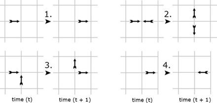
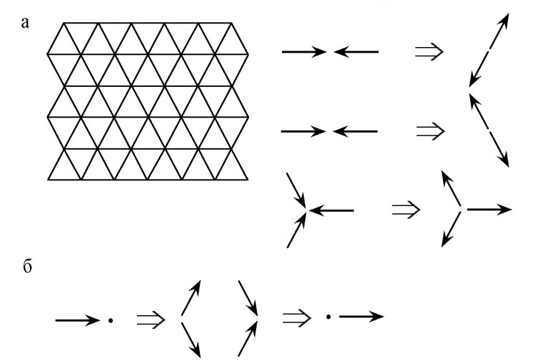
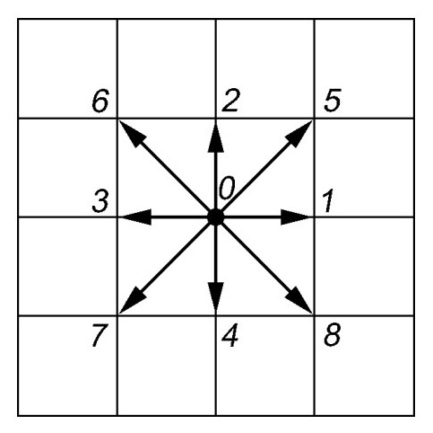

---
## Front matter
lang: ru-RU
title: Решеточные газы, решеточное уравнение Больцмана
subtitle: Групповой проект. Этап 2
author:
  - Команда №4 Абакумова О.М., Астраханцева А.А., Ганина Т.С., Ибатулина Д.Э.
institute:
  - Российский университет дружбы народов, Москва, Россия
date: 11 апреля 2025

## i18n babel
babel-lang: russian
babel-otherlangs: english

## Formatting pdf
toc: false
toc-title: Содержание
slide_level: 2
aspectratio: 169
section-titles: true
theme: metropolis
header-includes:
 - \metroset{progressbar=frametitle,sectionpage=progressbar,numbering=fraction}
---

# Вводная часть

## Состав исследовательской команды

Студенты группы НФИбд-01/02-22:

- Абакумова Олеся Максимовна
- Астраханцева Анастасия Александровна
- Ганина Таисия Сергеевна
- Ибатулина Дарья Эдуардовна

## Постановка проблемы

Моделирование газовых потоков и жидкостей традиционными методами, такими как уравнения Навье-Стокса, требует значительных вычислительных ресурсов. 

Методы LGA и LBE предлагают альтернативу, упрощая вычисления при сохранении физической достоверности.

## Актуальность

1.  Исследования сложных многокомпонентных течений.
2.  Течений с фазовыми переходами и химическими реакциями.
3.  Создания высокопроизводительных параллельных алгоритмов.

Рассмотрим основные алгоритмы и модели, используемые для решения задач с применением LGA и LBE.

## Объект и предмет исследования

- физические процессы в газах и жидкостях
- использование решеточных методов (LGA и LBE) для описания динамики частиц на дискретной сетке

## Цель

Исследовать алгоритмы решения задачи с применением LGA и LBE.

# Основная часть

## Модель HPP (Hardy–Pomeau–Pazzis). Описание

Модель HPP (Hardy-Pomeau-Pazzis) представляет собой дискретную систему, где пространство и время дискретизованы, а частицы двигаются по узлам квадратной решетки.

## Основные характеристики

:::::::::::::: {.columns align=center}
::: {.column width="40%"}

1. **Решетка**: Двумерная квадратная  
2. **Частицы**: Единичной массы, 4 направления  
3. **Скорость**: Δx/Δt = 1  
4. **Принцип исключения**: ≤1 частица/направление  
5. **Эволюция**: Распространение → Столкновения  
6. **Столкновения**: Сохранение импульса, 90° поворот
7. **Кодирование**: 4-битный формат (1 бит/направление)

:::
::: {.column width="60%"}

{width=90%}

:::
::::::::::::::

## Основные операции для работы с состояниями узлов

1.  **Добавление частицы**: добавление к состоянию $S$ частицы с направлением скорости $d_k$:
    $$
    S \text{ OR } d_k \rightarrow S
    $$

2.  **Проверка наличия частицы**: проверка, есть ли в состоянии $S$ частица с направлением скорости $d_k$:
    $$
    \text{if } (S \text{ AND } d_k) \neq 0
    $$
    Если результат не равен 0, то частица с направлением $d_k$ присутствует в узле.
    
## Недостатки модели HPP

1.  **Отсутствие симметрии**

2.  **Нефизичное поведение**

## Модель FHP-I. Описание

Модель FHP-I (Frisch-Hasslacher-Pomeau) — это улучшенная модель решеточных газов. Используется треугольная сетка и 6 направлений скорости.

## Основные характеристики

1. **Решетка**: Двумерная треугольная сетка (6 направлений)  
2. **Частицы**: Единичной массы, движение в 6 направлениях  
3. **Скорость**: Аналогично HPP (Δx/Δt = 1)  
4. **Принцип исключения**: ≤1 частица/направление  
5. **Эволюция**:  
   - Распространение → Столкновения  
6. **Столкновения**:  
   - 2-частичные (60° поворот)  
   - 3-частичные (сохранение импульса)  
7. **Кодирование**: 6-битный формат (1 бит/направление)  

## Преимущества и недостатки модели FHP-I

`+`:
1.  Улучшенная симметрия

2.  Реалистичное поведение

`-`:
Сложность реализации

## Модель FHP-III. Описание

Модель FHP-III — это расширение модели FHP-I. Происходит добавление покоящихся частиц.

## Основные характеристики модели FHP-III

1. **Решетка**: 2D треугольная (6 направлений)
2. **Частицы**: Ед. массы; 6 движущихся + 1 покоящаяся
3. **Скорость**: Движущиеся - Δx/Δt = 1; покоящиеся - 0
4. **Принцип исключения**: ≤1 движущаяся/направление; ≤1 покоящаяся
5. **Эволюция**:
   - Распространение (движущиеся)
   - Столкновения (сохранение)
6. **Столкновения**:
   - 2 частицы → 60°
   - Частица + покой → изменение направления
   - Создание/уничтожение покоящейся
7. **Кодирование**: 7 бит (6 направлений + покой)

## Недостаток модели FHP-III

Сложность реализации

\centering
{width=50%}

## Модель с 9 направлениями скорости. Основные характеристики

:::::::::::::: {.columns align=center}
::: {.column width="50%"}

1. **Решетка**: 2D квадратная
2. **Частицы**: Движение по 8 направлениям + покой
3. **Скорость**: Горизонталь/вертикаль: v₁ = 1, Диагональ: v₂ = √2, Покой: 0
4. **Направления**: 4 (v₁), 4 (v₂): диагонали; 1 состояние покоя
5. **Эволюция**: Распространение, столкновения
6. **Столкновения**: Сохранение массы, импульса, энергии
7. **Кодирование**: 9 бит/узел (8 направлений + покой)

:::
::: {.column width="50%"}

{width=70%}

:::
::::::::::::::

## Физические параметры

1.  **Плотность** ($\rho$):
    $$\rho = n_0 + n_1 + n_2$$

2.  **Полная энергия** ($E$):
    $$E = P + \frac{\rho u^2}{2} = \sum_i n_i \frac{v_i^2}{2} = \frac{n_1}{2} + n_2$$

3.  **Температура** ($T$):
    $T = \frac{P}{\rho}$
    
## Преимущества и недостатки

:::::::::::::: {.columns align=center}
::: {.column width="50%"}

Преимущества:

1. Изотропность

2. Возможность введения температуры

3. Более реалистичное поведение

:::
::: {.column width="50%"}

Недостатки:

1. Сложность реализации

2. Вычислительные затраты

:::
::::::::::::::

## Решеточное уравнение Больцмана (LBE, Lattice Boltzmann Equation). Описание

Решеточное уравнение Больцмана (LBE) — метод моделирования гидродинамики, фазовых переходов и хим. реакций. В отличие от моделей решеточных газов (LGA), LBE — более точный и гибкий подход для моделирования сложных систем.

## Основные характеристики

1. **Дискретизация**: Пространство и время дискретизируются (решетка + шаги).

2. **Функция распределения**: Вместо частиц используется функция распределения $f_k(x, t)$.

3. **Скорости**: Дискретные направления скоростей $c_k$.

4. **Основное уравнение**: $f_k(x + c_k \Delta t, t + \Delta t) = f_k(x, t) + \Omega_k(x, t)$

5. **Столкновительный член (BGK)**: $\Omega_k = \frac{1}{\tau}(f_k^{eq} - f_k)$

6. **Равновесная функция (D2Q9)**: $f_k^{eq} = w_k \rho \left[1 + \frac{c_k \cdot u}{c_s^2} + \frac{(c_k \cdot u)^2}{2c_s^4} - \frac{u^2}{2c_s^2}\right]$

7. **Макроскопические параметры**: $\rho = \sum_k f_k$, $\rho u = \sum_k f_k c_k$

## Преимущества и недостатки LBE

:::::::::::::: {.columns align=center}
::: {.column width="50%"}

Преимущества:

1.  Гибкость

2.  Эффективность

3.  Точность

4.  Простота реализации граничных условий

:::
::: {.column width="50%"}

Недостатки:

1.  Ограничения по скорости

2.  Вычислительные затраты

:::
::::::::::::::

## Применение

1. Гидродинамика
2. Аэродинамика
3. Пористые среды
4. Медицина
5. Химическая инженерия
6. Моделирование фазовых переходов

## Модель с взаимодействием между частицами. Основные характеристики

1. Взаимодействие между частицами

2. Типы взаимодействий: Отталкивание; Притяжение

3. Влияние внешних сил: $\Delta u = \frac{F \Delta t}{\rho}$

Уравнение Больцмана модифицируется добавкой:
$f_k(x + c_k \Delta t, t + \Delta t) = f_k(x, t) + \Omega_k(x, t) + \Delta f_k$

4. Моделирование фазовых переходов
$F(x) = \psi(\rho(x)) \sum_{k} G_k e_k \psi(\rho(x + e_k))$

## Алгоритм моделирования с взаимодействием

1. **Инициализация**:
   * Решетка (квадрат/треугольник)
   * Начальные условия (плотность, скорость, температура)
   * Параметры взаимодействия

2. **Распространение**: Перемещение частиц

3. **Вычисление сил**: Расчет взаимодействия между узлами

4. **Столкновения**: Учет сил взаимодействия

5. **Обновление скоростей**: Изменение скоростей под действием сил

6. **Повторение**: Шаги 2-5 до стационарного состояния

## Применение

* Конденсация/испарение
* Разделение фаз
* Многофазные потоки

## Модель с несколькими компонентами. Характеристики

1.  **Несколько типов частиц**: Разные компоненты смеси
2.  **Функции распределения**: $f_{k,i}(x, t)$ для каждого компонента
3.  **Взаимодействия**: Силы между компонентами
4.  **Химические реакции**: Превращения частиц
5.  **Уравнения эволюции**: Учитывают гидродинамику и реакции

## Алгоритм

1.  **Инициализация**:
    *   Решетка
    *   Начальные условия (плотность, скорость, концентрация)
    *   Параметры взаимодействия
    *   Правила реакций
2.  **Распространение**: Перемещение частиц
3.  **Вычисление сил**: Взаимодействие между компонентами
4.  **Столкновения**: Учет сил
5.  **Химические реакции**: Изменение количества частиц
6.  **Обновление скоростей**: Под действием сил
7.  **Повторение**: Шаги 2-6 до стационарности

## Математическое описание

Для LBE с несколькими компонентами уравнение эволюции выглядит следующим образом:

$$
f_{k,i}(x + c_k \Delta t, t + \Delta t) = f_{k,i}(x, t) + \Omega_{k,i}(x, t)
$$

Столкновительный член может включать в себя как релаксацию к равновесию, так и члены, описывающие химические реакции:

$$
\Omega_{k,i} = \Omega_{k,i}^{collision} + \Omega_{k,i}^{reaction}
$$

## Применение:

*   Смешивание жидкостей
*   Разделение веществ
*   Моделирование реакций
*   Реакция-диффузия

# Заключительная часть

## Заключение

Модели решеточных газов $(LGA)$ и решеточное уравнение Больцмана $(LBE)$ — эффективные инструменты для моделирования газовых потоков, требующие меньше ресурсов.

Разные модели применимы для разных задач:

* $HPP$ - базовая модель

* $FHP-I$ и $FHP-III$ - улучшенная симметрия.

* 9 направлений - позволяет ввести температуру.
* $LBE$ - наиболее гибкий подход.

Выбор алгоритма зависит от требований к точности, ресурсов и специфики задачи.

## Выводы

В ходе второго этапа проекта сделано теоретическое описание алгоритмов для моделирования решеточного уравнения Больцмана.

# Список литературы

1. Медведев Д.А. и др. Моделирование физических процессов и явлений на ПК: Учеб. пособие. // Новосибирск: Новосиб. гос. ун-т, 2010. 101 с.

2. Куперштох А. Л. Моделирование течений с границами раздела жидкость-пар методом LBE //
   Вестник НГУ. Сер. Математика, механика и информатика. 2005. Т. 5, № 3. с. 29–42.

3. Chen S., Lee M., Zhao K. H., Doolen G. D. A lattice gas model with temperature // Physica D. 1989. V. 37. p. 42–59.

4. [Чащин Г.С. Метод решёточных уравнений Больцмана](https://doi.org/10.20948/prepr-2021-99) // [Препринты. 2021. № 99. 31 с.](https://library.keldysh.ru/preprint.asp?id=2021-99).

5. Frisch, Uriel, Brosl Hasslacher, and Yves Pomeau. "Lattice Gas Automata for the Navier-Stokes Equation." Phys. Rev. Lett. 56, no. 14 (1986): 1505-1508.

6. Succi, Sauro. The Lattice Boltzmann Equation for Fluid Dynamics and Beyond. Oxford University Press, 2001.
