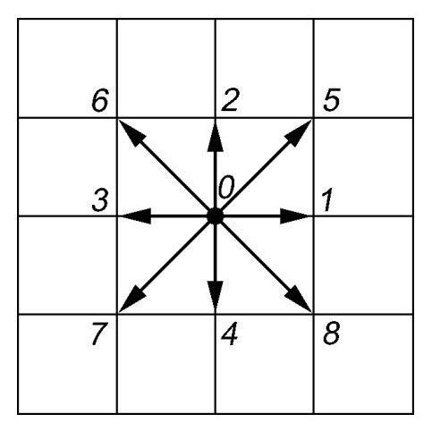

---
## Front matter
title: Решеточные газы, решеточное уравнение Больцмана
subtitle: Отчёт по второму этапу группового проекта
author: |
  Команда №4:
  Абакумова Олеся Максимовна (НФИбд-02-22)  
  Астраханцева Анастасия Александровна (НФИбд-01-22)  
  Ганина Таисия Сергеевна (НФИбд-01-22)  
  Ибатулина Дарья Эдуардовна (НФИбд-01-22)

## Generic otions
lang: ru-RU
toc-title: "Содержание"

## Bibliography
bibliography: bib/cite.bib
csl: pandoc/csl/gost-r-7-0-5-2008-numeric.csl

## Pdf output format
toc: true # Table of contents
toc-depth: 2
lof: true # List of figures
lot: false # List of tables
fontsize: 12pt
linestretch: 1.5
papersize: a4
documentclass: scrreprt
## I18n polyglossia
polyglossia-lang:
  name: russian
  options:
	- spelling=modern
	- babelshorthands=true
polyglossia-otherlangs:
  name: english
## I18n babel
babel-lang: russian
babel-otherlangs: english
## Fonts
mainfont: PT Serif
romanfont: PT Serif
sansfont: PT Sans
monofont: PT Mono
mainfontoptions: Ligatures=TeX
romanfontoptions: Ligatures=TeX
sansfontoptions: Ligatures=TeX,Scale=MatchLowercase
monofontoptions: Scale=MatchLowercase,Scale=0.9
## Biblatex
biblatex: true
biblio-style: "gost-numeric"
biblatexoptions:
  - parentracker=true
  - backend=biber
  - hyperref=auto
  - language=auto
  - autolang=other*
  - citestyle=gost-numeric
## Pandoc-crossref LaTeX customization
figureTitle: "Рис."
tableTitle: "Таблица"
listingTitle: "Листинг"
lofTitle: "Список иллюстраций"
lotTitle: "Список таблиц"
lolTitle: "Листинги"
## Misc options
indent: true
header-includes:
  - \usepackage{indentfirst}
  - \usepackage{float} # keep figures where there are in the text
  - \floatplacement{figure}{H} # keep figures where there are in the text
---

# Введение

## Цель проекта

Разработать и проанализировать модель на основе решеточного уравнения Больцмана для описания течений газа.

## Задачи второго этапа проекта

1. Исследовать алгоритмы решения задачи

## Актуальность 

Моделирование газовых потоков и жидкостей традиционными методами требует значительных вычислительных ресурсов. В связи с этим, методы решеточных газов (LGA) и решеточного уравнения Больцмана (LBE) становятся все более актуальными. Они позволяют упростить вычисления, сохраняя при этом физическую достоверность, и находят применение в различных областях, от гидродинамики до биофизики. В данном докладе мы рассмотрим основные алгоритмы и модели, используемые для решения задач с применением LGA и LBE [@Medvedev2010;@Kupershthok2005].

# Основная часть

## Модель HPP (Hardy–Pomeau–Pazzis)

Модель HPP (Hardy-Pomeau-Pazzis) — это базовая модель решеточных газов (LGA), используемая для моделирования гидродинамических явлений на микроскопическом уровне. Она представляет собой дискретную систему, где пространство и время дискретизованы, а частицы двигаются по узлам квадратной решетки [@Chen1989].

### Основные характеристики модели HPP

1.  **Решетка**: используется двумерная квадратная решетка, где узлы расположены на одинаковом расстоянии друг от друга.

2.  **Частицы**: в каждом узле решетки могут находиться частицы единичной массы. Каждая частица может двигаться в одном из четырех направлений: вверх, вниз, вправо или влево.

3.  **Скорость**: все частицы имеют одинаковую скорость, направленную к соседнему узлу. Расстояние между узлами ($\Delta x$) и шаг времени ($\Delta t$) выбираются так, чтобы частица могла переместиться в соседний узел за один временной шаг.

4.  **Принцип исключения**: в каждом узле может находиться не более одной частицы, движущейся в заданном направлении.

5.  **Этапы эволюции**:
    *   **Распространение (Streaming)**: частицы перемещаются в соседние узлы в соответствии со своими скоростями. За один шаг времени частица переходит в соседний узел в направлении своего движения.
    *   **Столкновения (Collision)**: в узлах происходят столкновения частиц, при которых сохраняются количество частиц и полный импульс.

6.  **Правила столкновений**: столкновения происходят таким образом, чтобы выполнялись законы сохранения. В модели HPP нетривиальные столкновения происходят, когда две частицы движутся навстречу друг другу (почти "лоб в лоб"). После столкновения частицы меняют направления движения на 90 градусов. Во всех остальных случаях столкновения считаются несущественными, и частицы продолжают двигаться в прежних направлениях (рис. @fig:001).

{#fig:001 width=100%}

7.  **Кодирование состояний**: состояние каждого узла решетки кодируется битами. Поскольку имеется четыре возможных направления движения, для кодирования состояния узла требуется четыре бита. Каждый бит соответствует одному из направлений: 0 — нет частицы, 1 — есть частица, движущаяся в этом направлении. Например, если частицы движутся вправо и вверх, состояние узла кодируется как `1100` в двоичном формате.

### Математическое описание

Обозначим возможные направления скорости как $d_1, d_2, d_3, d_4$$. Тогда:

*   $d_1 = 0001_2 = 1$

*   $d_2 = 0010_2 = 2$

*   $d_3 = 0100_2 = 4$

*   $d_4 = 1000_2 = 8$

Основные операции для работы с состояниями узлов:

1.  **Добавление частицы**: добавление к состоянию $S$ частицы с направлением скорости $d_k$:
    $$
    S \text{ OR } d_k \rightarrow S
    $$

2.  **Проверка наличия частицы**: проверка, есть ли в состоянии $S$ частица с направлением скорости $d_k$:
    $$
    \text{if } (S \text{ AND } d_k) \neq 0
    $$
    Если результат не равен 0, то частица с направлением $d_k$ присутствует в узле [@Chaschin2021].

### Недостатки модели HPP

1.  **Отсутствие симметрии**: квадратная решетка с четырьмя направлениями скорости недостаточно симметрична, что приводит к анизотропии в макроскопических свойствах.

2.  **Нефизичное поведение**: модель HPP неточно описывает гидродинамические свойства жидкостей и газов.

Для устранения этих недостатков были разработаны более совершенные модели, такие как FHP (Frisch-Hasslacher-Pomeau) на треугольных решетках и модели с добавлением покоящихся частиц.

## Модель FHP-I (Frisch-Hasslacher-Pomeau)

Модель FHP-I (Frisch-Hasslacher-Pomeau) — это улучшенная модель решеточных газов (LGA), разработанная для устранения недостатков модели HPP, связанных с недостаточной симметрией. В модели FHP-I используется треугольная сетка и шесть направлений скорости [@Chaschin2021].

### Основные характеристики модели FHP-I

1.  **Решетка**: используется двумерная треугольная решетка, где каждый узел имеет шесть ближайших соседних узлов, расположенных под углами 60 градусов друг к другу.

2.  **Частицы**: в каждом узле решетки могут находиться частицы единичной массы. Каждая частица может двигаться в одном из шести направлений к соседним узлам.

3.  **Скорость**: все частицы имеют одинаковую скорость, направленную к соседнему узлу. Как и в модели HPP, расстояние между узлами и шаг времени выбираются так, чтобы частица могла переместиться в соседний узел за один временной шаг.

4.  **Принцип исключения**: в каждом узле может находиться не более одной частицы, движущейся в заданном направлении.

5.  **Этапы эволюции**:
    *   **Распространение (Streaming)**: частицы перемещаются в соседние узлы в соответствии со своими скоростями.
    *   **Столкновения (Collision)**: в узлах происходят столкновения частиц, при которых сохраняются количество частиц и полный импульс.

6.  **Правила столкновений**: столкновения происходят таким образом, чтобы выполнялись законы сохранения. Важным аспектом модели FHP-I является наличие нескольких типов столкновений, обеспечивающих сохранение массы и импульса. Примеры столкновений:
    *   Две частицы, движущиеся навстречу друг другу, могут изменить направление на 60 градусов.
    *   Три частицы, движущиеся по трем направлениям, могут изменить направления так, чтобы общий импульс остался неизменным.

7.  **Кодирование состояний**: состояние каждого узла решетки кодируется битами. Поскольку имеется шесть возможных направлений движения, для кодирования состояния узла требуется шесть битов. Каждый бит соответствует одному из направлений: 0 — нет частицы, 1 — есть частица, движущаяся в этом направлении [@Frisch1986].

### Преимущества модели FHP-I

1.  **Улучшенная симметрия**: треугольная решетка с шестью направлениями скорости обладает большей симметрией по сравнению с квадратной решеткой модели HPP. Это позволяет получить более точное описание гидродинамических свойств.

2.  **Реалистичное поведение**: модель FHP-I более точно описывает гидродинамические свойства жидкостей и газов по сравнению с моделью HPP.

### Недостаток модели FHP-I

**Сложность реализации**: треугольная решетка и более сложные правила столкновений делают реализацию модели FHP-I более сложной по сравнению с моделью HPP.

## Модель FHP-III

Модель FHP-III — это расширение модели FHP-I, предназначенное для улучшения её физических свойств за счет добавления покоящихся частиц. Введение покоящихся частиц позволяет более точно моделировать гидродинамические явления и улучшить изотропность модели [@Succi2001].

### Основные характеристики модели FHP-III

1.  **Решетка**: используется двумерная треугольная решетка, как и в модели FHP-I. Каждый узел имеет шесть ближайших соседних узлов, расположенных под углами 60 градусов друг к другу.

2.  **Частицы**: в каждом узле решетки могут находиться частицы единичной массы. В отличие от FHP-I, в FHP-III добавлены покоящиеся частицы, которые не двигаются между узлами. Таким образом, у нас есть шесть движущихся частиц и покоящаяся частица.

3.  **Скорость**: шесть движущихся частиц имеют одинаковую скорость, направленную к соседнему узлу. Покоящиеся частицы имеют нулевую скорость.

4.  **Принцип исключения**: в каждом узле может находиться не более одной частицы, движущейся в заданном направлении, и не более одной покоящейся частицы.

5.  **Этапы эволюции**:
    *   **Распространение (Streaming)**: движущиеся частицы перемещаются в соседние узлы в соответствии со своими скоростями. Покоящиеся частицы остаются на месте.
    *   **Столкновения (Collision)**: в узлах происходят столкновения частиц, при которых сохраняются количество частиц и полный импульс. В FHP-III добавляются новые правила столкновений, учитывающие покоящиеся частицы.

6.  **Правила столкновений**: столкновения происходят таким образом, чтобы выполнялись законы сохранения. Некоторые примеры столкновений:
    *   Две частицы, движущиеся навстречу друг другу, могут изменить направление на 60 градусов (как в FHP-I).
    *   Частица может столкнуться с покоящейся частицей, изменив направление своего движения.
    *   Покоящаяся частица может быть создана или уничтожена в результате столкновений.

7.  **Кодирование состояний**: состояние каждого узла решетки кодируется битами. Поскольку имеется шесть возможных направлений движения и возможность наличия покоящейся частицы, для кодирования состояния узла требуется семь битов. Шесть битов соответствуют направлениям движения, а один бит — наличию покоящейся частицы [@Kupershthok2005].

### Преимущества модели FHP-III

1.  **Улучшенная изотропность**: добавление покоящихся частиц улучшает изотропность модели, что позволяет получить более точное описание гидродинамических свойств.

2.  **Более реалистичное поведение**: модель FHP-III более точно описывает гидродинамические свойства жидкостей и газов по сравнению с моделями HPP и FHP-I.

### Недостаток модели FHP-III

**Сложность реализации**: добавление покоящихся частиц и новых правил столкновений делает реализацию модели FHP-III более сложной по сравнению с моделями HPP и FHP-I (рис. @fig:002).

{#fig:002 width=100%}

Модель с 9 направлениями скорости является модификацией модели решеточных газов, предназначенной для улучшения изотропности и введения понятия температуры в систему. Она использует квадратную сетку, но расширяет возможные направления движения частиц, позволяя им перемещаться не только по горизонтали и вертикали, но и по диагонали. Кроме того, вводится понятие покоящихся частиц.

## Модель с 9 направлениями скорости

### Основные характеристики модели с 9 направлениями скорости

1.  **Решетка**: используется двумерная квадратная решетка, как и в модели HPP.

2.  **Частицы**: в каждом узле решетки могут находиться частицы, движущиеся в одном из восьми направлений (вверх, вниз, вправо, влево, и по четырем диагоналям), а также покоящиеся частицы.

3.  **Скорость**:
    *   Частицы, движущиеся по горизонтали и вертикали, имеют скорость $v_1 = 1$.
    *   Частицы, движущиеся по диагонали, имеют скорость $v_2 = \sqrt{2}$.
    *   Покоящиеся частицы имеют нулевую скорость.

4.  **Направления движения**:
    *   4 направления с единичной скоростью: вправо, влево, вверх, вниз.
    *   4 направления с диагональной скоростью: вправо-вверх, вправо-вниз, влево-вверх, влево-вниз.
    *   1 состояние покоя (рис. @fig:003).
    
{#fig:003 width=100%}

5.  **Этапы эволюции**:
    *   **Распространение (Streaming)**: частицы перемещаются в соседние узлы в соответствии со своими скоростями.
    *   **Столкновения (Collision)**: в узлах происходят столкновения частиц, при которых сохраняются количество частиц, импульс и энергия.

6.  **Правила столкновений**: правила столкновений должны обеспечивать сохранение массы, импульса и энергии. Это достигается за счет более сложных правил столкновений по сравнению с моделями HPP и FHP.

7.  **Кодирование состояний**: состояние каждого узла решетки кодируется битами. Поскольку имеется 9 возможных состояний (8 направлений движения и состояние покоя), для кодирования состояния узла требуется 9 битов.

### Физические параметры

В модели с 9 направлениями скорости можно определить макроскопические параметры, такие как плотность, полная энергия и температура.

1.  **Плотность** ($\rho$):
    $$\rho = n_0 + n_1 + n_2$$
    *   $n_0$ — число покоящихся частиц.

    *   $n_1$ — число частиц с единичной скоростью.

    *   $n_2$ — число частиц со скоростью $\sqrt{2}$.

2.  **Полная энергия** ($E$):
    $$E = P + \frac{\rho u^2}{2} = \sum_i n_i \frac{v_i^2}{2} = \frac{n_1}{2} + n_2$$
    *   $P$ — давление.

    *   $u$ — макроскопическая скорость.

3.  **Температура** ($T$):
    $T = \frac{P}{\rho}$

### Преимущества модели с 9 направлениями скорости

1.  **Изотропность**: добавление диагональных направлений движения улучшает изотропность модели по сравнению с моделью HPP.

2.  **Возможность введения температуры**: наличие различных скоростей позволяет ввести понятие температуры, что важно для моделирования тепловых процессов.

3.  **Более реалистичное поведение**: модель с 9 направлениями скорости более точно описывает гидродинамические свойства жидкостей и газов по сравнению с более простыми моделями.

### Недостатки модели с 9 направлениями скорости

1.  **Сложность реализации**: добавление новых направлений движения и покоящихся частиц усложняет реализацию модели по сравнению с моделями HPP и FHP.

2.  **Вычислительные затраты**: большее число состояний и более сложные правила столкновений увеличивают вычислительные затраты [@Medvedev2010].

## Решеточное уравнение Больцмана (LBE, Lattice Boltzmann Equation)

Решеточное уравнение Больцмана (LBE) — это вычислительный метод, используемый для моделирования широкого спектра физических процессов, включая гидродинамику, фазовые переходы и химические реакции. LBE является более общим подходом по сравнению с моделями решеточных газов (LGA), такими как HPP, FHP-I и FHP-III, и предоставляет более точное и гибкое средство моделирования сложных систем [@Kupershthok2005;@Medvedev2010].

### Основные характеристики LBE

1.  **Дискретизация пространства и времени**: LBE, как и LGA, дискретизует пространство и время. Пространство представляется в виде решетки (обычно квадратной или треугольной), а время разбивается на дискретные шаги.

2.  **Функция распределения**: в отличие от LGA, где отслеживаются отдельные частицы, LBE работает с функцией распределения $f_k(x, t)$, которая описывает вероятность нахождения частиц в узле $x$ в момент времени $t$, движущихся в направлении $k$.

3.  **Скорости**: частицы могут двигаться в нескольких дискретных направлениях $c_k$, определяемых геометрией решетки.

4.  **Основное уравнение**: эволюция системы описывается уравнением:

    $$
    f_k(x + c_k \Delta t, t + \Delta t) = f_k(x, t) + \Omega_k(x, t)
    $$

    *   $f_k(x, t)$ — одночастичная функция распределения.

    *   $c_k$ — скорость частиц.

    *   $\Omega_k(x, t)$ — столкновительный член, описывающий изменения функции распределения из-за столкновений частиц.

5.  **Столкновительный член**: описывает, как частицы взаимодействуют друг с другом. Наиболее часто используется модель BGK (Bhatnagar-Gross-Krook):

    $$
    \Omega_k = \frac{1}{\tau}(f_k^{eq} - f_k)
    $$

    *   $\tau$ — время релаксации, характеризующее скорость приближения системы к равновесию.

    *   $f_k^{eq}$ — равновесная функция распределения, описывающая состояние системы в равновесии.

6.  **Равновесная функция распределения**: обычно выбирается в виде разложения по полиномам Эрмита или в другом подходящем виде, чтобы обеспечить выполнение законов сохранения. Например, для модели D2Q9 (двумерная модель с 9 скоростями) равновесная функция распределения может быть записана как:

    $$
    f_k^{eq} = w_k \rho \left[1 + \frac{c_k \cdot u}{c_s^2} + \frac{(c_k \cdot u)^2}{2c_s^4} - \frac{u^2}{2c_s^2}\right]
    $$

    *   $w_k$ — весовые коэффициенты, зависящие от направления скорости.
    *   $\rho$ — плотность.
    *   $u$ — макроскопическая скорость.
    *   $c_s$ — скорость звука в решеточной модели.

7.  **Макроскопические параметры**: макроскопические параметры, такие как плотность и скорость, вычисляются через функции распределения:

    $$
    \rho = \sum_k f_k
    $$

    $$
    \rho u = \sum_k f_k c_k
    $$

### Преимущества LBE

1.  **Гибкость**: LBE может быть использован для моделирования широкого спектра физических явлений, включая гидродинамику, теплопередачу, фазовые переходы, химические реакции и многофазные потоки.
2.  **Эффективность**: LBE обладает хорошей параллелизуемостью, что позволяет эффективно использовать многопроцессорные системы для моделирования больших систем.
3.  **Точность**: LBE обеспечивает более точное описание гидродинамических свойств по сравнению с более простыми моделями LGA.
4.  **Простота реализации граничных условий**: LBE позволяет легко реализовывать сложные граничные условия.

### Недостатки LBE

1.  **Ограничения по скорости**: LBE обычно работает хорошо для низкоскоростных течений. Для моделирования высокоскоростных течений требуются специальные модификации.
2.  **Вычислительные затраты**: LBE требует больше вычислительных ресурсов по сравнению с простыми моделями LGA [@Medvedev2010].

### Применение LBE

LBE находит широкое применение в различных областях науки и техники, включая:

1.  **Гидродинамика**: моделирование течений жидкостей и газов в сложных геометриях.
2.  **Аэродинамика**: моделирование обтекания тел потоками воздуха.
3.  **Пористые среды**: моделирование течений в пористых материалах.
4.  **Медицина**: моделирование кровотока в сосудах.
5.  **Химическая инженерия**: моделирование химических реакций в растворах.
6.  **Моделирование фазовых переходов**: моделирование процессов конденсации, испарения и кристаллизации.

Модель с взаимодействием между частицами используется для моделирования фазовых переходов и разделения фаз. В этой модели к обычным алгоритмам решеточных газов или решеточного уравнения Больцмана добавляются силы, действующие между частицами, находящимися в разных узлах решетки.

## Модель с взаимодействием между частицами

### Основные характеристики модели с взаимодействием между частицами

1.  **Взаимодействие между частицами**: для описания жидкостей и газов вводятся силы взаимодействия между частицами. Эти силы могут быть как отталкивающими (для моделирования разделения веществ), так и притягивающими (для моделирования фазовых переходов жидкость-газ).

2.  **Типы взаимодействий**:
    *   **Отталкивание**: используется для моделирования разделения смеси веществ на компоненты. Частицы разных компонентов отталкиваются друг от друга, что приводит к их разделению.
    *   **Притяжение**: используется для моделирования фазовых переходов, таких как конденсация пара в жидкость или вскипание перегретой жидкости. Частицы притягиваются друг к другу, образуя кластеры или капли.

3.  **Влияние внешних сил**: внешние силы могут быть учтены через изменение скорости частиц:
    $$
    \Delta u = \frac{F \Delta t}{\rho}
    $$

    *   $\Delta u$ — изменение скорости.
    *   $F$ — внешняя сила.
    *   $\Delta t$ — шаг времени.
    *   $\rho$ — плотность.

    Уравнение Больцмана модифицируется добавкой:

    $$
    f_k(x + c_k \Delta t, t + \Delta t) = f_k(x, t) + \Omega_k(x, t) + \Delta f_k
    $$

    где:

    $$
    \Delta f_k = f_k^{eq}(\rho, u + \Delta u) - f_k^{eq}(\rho, u)
    $$

    *   $\Delta f_k$ — изменение функции распределения, вызванное внешней силой.
    *   $f_k^{eq}$ — равновесная функция распределения.

4.  **Моделирование фазовых переходов**: фазовые переходы моделируются через силы притяжения между соседними узлами:

    $$
    F(x) = \psi(\rho(x)) \sum_{k} G_k e_k \psi(\rho(x + e_k))
    $$

    *   $F(x)$ — сила, действующая на узел $x$.
    *   $\psi(\rho(x))$ — функция, зависящая от плотности в узле $x$.
    *   $G_k > 0$ — константа, определяющая силу притяжения.
    *   $e_k$ — вектор, указывающий направление к соседнему узлу.

### Алгоритм моделирования с взаимодействием

1.  **Инициализация**:
    *   Создание решетки (квадратной или треугольной).
    *   Установка начальных условий (плотность, скорость, температура).
    *   Определение параметров взаимодействия (сила притяжения или отталкивания).

2.  **Распространение (Streaming)**: частицы перемещаются в соседние узлы в соответствии со своими скоростями.

3.  **Вычисление сил взаимодействия**: для каждого узла вычисляется сила, действующая на него со стороны соседних узлов.

4.  **Столкновения (Collision)**: в узлах происходят столкновения частиц, при которых сохраняются количество частиц, импульс и энергия. Учитывается влияние сил взаимодействия на изменение скоростей частиц.

5.  **Обновление скоростей**: скорости частиц изменяются под действием сил взаимодействия и внешних сил.

6.  **Повторение шагов 2-5**: процесс повторяется до достижения стационарного состояния или заданного времени моделирования.

### Применение

*   **Моделирование конденсации и испарения**: позволяет изучать процессы образования капель из пересыщенного пара и вскипания перегретой жидкости.

*   **Разделение фаз (спинодальная декомпозиция)**: моделирование разделения смеси на фазы с разными свойствами.

*   **Моделирование многофазных потоков**: изучение течений, в которых одновременно присутствуют несколько фаз (например, жидкость и газ) [@Chaschin2021].

## Модель с несколькими компонентами

Модель с несколькими компонентами используется для моделирования смесей веществ и химических реакций. В этой модели каждый компонент представлен своим набором частиц или функций распределения, и учитываются взаимодействия между различными компонентами [@Medvedev2010].

### Основные характеристики модели с несколькими компонентами

1.  **Несколько типов частиц**: в системе присутствует несколько видов частиц, каждый из которых соответствует определенному компоненту смеси.

2.  **Функции распределения для каждого компонента**: если используется подход LBE, то для каждого компонента определяется своя функция распределения $f_{k,i}(x, t)$, где $i$ — индекс компонента.

3.  **Взаимодействия между компонентами**: учитываются силы взаимодействия между различными компонентами смеси. Эти силы могут быть как отталкивающими (для моделирования разделения фаз), так и притягивающими (для моделирования образования соединений).

4.  **Химические реакции**: в модели могут быть реализованы химические реакции между компонентами. Для этого вводятся правила, определяющие, как и с какой вероятностью частицы разных компонентов могут превращаться друг в друга.

5.  **Уравнения эволюции**: эволюция системы описывается набором уравнений, учитывающих как гидродинамические процессы, так и химические реакции.

### Алгоритм моделирования с несколькими компонентами

1.  **Инициализация**:

    *   Создание решетки (квадратной или треугольной).
    *   Установка начальных условий (плотность, скорость, концентрация каждого компонента).
    *   Определение параметров взаимодействия между компонентами.
    *   Задание правил химических реакций (если они есть).

2.  **Распространение (Streaming)**: частицы каждого компонента перемещаются в соседние узлы в соответствии со своими скоростями.

3.  **Вычисление сил взаимодействия**: для каждого узла вычисляются силы, действующие на частицы каждого компонента со стороны других компонентов.

4.  **Столкновения (Collision)**: в узлах происходят столкновения частиц, при которых сохраняются количество частиц, импульс и энергия для каждого компонента. Учитывается влияние сил взаимодействия на изменение скоростей частиц.

5.  **Химические реакции**: в узлах происходят химические реакции между компонентами в соответствии с заданными правилами. В результате этих реакций изменяется количество частиц каждого компонента.

6.  **Обновление скоростей**: скорости частиц каждого компонента изменяются под действием сил взаимодействия и внешних сил.

7.  **Повторение шагов 2-6**: процесс повторяется до достижения стационарного состояния или заданного времени моделирования [@Frisch1986].

### Математическое описание

Для LBE с несколькими компонентами уравнение эволюции выглядит следующим образом:

$$
f_{k,i}(x + c_k \Delta t, t + \Delta t) = f_{k,i}(x, t) + \Omega_{k,i}(x, t)
$$

*   $f_{k,i}(x, t)$ — функция распределения для компонента $i$ в узле $x$ в момент времени $t$.
*   $c_k$ — скорость частиц.
*   $\Omega_{k,i}(x, t)$ — столкновительный член, описывающий изменения функции распределения из-за столкновений и химических реакций.

Столкновительный член может включать в себя как релаксацию к равновесию, так и члены, описывающие химические реакции:

$$
\Omega_{k,i} = \Omega_{k,i}^{collision} + \Omega_{k,i}^{reaction}
$$

### Применение

*   **Моделирование смешивания жидкостей**: позволяет изучать процессы смешивания различных жидкостей и газов.

*   **Разделение веществ**: моделирование разделения смеси на компоненты (например, разделение нефти на фракции).

*   **Моделирование химических реакций**: изучение кинетики химических реакций в растворах и газах.

*   **Реакция-диффузия**: моделирование процессов, в которых химические реакции сочетаются с диффузией веществ [@Chaschin2021].

# Заключительная часть

## Заключение

Модели решеточных газов  $(LGA)$ и решеточное уравнение Больцмана $(LBE)$ представляют собой эффективные инструменты для моделирования газовых потоков, требующие меньше вычислительных ресурсов по сравнению с традиционными методами.

Различные модели обладают разными характеристиками и применимы для разных задач. $HPP$ — простая базовая модель, $FHP-I$ и $FHP-III$ улучшают симметрию и изотропность, а модель с 9 направлениями скорости позволяет вводить понятие температуры. $LBE$ является наиболее общим и гибким подходом.

Выбор конкретного алгоритма зависит от требований к точности, вычислительным ресурсам и специфике решаемой задачи.

## Выводы

Во время выполнения второго этапа группового проекта мы сделали теоретическое описание алгоитмов, которые могут быть использованы для моделирования решеточного уравнения Больцмана.

# Список литературы

::: {#refs}
:::
