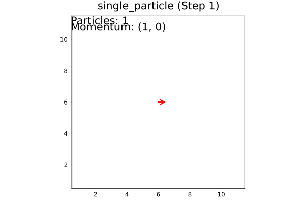
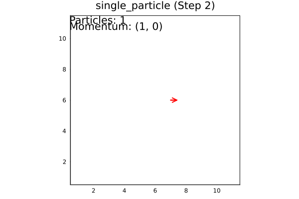
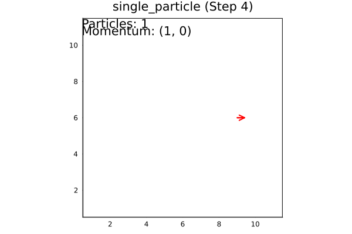
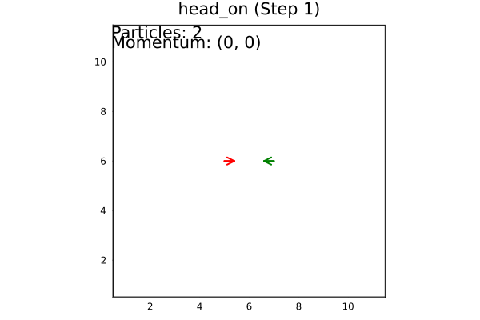
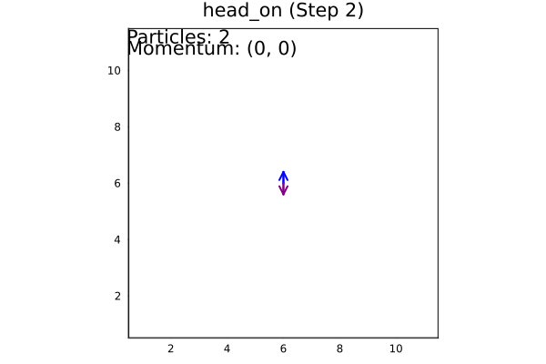
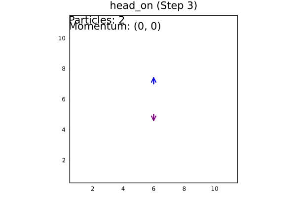
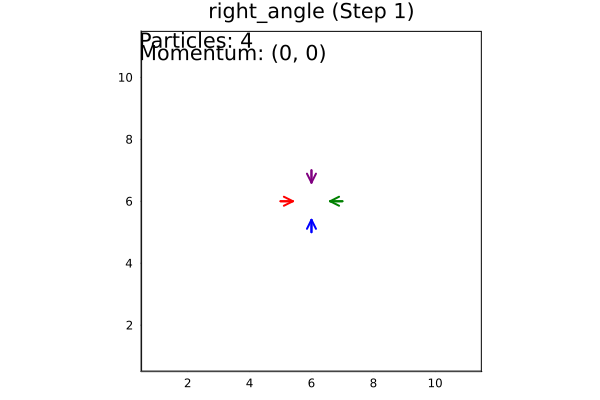
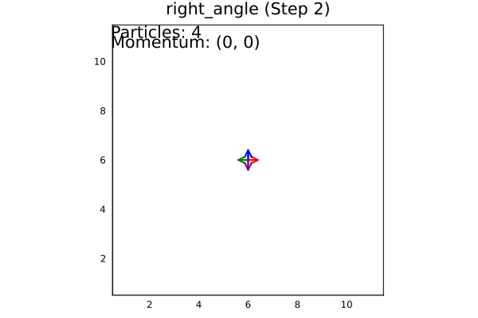
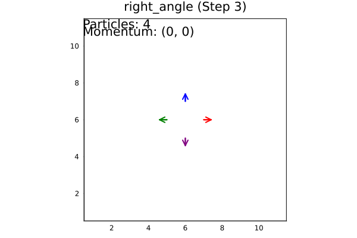

---
## Front matter
lang: ru-RU
title: Решеточные газы, решеточное уравнение Больцмана
subtitle: Групповой проект. Этап 3
author:
  - Команда №4 Абакумова О.М., Астраханцева А.А., Ганина Т.С., Ибатулина Д.Э.
institute:
  - Российский университет дружбы народов, Москва, Россия
date: 1 мая 2025


## i18n babel
babel-lang: russian
babel-otherlangs: english

## Formatting pdf
toc: false
toc-title: Содержание
slide_level: 2
aspectratio: 169
section-titles: true
theme: metropolis
header-includes:
 - \metroset{progressbar=frametitle,sectionpage=progressbar,numbering=fraction}
---

# Вводная часть

## Состав исследовательской команды

Студенты группы НФИбд-01/02-22:

- Абакумова Олеся Максимовна
- Астраханцева Анастасия Александровна
- Ганина Таисия Сергеевна
- Ибатулина Дарья Эдуардовна

## Постановка проблемы

Традиционные методы моделирования газовых потоков и жидкостей требуют значительных вычислительных ресурсов, что затрудняет их применение для сложных задач. В связи с этим возникает необходимость разработки более эффективных и простых в реализации моделей, способных адекватно описывать поведение газов на микроскопическом уровне. Модели решеточных газов (LGA) и решеточного уравнения Больцмана (LBE) представляют собой такой подход, позволяющий упростить вычисления, сохраняя при этом физическую достоверность.

## Актуальность

Методы LGA и LBE важны в гидродинамике и биофизике благодаря эффективности. Модель HPP - основа для более сложных моделей. Важно реализовать и протестировать HPP для проверки алгоритмов.

## Цель

Разработать и проанализировать модель на основе решеточного уравнения Больцмана для описания течений газа.

## Задачи третьего этапа проекта

1. Реализовать и описать программный алгоритм решения задачи на языке `Julia`.

# Основная часть

## Модель HPP (Hardy–Pomeau–Pazzis)

Модель HPP (Hardy-Pomeau-Pazzis) — это базовая модель решеточных газов (LGA), используемая для моделирования гидродинамических явлений на микроскопическом уровне. Она представляет собой дискретную систему, где пространство и время дискретизованы, а частицы двигаются по узлам квадратной решетки.

## Основные характеристики

:::::::::::::: {.columns align=center}
::: {.column width="40%"}

1. **Решетка**: Двумерная квадратная  
2. **Частицы**: Единичной массы, 4 направления  
3. **Скорость**: Δx/Δt = 1  
4. **Принцип исключения**: ≤1 частица/направление  
5. **Эволюция**: Распространение → Столкновения  
6. **Столкновения**: Сохранение импульса, 90° поворот
7. **Кодирование**: 4-битный формат (1 бит/направление)

:::
::: {.column width="60%"}

{width=90%}

:::
::::::::::::::

## Математическое описание:

Обозначим возможные направления скорости как $d_1, d_2, d_3, d_4$$. Тогда:

*   $d_1 = 0001_2 = 1$

*   $d_2 = 0010_2 = 2$

*   $d_3 = 0100_2 = 4$

*   $d_4 = 1000_2 = 8$


## Основные операции для работы с состояниями узлов

1.  **Добавление частицы**: добавление к состоянию $S$ частицы с направлением скорости $d_k$:
    $$
    S \text{ OR } d_k \rightarrow S
    $$

2.  **Проверка наличия частицы**: проверка, есть ли в состоянии $S$ частица с направлением скорости $d_k$:
    $$
    \text{if } (S \text{ AND } d_k) \neq 0
    $$
    Если результат не равен 0, то частица с направлением $d_k$ присутствует в узле.
    

## Недостатки модели HPP

1.  **Отсутствие симметрии**

2.  **Нефизичное поведение**


## Описание задания

 Реализуйте модель HPP. Задайте периодические граничные условия. Это просто сделать, добавив по одному ряду узлов с каждой стороны области (фиктивные узлы). Перед шагом распространения необходимо скопировать значения левого ряда физических узлов в правый фиктивный ряд. Тогда частицы, вылетая из левой границы области налево, появятся на ее правой границе. С другими границами поступают также. Вначале возьмите одну единственную частицу  и проверьте правильность всех граничных условий. Затем убедитесь, что для двух частиц их столкновения "почти лоб в лоб" и под прямым углом происходят верно. Для любого числа частиц должны сохраняться их полное число и полный импульс.


## Описание программного кода

Код для модели HPP мы реализовали на языке Julia.


## Применение периодических граничных условий

```julia
function apply_periodic_boundaries!(grid)
    for d in 1:4
        grid[1, 2:Ny+1, d] .= grid[Nx+1, 2:Ny+1, d]     
        # левая фиктивная = правая физическая
        grid[Nx+2, 2:Ny+1, d] .= grid[2, 2:Ny+1, d]     
        # правая фиктивная = левая физическая
        grid[2:Nx+1, 1, d] .= grid[2:Nx+1, Ny+1, d]     
        # нижняя фиктивная = верхняя физическая
        grid[2:Nx+1, Ny+2, d] .= grid[2:Nx+1, 2, d]     
        # верхняя фиктивная = нижняя физическая
    end
end
```

## Обработка столкновений частиц

```julia
function collide!(grid)
    for x in 2:Nx+1, y in 2:Ny+1
        right, up, left, down = grid[x,y,1], 
                                grid[x,y,2], 
                                grid[x,y,3], 
                                grid[x,y,4]
        if right && left && !up && !down
            grid[x,y,1] = false
            grid[x,y,3] = false
            grid[x,y,2] = true
            grid[x,y,4] = true
            <...>
```

## Обработка столкновений частиц

```Julia
        <...>
        elseif up && down && !right && !left
            grid[x,y,2] = false
            grid[x,y,4] = false
            grid[x,y,1] = true
            grid[x,y,3] = true
        end
    end
end
```

## Распространение частиц

```julia
function propagate!(grid)
    new_grid = zeros(Bool, size(grid))
    for x in 2:Nx+1, y in 2:Ny+1, d in 1:4
        if grid[x, y, d]
            nx, ny = x + dx[d], y + dy[d]
            new_grid[nx, ny, d] = true
        end
    end
    return new_grid
end
```

## Первый тест

- **test_single_particle()** - одна частица в центре движется вправо, проверяется распространение и периодичность.


## Первый тест, код

```Julia
# Тест 1: Одна частица
function test_single_particle()
    grid = create_grid()
    add_particle!(grid, Nx÷2, Ny÷2, 1)  # Частица в центре, движется вправо
    
    anim = @animate for step in 1:20
        apply_periodic_boundaries!(grid)
        collide!(grid)
        p = plot_grid(grid, step)
        grid = propagate!(grid)
        <...>
```

## Первый тест, код

```Julia
        <...>
        n = count_particles(grid)
        px, py = calculate_momentum(grid)
        annotate!(p, 0.5, Ny+1.2, text("Particles: $n", :left))
        annotate!(p, 0.5, Ny+0.8, text("Momentum: ($px, $py)", :left))
        
        p
    end
    
    gif(anim, "hpp_single_particle.gif", fps=2)
end
```

## Запуск теста №1. Одна частица в центре, движется вправо. Шаг №1

{width=40%}

## Запуск теста №1. Одна частица в центре, движется вправо. Шаг №2

{width=40%}

## Запуск теста №1. Одна частица в центре, движется вправо. Шаг №4

{width=40%}

## Второй тест

- **test_head_on_collision()** - две частицы движутся навстречу, проверяется лобовое столкновение.

## Второй тест, код

```Julia
# Тест 2: Две частицы (лобовое столкновение)
function test_head_on_collision()
    grid = create_grid()
    add_particle!(grid, 4, 5, 1)  # →
    add_particle!(grid, 6, 5, 3)  # ←
    
    anim = @animate for step in 1:10
        apply_periodic_boundaries!(grid)
        collide!(grid)
        p = plot_grid(grid, step)
        grid = propagate!(grid)
        <...>
```

## Второй тест, код

```Julia
        <...>
        n = count_particles(grid)
        px, py = calculate_momentum(grid)
        annotate!(p, 0.5, Ny+1.2, text("Particles: $n", :left))
        annotate!(p, 0.5, Ny+0.8, text("Momentum: ($px, $py)", :left))
        
        p
    end
    
    gif(anim, "hpp_head_on.gif", fps=1)
end
```

## Запуск теста №2. Две частицы движутся навстречу, лобовое столкновение. Шаг №1

{width=40%}

## Запуск теста №2. Две частицы движутся навстречу, лобовое столкновение. Шаг №2

{width=40%}

## Запуск теста №2. Две частицы движутся навстречу, лобовое столкновение. Шаг №4

{width=40%}

## Третий тест

- **test_right_angle_collision()** - четыре частицы движутся навстречу под прямым углом, проверяется корректность столкновений.

## Третий тест, код

```Julia
# Тест 3: Четыре частицы (столкновение под прямым углом)
function test_right_angle_collision()
    grid = create_grid()
    add_particle!(grid, 5, 4, 2)  # ↑
    add_particle!(grid, 5, 6, 4)  # ↓
    add_particle!(grid, 4, 5, 1)  # →
    add_particle!(grid, 6, 5, 3)  # ←
    <...>
```

## Третий тест, код

```Julia
    <...>
    anim = @animate for step in 1:10
        apply_periodic_boundaries!(grid)
        collide!(grid)
        p = plot_grid(grid, step)
        grid = propagate!(grid)
        n = count_particles(grid)
        px, py = calculate_momentum(grid)
        annotate!(p, 0.5, Ny+1.2, text("Particles: $n", :left))
        annotate!(p, 0.5, Ny+0.8, text("Momentum: ($px, $py)", :left))
        p
    end
    gif(anim, "hpp_right_angle.gif", fps=1)
end
```


## Запуск теста №3. Четыре частицы движутся навстречу под прямым углом. Шаг №1

{width=40%}

## Запуск теста №3. Четыре частицы движутся навстречу под прямым углом. Шаг №2

{width=40%}

## Запуск теста №3. Четыре частицы движутся навстречу под прямым углом. Шаг №3

{width=40%}

## Общая информация про тесты

В каждом тесте:

- Создаётся сетка.

- Добавляются частицы.

- В цикле на каждом шаге применяются граничные условия, столкновения, визуализация и распространение.

- Считается число частиц и импульс.

- Создаётся анимация и сохраняется в GIF.

# Заключительная часть

## Заключение

Модели решеточных газов  $(LGA)$ и решеточное уравнение Больцмана $(LBE)$ представляют собой эффективные инструменты для моделирования газовых потоков. В данной части проекта мы рассмотрели простую базовую модель $HPP$. 

Реализовали двумерную модель решеточного газа HPP с четырьмя направлениями движения, периодическими граничными условиями, обработкой столкновений и визуализацией. Тесты демонстрируют корректность работы модели и сохранение физических величин (число частиц и импульс). 

## Выводы

Во время выполнения третьего этапа группового проекта мы описали и реализовали модель HPP - базовую модель решеточных газов (LGA), которая может быть использована для моделирования решеточного уравнения Больцмана.

# Список литературы

1. Медведев Д.А. и др. Моделирование физических процессов и явлений на ПК: Учеб. пособие. // Новосибирск: Новосиб. гос. ун-т, 2010. 101 с.

2. Succi, Sauro. The Lattice Boltzmann Equation for Fluid Dynamics and Beyond. Oxford University Press, 2001.


