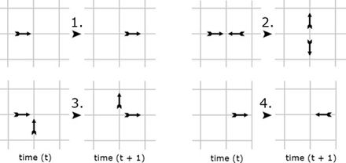

---
## Front matter
title: Решеточные газы, решеточное уравнение Больцмана
subtitle: Отчёт по третьему этапу группового проекта
author: |
  Команда №4:
  Абакумова Олеся Максимовна (НФИбд-02-22)  
  Астраханцева Анастасия Александровна (НФИбд-01-22)  
  Ганина Таисия Сергеевна (НФИбд-01-22)  
  Ибатулина Дарья Эдуардовна (НФИбд-01-22)

## Generic otions
lang: ru-RU
toc-title: "Содержание"

## Bibliography
bibliography: bib/cite.bib
csl: pandoc/csl/gost-r-7-0-5-2008-numeric.csl

## Pdf output format
toc: true # Table of contents
toc-depth: 2
lof: true # List of figures
lot: false # List of tables
fontsize: 12pt
linestretch: 1.5
papersize: a4
documentclass: scrreprt
## I18n polyglossia
polyglossia-lang:
  name: russian
  options:
	- spelling=modern
	- babelshorthands=true
polyglossia-otherlangs:
  name: english
## I18n babel
babel-lang: russian
babel-otherlangs: english
## Fonts
mainfont: PT Serif
romanfont: PT Serif
sansfont: PT Sans
monofont: PT Mono
mainfontoptions: Ligatures=TeX
romanfontoptions: Ligatures=TeX
sansfontoptions: Ligatures=TeX,Scale=MatchLowercase
monofontoptions: Scale=MatchLowercase,Scale=0.9
## Biblatex
biblatex: true
biblio-style: "gost-numeric"
biblatexoptions:
  - parentracker=true
  - backend=biber
  - hyperref=auto
  - language=auto
  - autolang=other*
  - citestyle=gost-numeric
## Pandoc-crossref LaTeX customization
figureTitle: "Рис."
tableTitle: "Таблица"
listingTitle: "Листинг"
lofTitle: "Список иллюстраций"
lotTitle: "Список таблиц"
lolTitle: "Листинги"
## Misc options
indent: true
header-includes:
  - \usepackage{indentfirst}
  - \usepackage{float} # keep figures where there are in the text
  - \floatplacement{figure}{H} # keep figures where there are in the text
---

# Введение

## Цель проекта

Разработать и проанализировать модель на основе решеточного уравнения Больцмана для описания течений газа.

## Задачи третьего этапа проекта

1. Реализовать и описать программный алгоритм решения задачи.

## Актуальность 

Моделирование газовых потоков и жидкостей традиционными методами требует значительных вычислительных ресурсов. В связи с этим, методы решеточных газов (LGA) и решеточного уравнения Больцмана (LBE) становятся все более актуальными. Они позволяют упростить вычисления, сохраняя при этом физическую достоверность, и находят применение в различных областях, от гидродинамики до биофизики. В данном докладе мы рассмотрим основные алгоритмы и модели, используемые для решения задач с применением LGA и LBE.

# Основная часть

## Модель HPP (Hardy–Pomeau–Pazzis)

Модель HPP (Hardy-Pomeau-Pazzis) — это базовая модель решеточных газов (LGA), используемая для моделирования гидродинамических явлений на микроскопическом уровне. Она представляет собой дискретную систему, где пространство и время дискретизованы, а частицы двигаются по узлам квадратной решетки.

### Основные характеристики модели HPP:

1.  **Решетка**: используется двумерная квадратная решетка, где узлы расположены на одинаковом расстоянии друг от друга.

2.  **Частицы**: в каждом узле решетки могут находиться частицы единичной массы. Каждая частица может двигаться в одном из четырех направлений: вверх, вниз, вправо или влево.

3.  **Скорость**: все частицы имеют одинаковую скорость, направленную к соседнему узлу. Расстояние между узлами ($\Delta x$) и шаг времени ($\Delta t$) выбираются так, чтобы частица могла переместиться в соседний узел за один временной шаг.

4.  **Принцип исключения**: в каждом узле может находиться не более одной частицы, движущейся в заданном направлении.

5.  **Этапы эволюции**:
    *   **Распространение (Streaming)**: частицы перемещаются в соседние узлы в соответствии со своими скоростями. За один шаг времени частица переходит в соседний узел в направлении своего движения.
    *   **Столкновения (Collision)**: в узлах происходят столкновения частиц, при которых сохраняются количество частиц и полный импульс.

6.  **Правила столкновений**: столкновения происходят таким образом, чтобы выполнялись законы сохранения. В модели HPP нетривиальные столкновения происходят, когда две частицы движутся навстречу друг другу (почти "лоб в лоб"). После столкновения частицы меняют направления движения на 90 градусов. Во всех остальных случаях столкновения считаются несущественными, и частицы продолжают двигаться в прежних направлениях.

7.  **Кодирование состояний**: состояние каждого узла решетки кодируется битами. Поскольку имеется четыре возможных направления движения, для кодирования состояния узла требуется четыре бита. Каждый бит соответствует одному из направлений: 0 — нет частицы, 1 — есть частица, движущаяся в этом направлении. Например, если частицы движутся вправо и вверх, состояние узла кодируется как `0101` в двоичном формате [@medvedev2010, @chaschin2021]

{#fig:001 width=100%}

### Математическое описание:

Обозначим возможные направления скорости как $d_1, d_2, d_3, d_4$$. Тогда:

*   $d_1 = 0001_2 = 1$

*   $d_2 = 0010_2 = 2$

*   $d_3 = 0100_2 = 4$

*   $d_4 = 1000_2 = 8$

Основные операции для работы с состояниями узлов:

1.  **Добавление частицы**: добавление к состоянию $S$ частицы с направлением скорости $d_k$:
    $$
    S \text{ OR } d_k \rightarrow S
    $$

2.  **Проверка наличия частицы**: проверка, есть ли в состоянии $S$ частица с направлением скорости $d_k$:
    $$
    \text{if } (S \text{ AND } d_k) \neq 0
    $$
    Если результат не равен 0, то частица с направлением $d_k$ присутствует в узле.

### Недостатки модели HPP:

1.  **Отсутствие симметрии**: квадратная решетка с четырьмя направлениями скорости недостаточно симметрична, что приводит к анизотропии в макроскопических свойствах.

2.  **Нефизичное поведение**: модель HPP неточно описывает гидродинамические свойства жидкостей и газов.

Для устранения этих недостатков были разработаны более совершенные модели, такие как FHP (Frisch-Hasslacher-Pomeau) на треугольных решетках и модели с добавлением покоящихся частиц. [@hardy1973time, @succi2001lattice]

## Описание задания

 Реализуйте модель HPP. Задайте периодические граничные условия. Это просто сделать, добавив по одному ряду узлов с каждой стороны области (фиктивные узлы). Перед шагом распространения необходимо скопировать значения левого ряда физических узлов в правый фиктивный ряд. Тогда частицы, вылетая из левой границы области налево, появятся на ее правой границе. С другими границами поступают также. Вначале возьмите одну единственную частицу  и проверьте правильность всех граничных условий. Затем убедитесь, что для двух частиц их столкновения "почти лоб в лоб" и под прямым углом происходят верно. Для любого числа частиц должны сохраняться их полное число и полный импульс.

## Описание программного кода

Код для модели HPP мы реализовали на языке Julia.

### Подключение библиотек и настройка визуализации

```julia
using Plots
gr()
```

- Подключается пакет `Plots` для построения графиков.

- Выбирается бэкенд `gr()` для отрисовки.

### Константы и параметры модели

```julia
const Nx, Ny = 10, 10
const dx = [1, 0, -1, 0]
const dy = [0, 1, 0, -1]
const dir_colors = [:red, :blue, :green, :purple]

```

- `Nx`, `Ny` - размеры внутренней области решетки (без фиктивных узлов).

- `dx`, `dy` - массивы смещений по x и y для четырёх направлений движения частиц: вправо, вверх, влево, вниз.

- `dir_colors` - цвета для визуализации направлений частиц.


### Создание пустой сетки

```julia
function create_grid()
    zeros(Bool, Nx+2, Ny+2, 4)
end
```

- Создаётся булев массив размером `(Nx+2, Ny+2, 4)`.

- `Nx+2` и `Ny+2` - учитывают фиктивные узлы по краям (по одному ряду с каждой стороны).

- Последнее измерение `4` - количество направлений движения частиц.

- Все значения изначально `false` (нет частиц).


### Добавление частицы в сетку

```julia
function add_particle!(grid, x, y, d)
    @assert 1 ≤ x ≤ Nx && 1 ≤ y ≤ Ny "Particle must be inside physical domain"
    @assert 1 ≤ d ≤ 4 "Direction must be between 1 and 4"
    grid[x+1, y+1, d] = true
end
```

- Добавляет частицу в позицию `(x, y)` с направлением `d`.

- `x+1`, `y+1` - сдвиг на 1 из-за фиктивных узлов.

- Проверяется корректность координат и направления.


### Применение периодических граничных условий

```julia
function apply_periodic_boundaries!(grid)
    for d in 1:4
        # левая фиктивная = правая физическая
        grid[1, 2:Ny+1, d] .= grid[Nx+1, 2:Ny+1, d]     
        # правая фиктивная = левая физическая
        grid[Nx+2, 2:Ny+1, d] .= grid[2, 2:Ny+1, d]     
        # нижняя фиктивная = верхняя физическая
        grid[2:Nx+1, 1, d] .= grid[2:Nx+1, Ny+1, d]     
        # верхняя фиктивная = нижняя физическая
        grid[2:Nx+1, Ny+2, d] .= grid[2:Nx+1, 2, d]     
    end
end
```

- Для каждого направления `d` копирует значения с противоположных физических границ в фиктивные узлы.

- Обеспечивает периодичность: частицы, выходящие с одной границы, появляются с противоположной.


### Обработка столкновений частиц

```julia
function collide!(grid)
    for x in 2:Nx+1, y in 2:Ny+1
        right, up, left, down = grid[x,y,1], 
                                grid[x,y,2], 
                                grid[x,y,3], 
                                grid[x,y,4]
        if right && left && !up && !down
            grid[x,y,1] = false
            grid[x,y,3] = false
            grid[x,y,2] = true
            grid[x,y,4] = true
        elseif up && down && !right && !left
            grid[x,y,2] = false
            grid[x,y,4] = false
            grid[x,y,1] = true
            grid[x,y,3] = true
        end
    end
end
```

- Проходит по всем физическим узлам.

- Проверяет столкновения:

  - Лобовое: если есть частицы вправо и влево, меняет их направления на вверх и вниз.

  - Под прямым углом: если есть частицы вверх и вниз, меняет направления на вправо и влево.

- Другие случаи столкновений не обрабатываются (частицы проходят без изменений).


### Распространение частиц

```julia
function propagate!(grid)
    new_grid = zeros(Bool, size(grid))
    for x in 2:Nx+1, y in 2:Ny+1, d in 1:4
        if grid[x, y, d]
            nx, ny = x + dx[d], y + dy[d]
            new_grid[nx, ny, d] = true
        end
    end
    return new_grid
end
```

- Создаёт новую пустую сетку.

- Для каждой частицы вычисляет новую позицию, смещая по направлению `d`.

- Записывает частицу в новую позицию.

- Возвращает обновлённую сетку.


### Подсчёт числа частиц

```julia
function count_particles(grid)
    sum(grid[2:Nx+1, 2:Ny+1, :])
end
```

- Считает общее количество частиц во всех направлениях во всех физических узлах.


### Вычисление суммарного импульса

```julia
function calculate_momentum(grid)
    px, py = 0, 0
    for x in 2:Nx+1, y in 2:Ny+1
        # движение вправо минус влево
        px += grid[x,y,1] - grid[x,y,3]
        # движение вверх минус вниз
        py += grid[x,y,2] - grid[x,y,4]
    end
    return (px, py)
end
```

- Суммирует по всем узлам разницу частиц, движущихся в противоположных направлениях, по осям X и Y.

- Возвращает вектор импульса.

### Визуализация состояния решетки

```julia
function plot_grid(grid, step)
    p = heatmap(0:Nx+1, 0:Ny+1, zeros(Nx+2, Ny+2),
        c=:white, aspect_ratio=1, legend=false,
        xlims=(0.5, Nx+1.5), ylims=(0.5, Ny+1.5),
        title="HPP Model (Step $step)")

    plot!(p, [0.5, Nx+1.5, Nx+1.5, 0.5, 0.5], 
             [0.5, 0.5, Ny+1.5, Ny+1.5, 0.5],
          color=:black, linewidth=2, label="")

    for x in 2:Nx+1, y in 2:Ny+1, d in 1:4
        if grid[x, y, d]
            quiver!(p, [x], [y], quiver=([dx[d]*0.4], 
                                         [dy[d]*0.4]),
                   color=dir_colors[d], lw=2, arrow=true)
        end
    end

    return p
end

```
- Создаёт белый холст с размерами решетки.

- Рисует чёрную рамку вокруг области.

- Для каждой частицы рисует стрелку в направлении движения с цветом, соответствующим направлению.

- Возвращает объект графика.


### Запуск всех тестов

```julia
function run_all_tests()
    println("Running single particle test...")
    test_single_particle()

    println("Running head-on collision test...")
    test_head_on_collision()

    println("Running right angle collision test...")
    test_right_angle_collision()

    println("All tests completed! Check generated GIFs.")
end

run_all_tests()
```

- **test_single_particle()** - одна частица в центре движется вправо, проверяется распространение и периодичность (рис. [-@fig:002]-[-@fig:004]).

```Julia
# Тест 1: Одна частица
function test_single_particle()
    grid = create_grid()
    # Частица в центре, движется вправо
    add_particle!(grid, Nx÷2, Ny÷2, 1)  
    
    anim = @animate for step in 1:20
        apply_periodic_boundaries!(grid)
        collide!(grid)
        p = plot_grid(grid, step)
        grid = propagate!(grid)
        
        n = count_particles(grid)
        px, py = calculate_momentum(grid)
        annotate!(p, 0.5, Ny+1.2, text("Particles: $n", :left))
        annotate!(p, 0.5, Ny+0.8, text("Momentum: ($px, $py)", :left))
        
        p
    end
    
    gif(anim, "hpp_single_particle.gif", fps=2)
end
```

{#fig:002 width=100%}

{#fig:003 width=100%}

{#fig:004 width=100%}


- **test_head_on_collision()** - две частицы движутся навстречу, проверяется лобовое столкновение (рис. [-@fig:005]-[-@fig:007]).


```Julia
# Тест 2: Две частицы (лобовое столкновение)
function test_head_on_collision()
    grid = create_grid()
    add_particle!(grid, 4, 5, 1)  # →
    add_particle!(grid, 6, 5, 3)  # ←
    
    anim = @animate for step in 1:10
        apply_periodic_boundaries!(grid)
        collide!(grid)
        p = plot_grid(grid, step)
        grid = propagate!(grid)
        
        n = count_particles(grid)
        px, py = calculate_momentum(grid)
        annotate!(p, 0.5, Ny+1.2, text("Particles: $n", :left))
        annotate!(p, 0.5, Ny+0.8, text("Momentum: ($px, $py)", :left))
        
        p
    end
    
    gif(anim, "hpp_head_on.gif", fps=1)
end
```

{#fig:005 width=100%}

{#fig:006 width=100%}

{#fig:007 width=100%}

- **test_right_angle_collision()** - четыре частицы движутся навстречу под прямым углом, проверяется корректность столкновений (рис. [-@fig:008]-[-@fig:010]).

```Julia
# Тест 3: Четыре частицы (столкновение под прямым углом)
function test_right_angle_collision()
    grid = create_grid()
    add_particle!(grid, 5, 4, 2)  # ↑
    add_particle!(grid, 5, 6, 4)  # ↓
    add_particle!(grid, 4, 5, 1)  # →
    add_particle!(grid, 6, 5, 3)  # ←
    
    anim = @animate for step in 1:10
        apply_periodic_boundaries!(grid)
        collide!(grid)
        p = plot_grid(grid, step)
        grid = propagate!(grid)
        
        n = count_particles(grid)
        px, py = calculate_momentum(grid)
        annotate!(p, 0.5, Ny+1.2, text("Particles: $n", :left))
        annotate!(p, 0.5, Ny+0.8, text("Momentum: ($px, $py)", :left))
        
        p
    end
    
    gif(anim, "hpp_right_angle.gif", fps=1)
end
```

{#fig:008 width=100%}

{#fig:009 width=100%}

{#fig:010 width=100%}

В каждом тесте:

- Создаётся сетка.

- Добавляются частицы.

- В цикле на каждом шаге применяются граничные условия, столкновения, визуализация и распространение.

- Считается число частиц и импульс.

- Создаётся анимация и сохраняется в GIF.


# Заключительная часть

## Заключение

Модели решеточных газов  $(LGA)$ и решеточное уравнение Больцмана $(LBE)$ представляют собой эффективные инструменты для моделирования газовых потоков. В данной части проекта мы рассмотрели простую базовую модель $HPP$. 

Реализовали двумерную модель решеточного газа HPP с четырьмя направлениями движения, периодическими граничными условиями, обработкой столкновений и визуализацией. Тесты демонстрируют корректность работы модели и сохранение физических величин (число частиц и импульс). 

## Выводы

Во время выполнения третьего этапа группового проекта мы описали и реализовали модель HPP - базовую модель решеточных газов (LGA), которая может быть использована для моделирования решеточного уравнения Больцмана.

# Список литературы

::: {#refs}
:::
